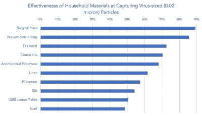

# 短缺时期的自制面具

> 原文：<https://hackaday.com/2020/03/18/homemade-masks-in-a-time-of-shortage/>

由于新冠肺炎的全球疫情，N95 口罩出现了巨大的短缺。来自 Smart Air 的[]帕迪·罗伯逊 ]一直致力于一款 DIY 面具的[设计，或许可以保护那些无法保护自己面具的人。虽然围绕人们能够用来替代过滤器的各种材料可能有大量的迷因，但在这些材料背后有一些非常真实的科学可以有效地保护我们免受病毒的侵害。](https://smartairfilters.com/en/blog/best-materials-make-diy-face-mask-virus/)

根据剑桥大学在 2009 年 H1N1 流感疫情期间进行的一项研究，虽然外科口罩在捕捉萎缩芽孢杆菌细菌(0.93-1.25 微米)和噬菌体 MS 病毒(0.023 微米)方面表现最佳，但真空吸尘器袋和茶巾(T2)以及棉 t 恤(T3)也不落后。冠状病毒为 0.1-0.2 微米，完全在测试结果的范围内。

事实证明，棉质自制口罩作为替代品可能相当有效——更不用说可重复使用了。他们还发现双层口罩无助于提高对病毒的防护。另一方面，一个重要的设计选择是材料的透气性。虽然真空吸尘器袋在阻挡小颗粒方面可能非常有效，但它们不如棉口罩舒适或容易吸入。

你试过自己做棉口罩吗？在医院的外科口罩越来越少的时候，这可能是帮助那些在第一线提供帮助的人保持急需的医疗用品的最佳选择。

【感谢馅饼的提示！]