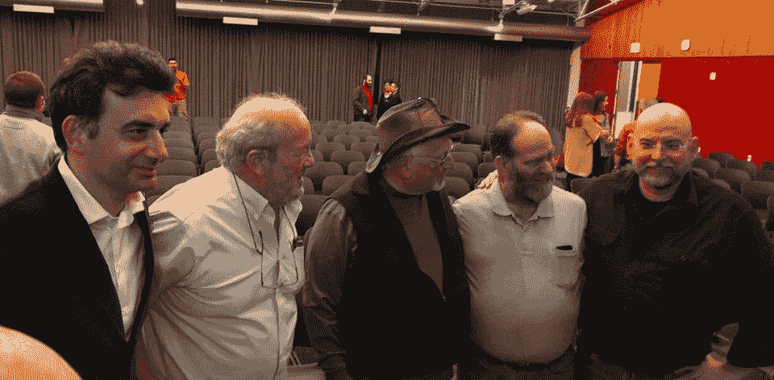

# 向查克·佩德尔致敬；6502 和芯片之父

> 原文：<https://hackaday.com/2019/12/25/honoring-chuck-peddle-father-of-the-6502-and-the-chips-that-went-with-it/>

6502 微处理器的鼻祖 Chuck Peddle 最近去世了。大多数人不知道他和他的工程师团队对他们生活的影响。我们经常理所当然地认为微处理器是计算设备中的一个普通组件，然而曾经有一段时间只有处理器，它们的大小相当于整个印刷电路板。

查克在摩托罗拉工作时有一个大胆的想法，他们可以将昂贵的处理器板缩小到一个集成电路，一个芯片，而且成本更低，几十美元而不是一万多美元。为了听 Chuck 谈论这件事，他收到了一封来自摩托罗拉以销售 14，000 美元的处理器板为生的部分的停止和终止信，并消除了关于 25 美元替代品的所有噪音。

在查克看来，这是允许他把自己的想法和工程团队带到别处。Chuck 和他的团队于 20 世纪 70 年代在宾夕法尼亚州诺里斯敦创立了 MOS Technologies，并将他们在摩托罗拉 6800 上的工作重新定位为 MOS 6502。诉讼接踵而至。

如果你问查克关于他的贡献，他会否认他是早期 KIM-1 单板微型计算机之父的说法，“看看键盘，你可以告诉你这是由计算器方面的人做的事情，”我相信我听到他说。

当被问及 6502 时，他的回答是，他更为外设感到自豪，即支持微处理器的输入/输出(I/O)芯片。这些支持芯片使用户与微处理器进行交互成为可能，他的回答大致是这样的:除非有办法读取用户的按键并显示一些信息，否则你不可能拥有终端或收银机系统。

Bruno Gandpa, Al Alcorn, Chuck Peddle, Leonard Tramiel, Bil Herd at the release of Growing the 8 Bit Generation. Photo courtesy of Robert Bernardo.

古老的 6502 的故事是我们永远不会知道它对人们的计算体验有多大影响的故事之一，即使在今天。你自己可能没有玩过 Atari 游戏，但是你的电脑的架构师/设计师/程序员很有可能玩过。游戏《《我的世界》》的设计者从 C128 准将开始，一个基于 6502 的系统，就像它著名的前身 C64 一样，如果你看过关于 20 世纪 80 年代的电视节目，他们不可避免地会展示基于 6502 的苹果电脑。

当我到达准将的时候，查克和他的团队已经离开了，尽管我已经被 MOS first 正式雇佣了。我们坐在他们办公室里的同一把椅子上，可以感觉到他们的存在，我过去常常开玩笑说烟灰缸里还有一支温热的雪茄，或者在大厅里看到佩珀德的独角兽，这是指我们归因于早期人的巫师般的光环。我还习惯称早期的团队为“摩托罗拉五人组”，以此向他们在摩托罗拉的“逃亡”状态致敬，尽管实际上他们可能有 6 个人。

在下面的视频中，杰里·埃尔斯沃斯和比尔·赫德问查克·佩德尔，他是否真的是一个一心想要毁灭世界的邪恶天才。

 [https://www.youtube.com/embed/F06R48cVAgU?version=3&rel=1&showsearch=0&showinfo=1&iv_load_policy=1&fs=1&hl=en-US&autohide=2&wmode=transparent](https://www.youtube.com/embed/F06R48cVAgU?version=3&rel=1&showsearch=0&showinfo=1&iv_load_policy=1&fs=1&hl=en-US&autohide=2&wmode=transparent)

我已经看到了最初的 6502 示意图，这是我所感觉到的最接近宗教的体验，在我看来，灯光变暗了，当示意图从最下面的抽屉里拿出来时，我觉得我可以闻到熏香的味道，听到诵经声……显然早期的示意图是印在羊皮纸上的，这就是旧的手绘示意图的情况。我的朋友本尼是许多你可能从未听说过的磁盘驱动器的父亲，他刷了刷在一个便笺簿符号上轻轻写的东西，然后当他读到用铅笔写的东西时笑了。所写的内容在某种意义上是对 Chuck 的致敬，他曾游说专门将其纳入 6502，Set Overflow (SO) pin，pad 已被重命名为 CPS，用于 Chuck Peddle Special pin。

Chuck Peddle，现代处理器和芯片之父之一，使其可用:1937-2019