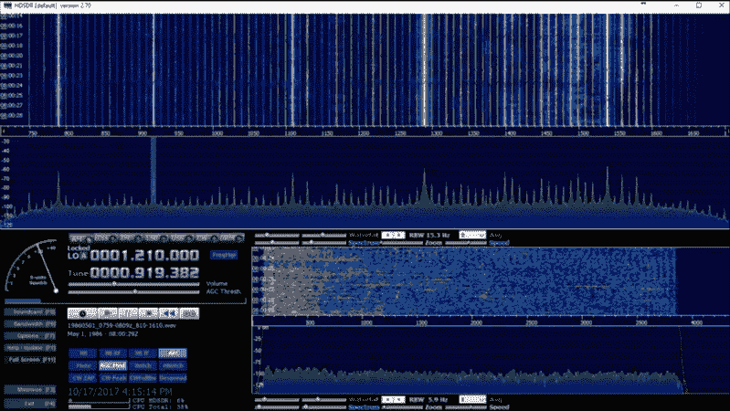

# 希望十二:软件无线电时代旅行

> 原文：<https://hackaday.com/2018/07/23/hope-xiii-time-travel-with-software-defined-radio/>

我们开车时，很容易把收音机当成背景噪音而不予理会。在最坏的情况下，你甚至会认为这只是广告商兜售商品的另一种方法。但实际上，它是特定时间和地点的文化快照；记录新闻内容，流行音乐，天气情况，基本上生活是什么样的。如果它足够重要，值得花费大量的金钱和复杂的程序在电台上播放，那么它可能值得保存下来以备将来参考。

 但是广播稍纵即逝，一个 24/7 的内容流永远不会完全相同两次。然而，当我们痴迷于记录音乐和视频时，没有人会费心去记录广播。你可以很容易地上网观看 50 年前播出的电视节目，但祝你好运，你可以找到当地电台上周播出的节目。所有的信息，丰富多彩的生活，都消失了，我们对此无能为力。

或者我们可以吗？在 HOPE XII 上，Thomas Witherspoon 做了一个名为“*创造无线电时间机器:软件定义的无线电和时移记录”*的演讲，概述了他一直在做的工作[记录和编目广播无线电频谱](http://spectrumarchive.org)。他演示了任何人都可以使用低成本的 SDR 硬件来记录，并在以后回放整个 AM 和短波波段。他描述的方法不是一个包含单个电台的音频文件，而是允许你交互式地收听不同的电台，并探索电波，就像它是现场直播一样。

## 现代演绎经典技术

你可能会认为这种无线电欺骗是现代硬件和软件的产物，但事实上托马斯和他的无线电档案小组使用的方法有相当多的追溯。早在 20 世纪 80 年代，专门寻找远距离信号的无线电爱好者发现，如果他们将无线电的中频(if)输出连接到 VCR，他们就可以捕获天线拾取的任何信号，供以后分析。当磁带通过收音机的天线端口播放时，他们可以调到单独的频率，搜索难以听到的信号。

当然，这种方法的效用并不仅限于微弱的信号。它让电台操作员可以做一些其他方式不可能做到的事情，比如回去收听同一时间播出的不同新闻广播。一些 DXers 意识到这些录音有潜在的历史价值，其中一些早期的磁带被保存下来，并最终成为托马斯建立和提供的播客的一部分。

这种技术的现代版本用许多负担得起的 SDR 设备中的任何一种来代替 AM 或短波接收器，并且 VCR 已经成为一种可以将 SDR 的输出转储到文件中的软件。然后，该文件可以载入兼容的 SDR 接口程序，如 HDSDR，以取代实际的无线电。

## 存储历史

托马斯设想了一个未来，研究人员将能够坐在一个信息亭前，浏览特定时间和地点的无线电广播，就像用缩微胶片机浏览几十年前的报纸一样。但是，尽管现在制作这些录音比以往任何时候都更便宜、更容易，但在此之前仍有一些后勤问题需要解决。其中最主要的问题是:你是如何储存这些信息的？

Thomas 提到，AM 广播波段一天的记录将产生大约 1 TB 的数据。潜在地，可以开发某种压缩方案，该方案将扫描记录以分离出可行的信号并删除其余的信号。另一种方法是一种环形缓冲区安排，其中系统只保留最近几天的记录，除非用户将它们提交给长期存储。如果发生了值得进一步研究的事情，可以将环形缓冲区转移到永久存储中，这样该事件以及之前的时间就可以保存下来以供历史使用。

在那之前，托马斯和他的团队将继续记录值得关注的事件。例如，他们在 2016 年美国总统选举期间进行了广泛的频谱记录，认为这将是后代可能希望尽可能多地了解信息的时刻。

 [https://www.youtube.com/embed/AWJwvPdsb70?version=3&rel=1&showsearch=0&showinfo=1&iv_load_policy=1&fs=1&hl=en-US&autohide=2&wmode=transparent](https://www.youtube.com/embed/AWJwvPdsb70?version=3&rel=1&showsearch=0&showinfo=1&iv_load_policy=1&fs=1&hl=en-US&autohide=2&wmode=transparent)

