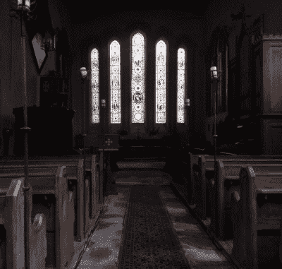
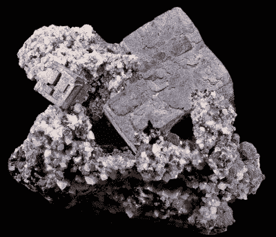
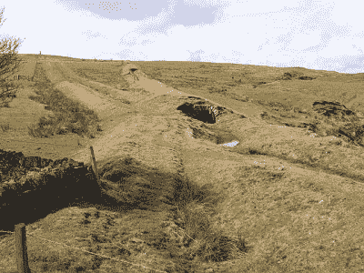

# 重金属怎么会飞？

> 原文：<https://hackaday.com/2020/04/17/how-can-heavy-metal-fly/>

科学家在冰川中发现了数量惊人的铅。他们通过从高山冰川采集冰芯样本来研究大气污染。令人惊讶的是，他们在 13 世纪晚期的地层中发现了比工业革命高峰期沉积的更多的铅。中世纪当然应该更多的是关于穿着闪亮盔甲的骑士，而不是黑暗的恶魔磨坊，这到底是怎么回事？在一个木制水车代表高科技的时代，铅工业为什么会超速发展？

答案就在离冰川一千英里远的地方使用的炼铅方法，以及一位中世纪圣徒的殉难。

## 一种大规模的军备竞赛

The magnificent late-13th-century priory church at Chetwode, Buckinghamshire.

1170 年，坎特伯雷大主教托马斯·贝克特在他的大教堂被一群骑士暗杀，据说是因为受到英国国王亨利二世的劝诫。这一罪行导致贝克特被封为圣徒，最终亨利开始了一项前所未有的计划，建造和扩建大教堂、修道院和其他宗教机构，以此来为贝克特的死赎罪。这种影响今天仍然可以在他的前王国的教会建筑和当时的冰川沉积物中看到。

似乎英国高地所有教堂屋顶的铅生产导致了铅污染的激增，超过了工业革命时期的水平，这些年后科学家们在冰层中清晰可见。这是一次进入 13 世纪黑暗政治的有趣旅程，但 Hackaday 的问题是，中世纪规模的采矿活动是如何释放出如此多的铅的，那么天气又是如何将如此多的铅带到整个大陆的呢？

## 从大教堂屋顶到高山冰川

A sample of galena ore mined in Missouri, USA. Didier Descouens ([CC BY-SA 4.0](https://commons.wikimedia.org/wiki/File:Gal%C3%A8neJoplinII.jpg))

最丰富的铅矿是方铅矿，硫化铅，通过在火或熔炉中加热可以很容易地熔化以回收金属铅。这是一个两阶段的反应，其中硫首先被去除，留下氧化铅和二氧化硫，然后生成的氧化铅在燃料中的碳存在下被还原，形成熔融的铅和二氧化碳。

这种易于提取的特点意味着它已经被人类使用了数千年，任何有现成燃料和方铅矿供应的地方都可以轻松支持铅的生产。中世纪的铅提取是在一个被称为 [bole smelter](https://discovery.ucl.ac.uk/id/eprint/1430483/) 的简陋熔炉中进行的，这是一个由木头和矿石交替层组成的明火，通常放置在高处以利用风，并用石墙包围以将风导入火中。这些冶炼厂的效率极低，以至于它们的炉渣中含有足够的剩余铅，可以在以后的几个世纪中回收利用，而且大量的铅蒸气和灰尘随废气一起逃逸。数百年后，他们的所在地仍然经常被铅残留物污染，这些废气的毒性足以毒害当地的家畜和在冶炼厂工作的人。

Part of the several-mile-long complex of horizontal lead smelting flues, Allendale, Northumberland. Oliver Dixon ([CC-BY-SA/2.0](https://www.geograph.org.uk/photo/1795947))

在后来的几个世纪里，拥有更高效的强制通风炉的铅冶炼厂通过建造非常长的水平烟道来回收大量的铅蒸汽和灰尘，就像这里显示的一样，铅蒸汽和灰尘可以在其中冷凝并被回收。他们的记录中包含了对这些烟道壁上任何时候的数量的估计，可能达到数百吨。尽管直接进入大气层，13 世纪冶炼厂的排放物会被天气系统带入高层大气，从而穿越欧洲大陆约 1000 英里到达高山冰川。现代的相似之处是，北非撒哈拉沙漠中的沙子出现在北欧的雨滴中，来自这些地区的任何一位车主都会告诉你，他们的汽车被暴雨覆盖在灰尘中。

我们从电影描述中对中世纪英格兰的文化想象是城堡、穿着闪亮盔甲的骑士，或许还有田园牧歌式乡村中快乐的农民。现实情况是，在一个大部分地区仍是森林覆盖的国家，贫困和疾病令人难以忍受，因此，当人们发现，在一些地方，污染的程度和几个世纪以来一样严重和普遍时，应该感到如此震惊吗？这个行业不仅仅在几个世纪后科学家对冰核的分析中留下了痕迹，它还剥离了数千棵用作燃料的树木，并对地貌的深刻变化做出了贡献。如果你的旅游带你进入一座铅屋顶的中世纪大教堂，你需要记住一些事情。