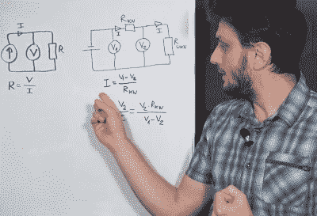

# 测量一个电阻需要多少根导线？

> 原文：<https://hackaday.com/2022/01/07/how-many-wires-do-you-need-to-measure-a-resistor/>

测电阻好像没什么大不了的。将您的仪表引线放在两根电线或两个端子之间，读取数值，对吗？大多数时候这已经足够了，但有时你需要更好的方法，为此，[你需要更多的电线](https://www.youtube.com/watch?v=-OEfzRwlzA4)，正如[FesZ]在他最近的视频中解释的那样，你可以在下面看到。

在通常情况下，电表施加一个已知的电压，测量电流，根据欧姆定律，得出电阻。也可以控制电流和测量电压——没关系。[FesZ]显示有多少电表测量已知电阻和未知电阻上的电压，因此不需要精密电压或电流源。

但是这个简单的方法有很多问题。首先，测试引线也有电阻。因此，一些电压会在它们之间下降，导致测量误差。当然，如果你在看一个 100K 的电阻，额外的 0.5 欧姆并不重要，但如果你试图测量，比如说，一台 3D 打印机的加热床，额外的 0.5 欧姆在总测量中占很大比例。

 实验室用台式电表通常支持 4 线测量。正如[FesZ]所示，这种方法测量三种不同的电压，试图消除一些测量误差。我们喜欢他使用三种不同的电表来展示它的工作原理，以及小电阻上 2 线和 4 线测量的区别。

还有一种更奇怪的方法，使用 3 根线来节省布线，比如说，远距离的传感器。3 根线其实至少有两种使用方法，视频都有涉及。

然而，要测量电路中的电阻，你需要多达六根导线。这种技术使用两条额外的导线来控制平衡电压，使未知电阻和电路其余部分之间的电流保持为零。这防止了除测量电流之外的电流流动。您将在视频中看到这一过程的模拟。

在之前，我们已经[研究过 4 线测量，如果你想尝试一些模拟练习的话。用于这种测量的](https://hackaday.com/2019/06/05/circuit-vr-resistance-measurement-with-four-wires/)[探测器](https://hackaday.com/2020/10/31/kelvin-probes-review-shows-how-4-wire-resistance-measurement-works/)也是一个受欢迎的项目。

 [https://www.youtube.com/embed/-OEfzRwlzA4?version=3&rel=1&showsearch=0&showinfo=1&iv_load_policy=1&fs=1&hl=en-US&autohide=2&wmode=transparent](https://www.youtube.com/embed/-OEfzRwlzA4?version=3&rel=1&showsearch=0&showinfo=1&iv_load_policy=1&fs=1&hl=en-US&autohide=2&wmode=transparent)

