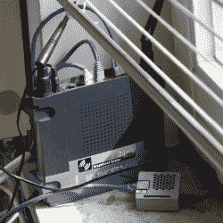

# DIY 对你来说值多少钱？

> 原文：<https://hackaday.com/2020/05/09/how-much-is-diy-worth-to-you/>

这一切都始于一篇关于 Wink 实验室对他们之前免费的服务收取月费的文章。让我愤怒的不是他们要价的多少(每月 5 美元)，而是他们会让你表面上买的设备变得一文不值，除非你付钱。我最近[已经对这一点咆哮够了](https://hackaday.com/2020/02/29/the-iot-trap/)，快速总结就是物联网公司似乎非常不擅长估计他们的真实成本，消费者最终为此受苦。

于是我自己开始考虑价格。家庭自动化服务每月 5 美元是多了还是少了？一方面，如果你把它延长到，比如说，10 年，你最终会得到 400 多美元的净现值，外加 70 美元的设备。很多，对吧？当然，我可以自己动手做一个更便宜的解决方案？还是我陷入了同样的物联网陷阱？

 这不是假设，因为我已经有了一个[适度的 DIY 家庭自动化系统](https://hackaday.com/2019/11/07/found-footage-elliot-williams-talks-nexus-technologies/)。我们运行一系列开关，在相关房间安装温度和湿度记录器，洗衣机和烘干机会在完成后通知我们。我也在各种有趣的项目中使用 [MQTT 基础设施](https://hackaday.com/tag/minimal-mqtt/)，但这是额外的收获。我们的集线器是一个 10 美元的橙色 Pi 和一个早已贬值的 WRT54g 路由器，它已经运行了四年，可能还会再运行六年。所以我口袋里看起来有 460 美元。

另一方面，对我来说这真的很划算，因为我已经知道当我设置系统时我在做什么，以及我不知道我想学什么。实际上，我可能总共在这个系统上花了大约 20 个小时，但大部分时间都在添加新设备和调整旧设备。您也必须对任何其他系统做这种事情，尽管我猜测专业系统在注册新的小工具方面更加精简:我有一个完整的目录，其中充满了作为守护进程运行的 Python 脚本，并且必须做大量的手工编辑。不过，假设这个系统没有发生其他重大变化，我可能会被狄莺赢走。

但是想象一下，我几乎没有或者根本没有技术线索，甚至把一个预先配置好的家庭自动化系统的图像闪现到一个树莓派上也是新鲜事。学会做那样的事要花多少时间？在您的家庭网络中，学习管理如此简单的系统需要多少时间？如果真实的我花了 20 个小时，那么假想的我可能要花两倍的时间。假设投入了 46 小时的时间。10 美元/小时在许多地方低于最低工资，这不是最低工资劳动，这是相当乐观的。

最后，如果这个系统有效的话，每月 5 美元可能是相当公平的。事实上，当我环顾我构建的所有系统时，几乎所有的系统花费的时间都比我开始时想象的要多。当然，我大部分时间都很享受，所以用我的全额咨询费可能不太公平。(如果我向我岳父收取技术支持费，我就发财了！)但是，如果说每个人都应该在困难的时候自己动手做一个家庭自动化解决方案，那就太天真了。

所以看看你的周围，陶醉在你花在各种 DIY 项目上的时间里。谁知道它们值这么多钱？

这篇文章是 Hackaday.com 时事通讯的一部分，在过去的 200 多周中，每七天发表一次。它还包括过去七天我们最喜欢的文章，您可以在[新闻简报](https://mailchi.mp/hackaday.com/hackaday-newsletter-0xd2)的网络版上看到。

想让这种类型的文章在每周五早上出现在你的收件箱里吗？[你要报名](http://eepurl.com/gTMxQf)！