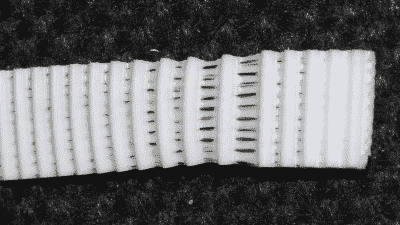

# 如何不设计 3D 打印皮带夹

> 原文：<https://hackaday.com/2018/12/16/how-not-to-design-a-3d-printed-belt-clamp/>

[马克·雷霍斯特]一直忙于他的*Ultra MegaMax Dominator*(UMMD)的 3D 打印机设计，在这个过程中他学到了许多东西，其中之一就是[如何**而不是**设计一个 3D 打印的皮带夹](https://drmrehorst.blogspot.com/2018/12/another-interesting-3d-printer-failure.html)。在过去，我们看到 UMMD 是如何放弃丝杠[的想法，转而支持皮带驱动的 Z 轴](https://hackaday.com/2018/01/04/huge-3d-printer-ditches-lead-screw-for-belt-driven-z-axis/)，但是[Mark]发现当皮带稍微摆动时，好像它们失去了张力，这有些不对劲。重新拉紧它们起了作用，但只持续了几天。原来，他选择的皮带夹设计导致了一个有趣的失败。

使用的皮带是普通的钢芯聚氨酯 GT2 皮带，夹具设计使用同一皮带的一小段将两端锁在一起，如上图所示。这是一个简单而有效的设计，但从长远来看是不可持续的。

问题是，这种设计导致皮带的塑料部分向外伸展，并在内部钢丝上滑动。聚氨酯的拉伸在这里显示的图像中很清楚，但任何皮带在设计时都会在夹具中遇到同样的问题。[Mark]意识到使用一种设计是一个更好的主意，在这种设计中，皮带可以自行折叠，因此张力分布更加均匀。

[Mark]一直在分享他建造 3D 打印机的经验和设计过程，所以如果你感兴趣，一定要去看看 UMMD 和它令人发指的 695 毫米 Z 行程。