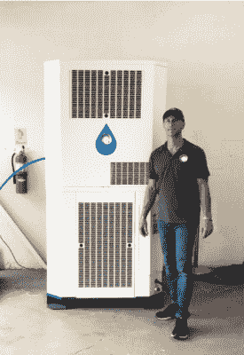
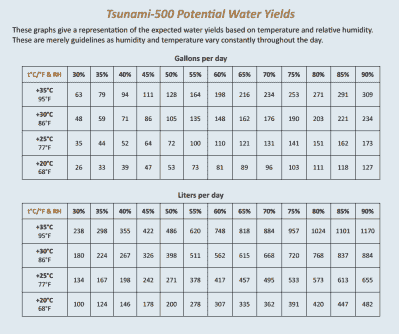

# 从空气中收集水有多实际？

> 原文：<https://hackaday.com/2021/10/29/how-practical-is-harvesting-water-from-the-air/>

水是维持人类生命所需的最珍贵的物质之一。不幸的是，在像加利福尼亚这样的一些地区，它已经开始枯竭了。

持续的干旱让一些人开始寻找替代解决方案，比如从空气中吸取水分。特别是，一家名为海啸产品的公司已经用它的大气水生成器在媒体上掀起了波澜，吹捧它们是干旱受灾地区的解决方案，[美联社*新闻*报道。](https://apnews.com/article/science-technology-lifestyle-business-california-bf3a376a4a23ab4ac88dfdb834613114)今天，我们将看看这些机器是如何捕捉水的，以及它们是否能帮助缺水地区。

## 简明的解释

海啸产品公司建造的系统被称为冷却冷凝型的大气水发生器。它们的工作原理与现代空调非常相似，都依赖于制冷回路。制冷回路用于产生冷表面，空气中的水在该冷表面上冷凝并被收集。在那里，水被过滤和净化，以去除任何可能从空气中捕获的病毒、细菌或其他污染物。

A Tsunami 500 unit pictured next to a human being for size.

这看起来很简单；基本原理很简单。收集凝结在凉爽表面的水，过滤，然后饮用！然而，我们通常不把空气本身看作水源是有原因的。这是因为能源成本，一句话，这是很重要的。本质上，运行这样的机器在功能上等同于运行大型空调。

例如，海啸产品提供的最小单元是[海啸 500](https://www.tsunamiproducts.com/products/tsunami-500) ，其价格约为 3 万美元，据报道每天能够输送高达 204 加仑(773 升)的水。这是一大笔水，大约足以满足两个美国人的日常需求——每人 82 加仑水。为了捕捉这些水，海啸 500 使用了惊人的 5.8-7.5 千瓦，这取决于周围的温度和相对湿度条件。把它乘以 24 小时，水的成本是 139.2-180 千瓦时。最好的情况是每加仑大约 0.68 千瓦时。相比之下，淡化海水，这已经被认为是能源密集型的，只需每加仑 0.0113 千瓦时。

## 如果我们使用可再生能源会怎么样？

对于那些有太阳能电池板和蓄电池的人来说，能源成本似乎不是问题。然而，对于那些坚持支付电网价格的人来说，在遭受干旱袭击的加州，这样一个装置每天的运行成本将在 27-36 美元左右，因为目前的能源价格约为每千瓦时 20 美分。考虑到加州目前的平均账单仅为每月 65 美元，这是一笔巨大的水费。

真正的关键是将这种技术与太阳能结合起来，以避免进一步加剧气候变化问题，而气候变化问题首先会导致高温天气和干旱。湾区男子唐·约翰逊住在贝尼西亚市，为了满足花园的用水需求，他给自己买了一台海啸 500。然而，他发现这台机器能够产生足够的水来满足他的花园和家庭用水。由于在他的屋顶上安装了大型太阳能装置，约翰逊在运行该系统时不必处理过多的电费。

Data on expected water yields in different environmental conditions for a Tsuanmi 500 device. Note that lower temperature and relative humidity causes a significant drop in production.

这种产品在市场上被宣传为在除了空气本身的湿度之外根本没有水的地方产生水的有用方法。他们确实可以这样做，但是条件必须合适。空气中必须有足够的湿度，温度不能太低。海啸产品公司总裁凯文·柯林斯表示，这种装置非常适合赤道两侧 10 到 15 度范围内的地区。“如果你在洛杉矶地区、旧金山或圣地亚哥，这些地区的气候通常不会结冰，”柯林斯说，并补充道“…我们可以在华氏 50 度以上的任何温度下制造水。”

## 现有空调能为此进行优化吗？

考虑到巨大的成本，这种技术尚未成为主流也就不足为奇了。据报道，在美联社新闻报道之前，海啸产品在 18 个月内仅售出 20 台。从那时起，该公司报告了大量的兴趣，并希望在年底前关闭 50 个订单。考虑到干旱带来的焦虑，那些有办法的人抓住机会确保他们自己的水供应也就不足为奇了。

然而，它确实提出了一个想法，也许这项技术可以用在更可持续的方式上。任何见过空调滴水的人都会熟悉其中的原理。也许有机会研究从商业和工业装置中的大型空调设备中捕获冷凝物，在那里冷凝物可以被净化以供现场使用。这可能会在不增加电力使用的情况下减少用水量，因为它依赖于现有的空调系统，因为它已经被采用。这不太可能在较小的家庭规模上起作用，因为这种系统收获的水量较低。然而，对于较大的安装，它可能证明是有益的。

然而，总的来说，从潮湿空气中生产水仍然是一项能源密集型的工作，因此成本很高。虽然大气水捕获可能会在离网地区和现金充裕的房主中找到一些应用，但它绝不可能成为加州和其他干旱地区水资源困境的普遍解决方案。将不得不采用更传统的节水和集水方法。