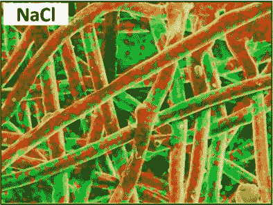

# 研究人员是如何用盐来赋予口罩抵御病原体的优势的

> 原文：<https://hackaday.com/2020/12/19/how-researchers-used-salt-to-give-masks-an-edge-against-pathogens/>

口罩被证明是对抗空气传播疾病的工具，但病原体——如新冠肺炎病毒——可以在口罩中聚集并存活，这使得处理和处置变得复杂。阿尔伯塔大学的研究员伊拉娅·鲁比诺最近获得了一个奖项，因为她的工作表明[用主要由盐和水组成的溶液(加上表面活性剂以帮助润湿过程)处理口罩的主过滤层可以帮助口罩灭活接触的病原体](https://www.nature.com/articles/s41598-020-70623-9)，从而使口罩可以重复使用。这种面罩通常是一次性使用的，并且在临床环境中，使用过的面罩被作为生物危害废物来处理和处置，因为它们可能含有活性病原体。这种盐处理赋予了面膜一种自我清洁的能力。

[Analysis showing homogenous salt coating](https://www.nature.com/articles/s41598-020-70623-9#Sec2) (red and green) on the surface of fibers. NaCl is shown here, but other salts work as well.

盐到底有什么帮助？沉积在口罩过滤层纤维上的非常细的盐涂层在接触空气传播的病原体时首先溶解，然后经历蒸发诱导的重结晶。因此，过滤器中捕获的病原体暴露于浓度越来越高的盐溶液中，然后受到物理损伤。将盐均匀地沉积在聚丙烯过滤纤维上需要一点技巧，因为合成纤维是天然疏水的，但润湿过程会处理好这一点。

纤维上的盐涂层非常精细，不会影响口罩的透气性，而且已经证明即使在恶劣环境下也很有效。该研究论文指出，“盐涂层在恶劣的环境条件下(37°C 和 70%、80%和 90%的相对湿度)保持了病原体灭活能力。”

同样，盐处理不会影响口罩过滤病原体的能力，但它会灭活截留的病原体，赋予口罩一种自我清洁的能力。对研究人员如何创造盐处理过滤器的具体细节感兴趣吗？[本文开头链接的论文](https://www.nature.com/articles/s41598-020-70623-9#Sec10)中的*方法*部分(以及同一主题的早期论文中的[方法部分)有所有的成分、零件号和尺寸。当你这么做的时候，也许](https://www.nature.com/articles/srep39956?#Sec8)[可以温习一下市面上可以买到的口罩和里面的东西](https://hackaday.com/2020/06/03/surviving-the-pandemic-as-a-hacker-peering-behind-the-mask/)。