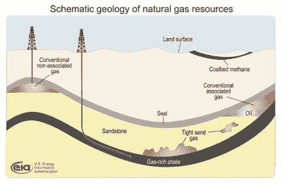
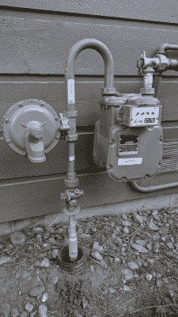

# 天然气电网的弹性如何？

> 原文：<https://hackaday.com/2022/08/24/how-resilient-is-the-natural-gas-grid/>

几年前，我设法让自己上了一个自称能源专家的人的邮件列表。实际上，似乎没有什么领域超出了他的专业范围，事实上，他的每封邮件都有一个用大写字母写的主题行，还有很多感叹号！！！！以他的真诚达成了交易。他喜欢吹嘘的一个事实是天然气是完美的燃料。它不仅燃烧清洁且相对便宜，还通过完全自供电的电网直接输送给消费者。即使在“僵尸启示录”的情况下，他声称天然气将继续流动。

当时，这似乎有点言过其实，但我认为至少有一点是真实的——足以让我在几年前从电灶和热水器转向燃气设备，并增加了燃气壁炉来补充热量。我只是想当然地认为天然气会流动，至少在最近北溪管道的混乱之前是这样。就在那时，我看到了运行这条管道所需的巨大涡轮压缩机的照片，其规模和复杂性似乎揭穿了天然气网自供电性质的谎言。

依赖这种设备的系统肯定不能完全自给自足，对吗？这个问题和其他问题在我的脑海中盘旋，所以我做了我在这些情况下总是做的事情:我决定写一篇文章，这样我就可以了解细节。以下是我发现的天然气分配是如何运作的，至少在北美是这样。

## 聚集在

评估我的全大写对话者的主张需要对油田地质学有一个基本的了解。2018 年，美国约有 12%的天然气产量来自所谓的伴生溶解源，其中天然气是石油生产的副产品。伴生气曾经被认为是一种公害，或者被排放到大气中，或者在油井中燃烧掉。伴生气通常溶解在原油储层的液相中，就像二氧化碳溶解在一瓶汽水的液体中一样。就像你突然打开汽水瓶的盖子一样，当钻井开采储层时，溶解在原油中的天然气会从溶液中冒出来。伴生天然气也可以是存在于原油储层中的气相，但不溶于液相。

Natural gas can often occur associated with oil reservoirs. Source: [US Energy Information Administration](https://commons.wikimedia.org/wiki/File:GasDepositDiagram.jpg), Public domain, via Wikimedia Commons

另一方面，一些天然气储层是非伴生的，在这些储层中发现的天然气不含任何重要的原油。非伴生天然气通常发现于不透水岩层覆盖多孔岩石(如砂岩)的地方，腐烂的化石植物产生的气体通过该层过滤。这些储层通常也承受着巨大的压力，一旦储层被开采，就很容易开采。在广义的非相关类别中，还有其他类型的天然气储层，如页岩气和煤层气。

无论是哪种类型，天然气储层的开采都是从钻井开始，并将其连接到集输管道网络。这些管道形成了一个巨大的网络，将数千口井与上游加工和管道系统连接起来。根据储层的类型，集气管可以输送未加工的天然气或液态原油。美国的岸上收集网络有大约 240，000 英里(386，000 公里)的管道，足以覆盖到月球的距离。

## 清理干净

原始天然气中通常不仅仅含有甲烷。根据储层类型的不同，天然气可以是甲烷、丙烷和丁烷以及水蒸气、二氧化碳甚至氦气等其他气体的混合物，也可以是原油和水的混合物，并伴有气体泡沫。大多数天然气井在进入收集系统之前至少需要进行一些处理，使用一种称为气体生产单元或 GPU 的设备。这些机器本质上是储层中的高压气体和收集系统中使用的低压气体之间的适配器。GPU 通过阻气门降低气体压力，但为了防止压力突然下降将气体混合物冷却到冰点，GPU 会加热工艺气体。在 GPU 的低压侧，一个水平分离器让水和液态烃沉淀出来，而气相上升。一些气体作为仪表气体排出，燃烧后为 GPU 的第一阶段提供热量。

 [https://www.youtube.com/embed/sBU-CSRC1zI?version=3&rel=1&showsearch=0&showinfo=1&iv_load_policy=1&fs=1&hl=en-US&autohide=2&wmode=transparent](https://www.youtube.com/embed/sBU-CSRC1zI?version=3&rel=1&showsearch=0&showinfo=1&iv_load_policy=1&fs=1&hl=en-US&autohide=2&wmode=transparent)

仪表气是天然气电网自供能性质的首批例子之一。仪表气被分流，为整个系统中的各种设备提供动力，这些设备的某些部分通常非常偏远，远远超出了电网的实际覆盖范围。除了在需要热量的过程中燃烧外，仪表气还可用于驱动发电机，为电气部件提供备用电源。原始天然气的压力有时也用于运行涡轮泵，并经常用于给储层加压和将产品压到地面。

## 压力下

In a dehydrator tower, wet natural gas flows up via bubble caps through TEG, drying out as it rises. The TEG is boiled to removed the water before being reused. Source [Kimray, Inc.]("https://kimray.com/training/gas-dehydration-system-overview)

水是管道运行的一个经常性问题。即使是被归类为“干气”储层的非伴生矿床，通常也会含有至少一些水蒸气，这些水蒸气可能会在管道内凝结并导致内部腐蚀，或者可能会冻结和堵塞管道。天然气脱水是为输送管道系统准备天然气的重要步骤。天然气通常使用化学处理工艺脱水，该工艺将湿气暴露于三甘醇或 TEG。三甘醇吸湿性很强，用于装有水平塔盘的高脱水器塔中。三甘醇进入塔顶，沿每个塔盘向下流动，而湿天然气进入塔底。气体通过 TEG 起泡，TEG 吸收溶解的水蒸气。脱水气体从塔顶排出，而湿的三甘醇从塔底流入重整器，重整器使用仪表气为燃烧器提供动力，燃烧器加热液体以去除水分，使三甘醇可以再次使用。

天然气干燥后，任何污染的丙烷或丁烷被清除，它准备进入传输系统。传输系统是大宗气体的长距离运输系统，由大直径、高压管道组成。在美国，有州际和州内管道，总长约 300 万英里(480 万公里)，每年运送约 2.7 万亿立方英尺(760 亿立方米)的天然气。

传输管道可在 200 至 1500 磅/平方英寸(1.3 至 10.3 兆帕)的压力下运行。为了获得有效输送气体的压力和流速，并补偿由于用户使用和管道摩擦引起的压力损失，输送管道沿线使用压缩机站。大多数传输压缩机由燃气轮机提供动力，而燃气轮机由正在运输的天然气提供动力。压缩机站从高压侧抽取天然气为燃气涡轮发动机提供动力，而燃气涡轮发动机又为压缩机提供动力——这是天然气电网自供电性质的另一个例子。当然，压缩机站也需要电力，电力由常规电网提供，或者由天然气驱动的备用发电机提供。位于电网之外的压缩机站通常完全依靠燃气发电机运行。

## 给顾客

The typical residential gas meter set is entirely mechanical and powered by the process gas.

虽然一些天然气客户，如发电厂和大型化工厂，可以直接从高压分配系统获得服务，但大多数最终用户实际上是由当地分配公司或 LDC 提供服务的。这些运营商维护着蜿蜒在大多数城市街道下的天然气总管、支管和计量装置的本地网络。最不发达国家与天然气输送系统保持一个或多个连接，并使用调节器降低其系统内的气体压力，使用流量计测量气体使用量。最不发达国家还负责注入甲硫醇添味剂，这种添味剂赋予天然气特有的气味。

总的来说，最不发达国家进行的压力调节和计量是机械性的；调节器倾向于使用隔膜和弹簧来将主管道中的压力降低到非常低的压力，通常只是许多燃气器具所使用的 psi 的几分之一。计量方法各不相同，但住宅和商业用户的计量表通常由在气体压力下膨胀的波纹管驱动，以记录气体流量。

像传输管道运营商一样，最不发达国家依靠电力为相当多的设备提供动力，包括监测和控制装置。在大多数情况下，最不发达国家和其他国家一样接入了电网。像输电运营商一样，他们也有天然气燃烧的备用发电机，以防当地停电，但几乎所有的主要配电功能都是由天然气本身的压力驱动的。

因此，虽然这个故事远比全大写先生透露的要多，但看起来他并没有远离事实。天然气网实际上基本上是自给自足的，无论发生什么情况都能持续工作。