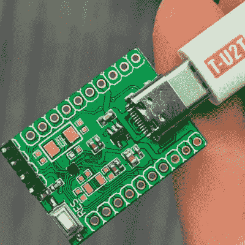

# 多小才算太小？

> 原文：<https://hackaday.com/2022/03/05/how-small-is-too-small/>

不是反问句！本周我们考虑最微型的微控制器:[hc32l 110](https://hackaday.com/2022/03/01/new-part-day-smallest-arm-mcu-uproots-competition-needs-research/)。它是最小的 ARM Cortex M0+部件的新头衔持有者。但是你真的能用它吗？

MCU is the black thing that’s smaller than the capacitor.

我记得很久以前，当我第一次学习焊接表面贴装元件时。一开始很麻烦，但是现在我不使用通孔元件，除非有人强迫我。我仍然自己做焊接——0603 真的没有熨斗那么糟糕，在那下面，总是有加热板。我的加热板也让我经历了两次真正需要放下球栅阵列部件的时候。老实说，并不像我担心的那么糟。

因此，也许是时候让我投身 BGA，设计一两块电路板，只是为了更熟悉这项技术。我可能不会一头扎进最深处，比如这里的 0.35 毫米球距特色芯片，而是坚持使用廉价 PCB 服务可以轻松处理的东西。我的经验告诉我，学习一件事情的最好方法就是去尝试。

现在，在芯片危机中去购物吧！祝我好运。

This article is part of the Hackaday.com newsletter, delivered every seven days for each of the last 200+ weeks. It also includes our favorite articles from the last seven days that you can see on [the web version of the newsletter](https://mailchi.mp/hackaday.com/hackaday-newsletter-649368). Want this type of article to hit your inbox every Friday morning? [You should sign up](http://eepurl.com/gTMxQf)!