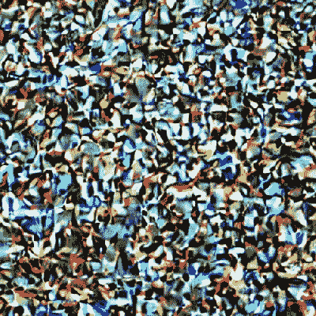

# 稳定扩散的艺术生成人工智能是如何工作的

> 原文：<https://hackaday.com/2022/10/24/how-the-art-generating-ai-of-stable-diffusion-works/>

[Jay Alammar]提供了一个关于稳定扩散如何工作的图解指南，其中的原则完全适用于理解类似的系统，如 OpenAI 的 Dall-E 或 Google 的 Imagen 如何在引擎盖下工作。这些系统最出名的可能是它们将文本提示(例如“天堂宇宙海滩”)转变成匹配图像的惊人能力。有时候。通常情况下。

“系统”是一个恰当的术语，因为稳定的扩散(以及类似的系统)实际上是由许多独立的部分组成的，这些部分共同作用来创造奇迹。[Jay]的图解指南在这里大放异彩，因为它从非常高的水平开始，只有三个组件(每个组件都有自己的神经网络)，并根据需要深入解释更深层次的情况，以及它如何融入整体。

Spot any similar shapes and contours between the image and the noise that preceded it? That’s because the image is a result of removing noise from a random visual mess, not building it up from scratch like a human artist would do.

有些人可能会惊讶地发现，图像创建部分并不像人类那样工作。也就是说，它不是从一张空白的画布开始，一点一点地从头开始构建一个图像。它始于一粒种子:一串随机的噪音。噪声在一系列步骤中被减去，使结果看起来不像噪声，而更像一幅美观的(理想的)连贯的图像。将这一点与以有利于符合文本提示的方式指导噪声去除的能力相结合，就有了文本到图像生成器的骨架。当然还有更多的内容，[Jay]为感兴趣的人提供了相当多的细节。

如果你不熟悉稳定扩散或艺术创造人工智能，这是一个变化如此之快以至于有时感觉无法跟上的领域。幸运的是，我们的 Matthew Carlson 解释了它是什么，以及它为什么重要。

稳定的扩散可以在本地进行。有一个很棒的开源 web UI ，所以没有比这更好的时间来开始体验了！