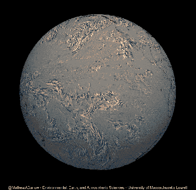
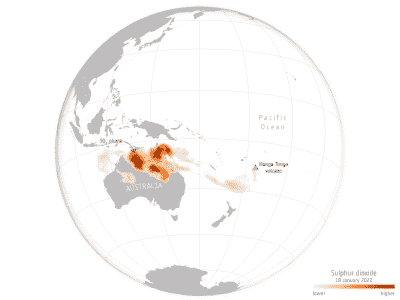

# 世界各地如何感受汤加火山爆发

> 原文：<https://hackaday.com/2022/02/01/how-the-hunga-tonga-volcano-eruption-was-felt-around-the-world/>

2022 年 1 月 14 日，洪加汤加-洪加哈帕伊火山开始了一次巨大的喷发，第二天将达到高峰。当汤加与世隔绝，海啸从欧洲地带袭来时，这座无人居住的火山岛很快成为头条新闻。

在这种规模的火山活动中，全世界都能感受到其影响。有了现代仪器，它们也能被正确理解。让我们来看看如何在全球范围内捕捉和测量洪加汤加火山爆发的影响。

## 深远的影响

The state of the Hunga Tonga-Hunga Ha’apai island in April 2021\. Credit: NASA

今年 1 月爆发的 Hunga Tonga-Hunga Ha'apai 火山岛有两个名字，因为它原本是两个独立的岛屿，在 2015 年由火山活动[连接起来，所以你知道这是一个地质活跃的地区。然而，这一次的火山爆发如此猛烈，以至于该岛几乎被完全摧毁，事后拍摄的卫星图像显示，该地区只有一小部分高地残留。](https://www.bbc.com/news/world-asia-60106981)

事件发生后，美国国家航空航天局报告说，这次喷发的威力是二战中投放在广岛的原子弹的几百倍，大约相当于 4-18 兆吨 TNT 炸药。火山灰被高高送入大气层，可能高达 50 公里，国际空间站的宇航员可以很容易地拍摄到这种云。

## 到处都是传感器

The pressure wave from the Tonga eruption as captured by the NOAA’s GOES-WEST satellite’s infrared radiance data. Animation credit: Mathew A Barlow, University of Massachusetts Lowell, [usage approved with attribution](https://github.com/mathewbarlow/animations)

然而，人们不需要国家太空计划的仪器和基础设施来探测如此大的事件。一位[爱德华·詹森]报道说，他自己在亚利桑那州凤凰城的气象站捕捉到了火山爆发带来的压力异常，该地区其他业余气象站也是如此。当然，这可能会被认为是一种异常现象，但数据证明了这一点。

事实上，通过[Daryl Herzmann]整理的国家气象网络的压力高度计读数，人们可以清楚地看到 1 月 15 日下午火山爆发产生的压力波穿过美国大陆[。国家气象局也同意他们自己的分析，显示压力波如何到达遥远的犹他州盐湖城和蒙大拿州格拉斯哥的](https://twitter.com/akrherz/status/1482834483762057223?ref_src=twsrc%5Etfw%7Ctwcamp%5Etweetembed%7Ctwterm%5E1482834483762057223%7Ctwgr%5E%7Ctwcon%5Es1_&ref_url=https%3A%2F%2Fwww.edwardjensen.net%2Fnews%2Fhunga-tonga-volcano-pressure-wave%2F6456%2F)[气象站。](https://twitter.com/NWSPhoenix/status/1482746491504529408?ref_src=twsrc%5Etfw%7Ctwcamp%5Etweetembed%7Ctwterm%5E1482746491504529408%7Ctwgr%5E%7Ctwcon%5Es1_&ref_url=https%3A%2F%2Fwww.edwardjensen.net%2Fnews%2Fhunga-tonga-volcano-pressure-wave%2F6456%2F)这种影响不仅仅出现在气象数据的波动图中；当压力波经过时，这座火山被认为是[驱散了西雅图](https://www.seattletimes.com/nation-world/pacific-volcano-erupts-with-explosive-force-heard-5000-miles-away/)的雾气。

Ash from the eruption was lofted high into the atmosphere. This photo of the eruption was taken from the International Space Station. Credit: [NASA](https://earthobservatory.nasa.gimg/149367/dramatic-changes-at-hunga-tonga-hunga-haapai)

分布式传感器网络对于追踪此类事件特别有用；我们自己也曾试图用类似的方法调查核事故，虽然没有成功。不过，顺便提一下，由全面禁止核试验条约组织维护的所有 53 个次声监测站都收到了[洪加汤加火山爆发的强大爆炸，这突出表明这一事件确实是核爆炸规模的。](https://eos.org/articles/the-surprising-reach-of-tongas-giant-atmospheric-waves)

正如你所料，地震传感器能够捕捉到火山爆发的隆隆声。美国地质调查局在推特上发布了图片[,展示了俄勒冈州胡德山的地震仪是如何记录这一事件的。与此同时，太平洋附近的](https://twitter.com/USGSVolcanoes/status/1482424543486435330?ref_src=twsrc%5Etfw%7Ctwcamp%5Etweetembed%7Ctwterm%5E1482424543486435330%7Ctwgr%5E%7Ctwcon%5Es1_&ref_url=https%3A%2F%2Fwww.oregonlive.com%2Fpacific-northwest-news%2F2022%2F01%2Ftongan-volcanic-eruption-registers-on-mount-hood-earthquake-monitors-plus-3-bonus-charts.html)[触发了海啸预警系统。](https://twitter.com/BuzzFeedStorm/status/1482411716239454210?ref_src=twsrc%5Etfw%7Ctwcamp%5Etweetembed%7Ctwterm%5E1482411716239454210%7Ctwgr%5E%7Ctwcon%5Es1_&ref_url=https%3A%2F%2Fwww.oregonlive.com%2Fpacific-northwest-news%2F2022%2F01%2Ftongan-volcanic-eruption-registers-on-mount-hood-earthquake-monitors-plus-3-bonus-charts.html)研究表明，虽然在远离汤加本土的许多海岸都探测到了 tusnami 波，例如在秘鲁和日本，但这些波很可能是由大气压力波与水的[相互作用产生的，而不是由地震事件本身产生的。](https://www.preventionweb.net/news/why-tonga-tsunami-arrived-much-earlier-and-much-larger-expected)

Data captured by the ESA’s Copernicus Sentinel-5P pollution monitoring satellite showed sulfur dioxide released from the eruption passing over Australia in the days after the event. Credit: [ESA](https://www.esa.int/ESA_Multimedimg/2022/01/Sulphur_dioxide_from_Tonga_eruption_spreads_over_Australia), CC BY-SA 3.0

除了此次事件产生的冲击波，火山活动的其他挥之不去的影响已经蔓延到世界各地。哥白尼 Sentinel-5P 任务捕捉到了火山爆发产生的巨大二氧化硫羽流，该羽流在 1 月 18 日飘到了澳大利亚。该卫星专用于污染监测，旨在跟踪大气中的气溶胶和微量气体。因此，它是监测气体云进程的完美工具，因为它在爆发后短短几天内就移动了 7000 公里。

## 你听到了吗？

然而，也许最令人惊讶的是，据报道，远在阿拉斯加也能听到火山活动，距离火山爆发的震中约 10，000 公里。[在一份来自](https://www.alaskapublic.org/2022/01/17/the-eruption-near-tonga-was-so-powerful-you-could-hear-it-in-alaska/) *[阿拉斯加州](https://www.alaskapublic.org/2022/01/17/the-eruption-near-tonga-was-so-powerful-you-could-hear-it-in-alaska/)*的报道中，居民们谈论着在周六早上被巨大的噪音吵醒。以音速传播——在海平面上大约 1225 千米/小时——这些噪音在喷发开始后大约八个小时被听到。

对于这样一次可以在全球范围内探测到的火山爆发来说，洪加汤加火山事件远没有岛上有人居住时那么糟糕。可悲的是，仍有 5 人死亡，18 人受伤，许多人仍然失踪。由于海底电缆受损，通讯中断，火山灰覆盖了周围大部分地区。令人欣慰的是，周边国家迅速部署了援助。

不过，事先得到警告比事后清理要好，火山爆发预测仍然是一个开放的研究问题。希望在这种情况下收集的数据能够更好地教育我们，帮助我们更好地减轻未来类似事件造成的损失。

【横幅图片: [NASA 地球天文台](https://www.earthobservatory.nasa.gimg/149347/hunga-tonga-hunga-haapai-erupts)镜头。去看看他们的动画 GIF 吧！]