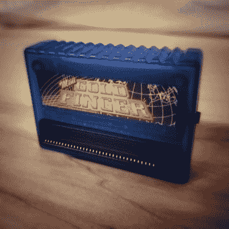

# 索尼 PlayStation 是如何被黑的

> 原文：<https://hackaday.com/2018/11/05/how-the-sony-playstation-was-hacked/>

操场是他们那个时代的评论区。每个工作日，从下午 1:17 到 1:43，有秋千要荡，有谣言要传播，有争论要解决，谁的声音最大(有些事情永远不会改变)。忠诚的形成和战线的划分仅仅基于你所支持的游戏机。正是这个游乐场系统延续了当时的城市神话。

对于 PlayStation 的粉丝来说，在《最终幻想 7》中有一个神话，如果你施展正确的咒语，你可以将艾瑞丝从她的命运中拯救出来，或者在《古墓丽影》中有一个秘密代码，可以让你看到整个萝拉·卡芙特。有一个神话是，没有人可以复制一个 PlayStation 游戏，因为所有的光盘底部都是黑色的。甚至第一个 PlayStation 的存在，超级任天堂 PlayStation 原型也是一个城市传说。不同的是最后一个被证明是真的。

让我们来看看 modchip 制造商试图击败原始 PlayStation 的版权保护和索尼保护其城堡的努力之间的猫鼠游戏。

## 给我给我动漫格斗小游戏

索尼的 PlayStation 是许多儿童游乐场游戏光盘的开端。事实证明，这种格式对开发者和游戏玩家来说都更便宜，而且它还有一个额外的好处，那就是可以放在耐用的塑料首饰盒里。这两种情况的结合导致了进口日本专用游戏的需求增加，但是由于从硬件和软件的角度来看 PlayStation 都是地区锁定的，因此需要一个中间设备。

Gold Finger game enhancer cheat device for PlayStation.

有许多这样的中间设备，[俗称游戏增强器](http://sadbuttru.tripod.com/index.htm)，允许用户欺骗游戏内菜单无法访问的代码，以及从其他地区启动游戏。PlayStation 的早期生产运行模型包含并行 I/O 端口，因此像金手指这样的游戏增强器可以通过并行端口直接连接，无需进一步修改即可播放最新的动画格斗游戏。

PlayStation 后来的版本将删除并行端口，并强制导入播放器进行适应，他们也确实适应了。探查 PlayStation 的内部结构成了绕过索尼区域锁定的唯一方法，在这个过程中，黑客发现了允许导入游戏启动的秘密。软件和硬件内存中都出现了区域特定的许可证密钥数据。这两个密钥必须匹配，光盘才能启动。随后，所有地区许可证密钥被转储并闪存到 PIC8 微控制器上，[一些首批 PlayStation modchips](https://web.archive.org/web/19980123150759/http://www.modchip.com:80/index2.shtml) 登陆互联网。现在，任何人只要在他们的游戏机里正确安装了 modchip，就可以玩 Asuka 120% Burning Fest 这样的游戏到午夜。

## 做摇摆凹槽

激光在，EPROMs 在。盒式磁带不再适用于视频游戏，因为所有这些全动态视频过场动画都需要存储在某个地方。通过在 CD-ROM 中采用标准化格式，索尼不能使用基于盒式系统的物理区域锁定机制。然而，他们确实拥有对光盘内容表的控制权。

除了地区特定的许可证密钥数据，索尼还在每张光盘的目录上压了一个特殊的坑。这个坑，也就是后来众所周知的[“摇摆凹槽”](http://www.psxdev.net/forum/viewtopic.php?f=70&t=1266)，对于消费级 CD 刻录机来说几乎是不可能复制的。为了在 CD-R 上刻录摆动凹槽，CD 写入器激光器需要被编程为在三维空间中物理移动。因此，获得专利的压制工艺同时实现了复制保护和区域编码。

<https://hackaday.com/wp-content/uploads/2018/11/ps1-reading-disc-with-startup-sound.mp3?_=1>

[https://hackaday.com/wp-content/uploads/2018/11/ps1-reading-disc-with-startup-sound.mp3](https://hackaday.com/wp-content/uploads/2018/11/ps1-reading-disc-with-startup-sound.mp3)

将复制保护与区域编码结合在一起的一个副作用是，那些在控制台中有 modchips 的用户可以同时绕过这两个过程。在 PlayStation 发布之前，基于 CD 的控制台，如 Sega CD 和 PC Engine CD，不包含压入光盘的复制保护。这些游戏机发布时 CD 刻录机的高昂价格足以阻止任何潜在的盗版者。然而，由于生产的规模经济和时间的推移，复制技术将超出 PlayStation 用户的预期无法为索尼所接受。

索尼在 modchip 领域变得明智起来，并能够将“反 mod 技术”写入流行游戏代码中，如 Grind Session 和 Dino Crisis 2。早期版本的 modchips 总是开启的，这使得它们在启动复制光盘后容易受到安全检查。为了应对这些额外的安全检查，包含所有许可证密钥数据的 PIC12 微控制器被焊接到 PlayStation lid 开关触点上。通过这种改变，modchips 将仅在启动期间使用，并在该序列之外停用，因此[“隐形 mod chip”](http://www.angelfire.com/super/modking/bin/whats_a_MOD_chip.htm)。

对于 PlayStation 来说，不可检测的 modchips 基本上已经玩完了。它们是在 PlayStation 生命周期的后期推出的，这意味着只有最专注的玩家才会安装一个。Modchips 也许能够击败 wobble groove，甚至满足世界对更多龙珠 Z 的需求，但他们无法击败 PlayStation 最大的城市神话。那些只是四处游荡。

尽管如此，索尼还是为 PlayStation 的黑底光盘保留了一点神秘感。在下面的 PlayStation Underground Volume 3 视频中，他们帮助延续了整个“防复制黑色光盘”的神话:

 [https://www.youtube.com/embed/2TnK8vyPUZI?version=3&rel=1&showsearch=0&showinfo=1&iv_load_policy=1&fs=1&hl=en-US&autohide=2&wmode=transparent](https://www.youtube.com/embed/2TnK8vyPUZI?version=3&rel=1&showsearch=0&showinfo=1&iv_load_policy=1&fs=1&hl=en-US&autohide=2&wmode=transparent)

