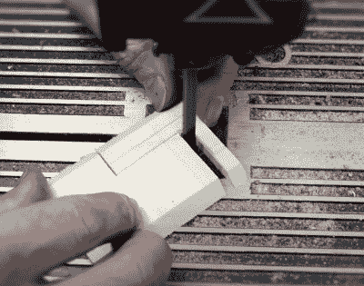

# 如何用好木头

> 原文：<https://hackaday.com/2021/09/06/how-to-get-good-with-wood/>

也许这并不奇怪，我们在 Hackaday 这里看不到太多的木工；毕竟，这是一个塑料和金属社区，如果曾经有过的话。但这并不意味着你永远不会遇到枯树需要按照你的意愿被砍伐或塑造的情况，所以我们感谢[【Eric Strebel】展示一些使用这种异常多功能建筑材料的技巧和最佳实践](https://www.youtube.com/watch?v=sMR2pVU5C4o)。

 第一个视频假设你是一个木材新手，讲述了你可能在业余爱好商店找到的不同种类的木材、合适的打磨技术，以及顺纹和逆纹切割的区别。你可以使用的一些不同的切割工具也包括在内，从简陋的业余爱好刀到带锯。像往常一样，[Eric]在视频中加入了他从丰富的专业经验中获得的技巧和诀窍，例如使用一些胶水和一些锯屑来填充不平整接缝留下的任何缝隙。

在第二个视频中，事情开始变得更高级。[Eric]演示了如何创建定制层压板，以及如何通过足够的蒸汽和夹紧压力将木材永久弯曲成任意形状。通过将这些新技术与第一个视频中的基本概念相结合，可以用最少的努力形成令人惊讶的复杂形状。

[【Eric】之前曾制作了一系列类似的关于丙烯酸树脂的视频](https://hackaday.com/2021/07/26/how-to-build-with-acrylic-using-the-tools-you-have/)，这种材料可以说是黑客读者更熟悉的材料。但是无论你使用什么材料，这个系列的信息是明确的:获得正确的工具，学习技术，专业的结果就在你的掌握之中。

 [https://www.youtube.com/embed/sMR2pVU5C4o?version=3&rel=1&showsearch=0&showinfo=1&iv_load_policy=1&fs=1&hl=en-US&autohide=2&wmode=transparent](https://www.youtube.com/embed/sMR2pVU5C4o?version=3&rel=1&showsearch=0&showinfo=1&iv_load_policy=1&fs=1&hl=en-US&autohide=2&wmode=transparent)

 [https://www.youtube.com/embed/U4VpAklt6pE?version=3&rel=1&showsearch=0&showinfo=1&iv_load_policy=1&fs=1&hl=en-US&autohide=2&wmode=transparent](https://www.youtube.com/embed/U4VpAklt6pE?version=3&rel=1&showsearch=0&showinfo=1&iv_load_policy=1&fs=1&hl=en-US&autohide=2&wmode=transparent)

