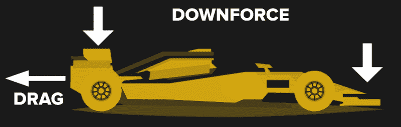
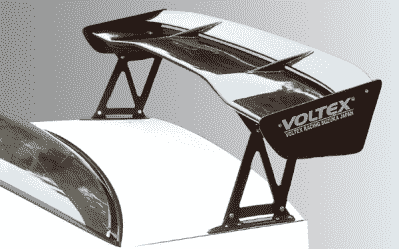
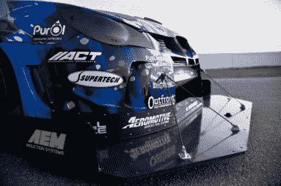
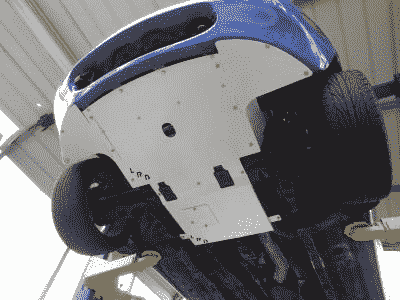

# 如何进入汽车:增加抓地力的空气动力学改装

> 原文：<https://hackaday.com/2020/08/19/how-to-get-into-cars-aero-mods-for-more-grip/>

1960 年，恩佐·法拉利说“空气动力学是给不会制造引擎的人的”。几十年来，这句话被证明是可笑的错误。几乎在赛车运动的任何一个分支，空气动力学都是任何一个认真对待性能的人的重要考虑因素。今天，我们将看看空气动力学如何影响你的赛车的性能，以及你可以进行哪些改进。

## 将获得的收益

根据你的最终目标，改善你的车的空气动力学可能意味着完全不同的事情。空气动力学影响一切，从最高速度，到燃油经济性，再到抓地力，针对这些不同的属性进行优化可能会采取截然不同的路线。通常，有必要在几个相互竞争的因素之间找到平衡，因为一个领域的改进往往会对另一个领域造成损害。

为了理解汽车的空气动力学，我们需要了解升力(或下压力)和阻力。阻力是与运动方向相反的力，使车辆减速。升力是垂直于运动方向产生的力。在飞行的情况下，升力是相对于重力向上产生的，使飞机腾空而起。在汽车领域，我们非常喜欢待在地面上。汽车上的机翼和空气动力学表面是为了产生相反方向的升力，将车辆向下推，并产生更多的抓地力。我们称这种“向下的升力”为下压力。

阻力由几个部分组成，很快会变得非常复杂。然而，对不同类型阻力的简单理解足以对车辆进行基本改进。最明显的元素是物体在流动中的横截面。车辆的一般形状在这里有最大的影响。像公共汽车这样的交通工具，其横截面几乎是扁平的矩形，会有很大的形状阻力。相反，更苗条，更流线型的形状有更少。还有升力引起的阻力需要考虑，这是由产生升力的表面产生的阻力，或者在这种情况下，是下压力。出于这个原因，f1 赛车和其他产生大量下压力的车辆都会遇到这种阻力。还有表面摩擦阻力，是空气沿着车身运动时产生的。通常，在探索车辆空气动力学时，这不是一个主要问题，但是值得注意的是，清洗掉车上的虫子通常会减少阻力的这一部分。

记住空气动力与速度的平方成正比也很重要。这意味着随着速度翻倍，下压力和阻力的空气动力翻了两番。对你的车进行空气动力学改造在高速行驶时效果最好。这意味着，如果你的主要赛车活动是停车场时速低于 60 英里的自动越野，你不会从空气动力学中获得太多好处。相反，如果你的主要追求是高速赛道工作，有许多超过 150 英里每小时的弯道，你可以通过正确的设置缩短几秒钟的单圈时间。

因此，改善你的汽车的空气动力学就是操纵下压力和阻力。这里应用是关键。如果你寻求终极的燃油经济性，最小化阻力是必须的，而下压力并不重要。相反，如果你正在创造一辆时间攻击车，你将需要尽可能多的下压力来保持高转弯速度。升力诱导阻力是一个必要的权衡，因为你会克服纯粹的马力。盐滩陆地速度赛车也将致力于将阻力降至最低，同时可能希望保持轻微的下压力，以保持车轮在地面上超过 200 英里/小时的速度。

像任何工程学科一样，这都是为了获得最佳性能而进行的深思熟虑的权衡。对于这篇文章，我们感兴趣的是 mods 产生更多的抓地力，帮助保持一辆专注于赛道的赛车粘在柏油路面上。

## 请增加下压力，不要吝啬下压力

你正在建造一辆赛车，旨在弯道超车，将你的竞争对手远远甩在身后。你已经有了粘性轮胎和顶级减震器——你现在需要让空气为你工作。这些模块将帮助你在你的追求，以减少圈时间粉碎。

## 后保护板

Most GT Wings are made of carbon fibre for its high strength and light weight. Adjustment is usually achieved with Allan keys.

获得真正赛车外观和增加下压力的一个很好的方法，在你的车后面有一个大的机翼是严重赛道朋友中常见的空气动力学模型。粘上鸭尾巴可以有一些小影响，但真正的收益，你会想要一个 GT 风格的机翼。

这些应该伴随着调整，允许迎角被改变；从而改变产生的下压力的大小。这是调整的一个重要方面，既可以避免过多的阻力，也可以获得正确的空气动力学平衡。过多的后下压力会导致高速弯道中的转向不足，因为压在后部的翼子板会降低赛车前部的牵引力。

将翼子板安装在正确的位置也很重要，不同的设置更适合不同的汽车。翼子板需要清晰的气流，并且能够有效地将下压力传递给车身。把机翼固定好是必须的——如果它从轨道上掉下来，你就有大麻烦了。

## 前分离器

This rather extreme front splitter is fitted to a time attack car. Note the rods, which can be changed in length to alter the angle of attack. This allows the amount of downforce generated to be tuned to suit the car and track.

前分离器是一种常见的修改，本质上与尾翼的作用相同，只是在前面。由于包装限制和需要看到前挡风玻璃外面，它们看起来有点不同，安装在前保险杠的底部。

前分离器有各种各样的设计，从温和到狂野。它们可以是简单的模制唇，有助于在汽车前部平稳地引导气流，也可以是带有调节器和多层边条和小翼的巨大碳纤维机翼，以获得最终的下压力。

对于街头车手来说，前者是常见的空气动力学模型和造型选择。后者通常限于全力进攻，而普通的追踪鼠介于两者之间。这些设备可以在速度上对前端抓地力产生巨大的影响，因为它们有助于将方向盘压入路面。

## 底架和扩散器

A front undertray can help by reducing turbulence and thus drag under the car.

尽管如此，对汽车空气动力学有重大影响的一个不太明显的方法是从下面看。通过小心管理这个区域的气流，就有可能产生大量的下压力。

不仅仅局限于专门制造的单座车，如果你对金属板和碳纤维有足够的冒险精神，甚至可以对大规模生产的街车进行改进。通常，这种情况下的目标是在气流到达后部的扩散器之前，使发动机罩区域下方的气流变得平稳，使前部分流器更好地工作。扩散器有助于产生下压力，它通过让车下的气流膨胀来减缓气流，从而产生低压区，将车吸到赛道上。

许多流行的跑车都有底架。他们也可以很容易地用金属板制造出来，供那些渴望建造自己的人使用。一般来说很难出错，平坦的底托总比没有好。关键是要让某些东西易于拆卸维修，而不是在汽车前部阻断必要的冷却气流。

扩散器稍微复杂一些，需要在设计中进行一些计算和预先考虑。同样重要的是，避免将组件放置在离热排气管太近的地方，或者使用能够耐热的材料。由于它们的复杂性和费用，它们通常被更铁杆的赛车手使用，而不是那些刚刚起步的人。

## 把系统作为一个整体来考虑

与功率更大的发动机或粘性更强的轮胎不同，空气动力学部件并不总是提高速度的简单解决方案。通常，在对空气动力学进行改动时，将车辆作为一个整体来考虑是很重要的。对于业余爱好者来说，一旦熟悉了赛车在赛道上的表现，空气动力学改装是最好的选择。例如，如果汽车在快速直道结束时突然刹车，前分离器可能会有所帮助。如果你注意到自从你安装了新的尾翼后，在高速弯道中转向不足，把它调低几档可能会有帮助。考虑零件将如何与汽车作为一个整体工作是最大限度地利用任何修改的关键！

虽然这篇文章不会帮助经验丰富的赛道螺母剃秒关闭在柳树泉，它应该作为一个指南，新手如何各种常见的空气动力学模块影响性能。知道如何和在哪里花钱是制造一辆跑车的主要部分，这个系列旨在帮助你完成这个任务。祝你好运，快乐的痛苦！