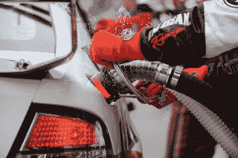

# 如何进入汽车:E85 燃料

> 原文：<https://hackaday.com/2021/12/23/how-to-get-into-cars-e85-fuel/>

如果你在过去几年里在改装车领域呆过一段时间，你可能听说过 E85。也许你甚至注意到了从坑里散发出来的一股甜味，或者听到人们开“玉米汁”的玩笑

这种由酒精和传统汽油混合而成的混合燃料，如果使用得当，可以带来显著的性能优势。今天，我们将探索这些是什么，以及如何设置您的骑行在 E85 上运行。

## 利弊

E85 至少名义上是 85%的乙醇和 15%的汽油的混合物。在一些国家，这是相当虔诚地坚持。然而，在美国，你在加油站得到的 E85 可以是 51%到 83%的乙醇，通常在寒冷地区和冬天会有较低的混合比例。这是因为乙醇基燃料的冷启动性能较差。然而，如果你买的是比赛级别的 E85，你可能会得到更接近这个名义比率的东西。

E85 is readily available from select gas stations in the United States. The ethanol content is typically produced from corn, hence regularly being referred to as “corn juice” or “corn sauce” at racetracks across the nation. Credit: [Mariordo](https://commons.wikimedia.org/wiki/File:E85_sale_4949_Maryland_03_2009.jpg "User:Mariordo"), CC-BY-3.0

E85 燃料的主要好处简单明了。乙醇的辛烷值比普通汽油高得多。根据美国使用的 [(R+M)/2 测量法](https://www.eia.gov/energyexplained/gasoline/octane-in-depth.php)，标准汽油的辛烷值约为 87，优质汽油高达 93，E85 燃料的辛烷值接近 103-105。

辛烷值是重要的，当谈到抗爆性。爆震发生在燃料空气充量爆炸而不是平稳燃烧时。奥托循环发动机(即气体发动机)可以通过提前点火火花的正时，在活塞在压缩冲程上升时使燃料燃烧，来产生更多的功率。然而，将正时提前太多，过早地燃烧燃料-空气充量，气缸中的压力会变得过高，导致燃料爆炸，而不是以更受控制的方式燃烧。这会很快损坏发动机。

正如优质汽油比普通汽油更抗爆一样，E85 也更抗爆。这允许发动机被调整为具有更大的点火正时提前，以及在强制进气发动机的情况下具有更大的增压。因此，这是可能的调整引擎，使更多的权力与 E85 没有经历损害，从爆震。

Racing series like V8 Supercars and IndyCar already use E85, both for its performance benefits and environmental credentials. The idea is that plants grown for biofuel production help fix carbon from the atmosphere. Credit: Getty Images

E85 比纯汽油具有更高的汽化潜热，这意味着当燃料喷入发动机时，它会从进气中吸收更多的热量。较冷的电荷产生更多的能量。

然而，对于管理 E85 来说，并不都是胜利。E85 每加仑比汽油少 27%的能量。这意味着在 E85 行驶时，燃油经济性通常会更差，在经过适当调校的车辆中，燃油经济性会比[差 20-30%](https://www.edmunds.com/fuel-economy/e85-vs-gasoline-comparison-test.html)。因此，要让 E85 产生同样的动力，发动机必须比汽油消耗更多的燃料。如果你在寻求一个提升，流速甚至会更高。

这种燃料还具有吸湿性，这意味着它可以从大气中吸收水分。这可能会使 E85 的保质期很短，因为含有过量水分的燃料表现不佳。对腐蚀的担忧通常被夸大了，但这种燃料在一些老式燃料箱中可能会有问题，特别是那些复合材料的燃料箱。80 年代及以前的老款汽车也可能有橡胶燃料系统部件，这些部件在乙醇存在的情况下会降解，堵塞燃料过滤器和喷射器。然而，从 90 年代后期开始的汽车通常都有这种保护；因此，E10 气体在全球范围内成为主流。

## 如何获得利益

所以，你已经了解了 E85 如何给你的引擎提供更大的动力，你渴望利用这一点。太好了！然而，除非你驾驶的汽车已经针对弹性燃料进行了调整，否则你可能需要做一些修改。然而，作为黑客，这就是我们的全部，所以准备好投入进去吧。

Dyno tuning is the best way to set up a car for maximum power running E85, allowing spark and fuel maps to be tuned accurately under controlled conditions. Credit: [AdamNavrotny](https://commons.wikimedia.org/wiki/File:4x4_Dynamometer.jpg), CC-BA-SA-3.0

你的引擎首先需要的是调音。如果你的车在出厂时就有一个锁定的引擎管理系统，你可能需要用一个独立的可调 ECU 来完全替换它。或者，如果你有合适的工具，一些汽车从工厂有可调谐的 ECU。无论哪种方式，你都需要能够控制火花时间和你的燃料地图，以获得最大的 E85。

提前计时，并在强制感应应用中增加增压，这是释放更多功率的方式，同时必须调整燃料图，以考虑这些变化，并弥补 E85 的较低能量值。Dyno 调谐是最好的，因为它允许外部变量得到控制，但真正富有冒险精神和经验的人总是可以尝试道路调谐。

你可能还想运行一个弹性燃料传感器，这样你的 ECU 就可以处理燃料中不同的乙醇含量。E85 泵并不随处可见，我们很少有人在加油时完全排空油箱。加油站出售乙醇含量从 51%到 83%的混合燃料只会增加混乱。如果你在半罐纯汽油的顶部倒入 51%的乙醇，你的功能辛烷值将是 E25，大约在 90 度左右。如果你的曲调期待辛烷值超过 100，你会很快得到敲。一个灵活的燃料传感器可以让你的汽车根据汽油和 E85 进行调节，然后根据燃料管道中检测到的乙醇含量进行插值。

或者，如果你驾驶一辆老式点火和碳水化合物装置的汽车，你需要运行一些酒精安全的燃料管线，扭转分配器多一点点，并改变喷射流更多的燃料。你可能还想为你的碳水化合物买一个 [E85 工具包，以确保旧的垫圈和密封件不会与乙醇发生反应。或者，从一开始就设计运行 E85 的碳水化合物就存在，专门设计来处理所需的更高的燃料流量。然而，没有简单的方法用碳水化合物装置来做弹性燃料，所以如果你调 E85，不要指望汽车能跑得很好或者根本不用普通汽油。](https://www.holley.com/blog/post/tech_tip_e85_conversion_on_a_4150_qft_carburetor_/)

The Koenigsegg CCXR is a great example of the benefits of E85, with the vehicle making a full 25% more horsepower than its conventionally-fueled counterpart. Credit: [Fpm](https://en.wikipedia.org/wiki/Koenigsegg_CCX#/media/File:Koenigsegg_CCXR_Edition_(1_von_2).jpg), CC-BA-SA-3.0

除此之外，你可能会发现你的燃料系统也需要一些修改。减少 30%的能量密度意味着你的发动机需要比以前多得多的燃料，如果你的燃油泵没有足够的空间，那么它可能会很快在 E85 上耗尽。因此，一个更大的燃油泵往往是切换到 E85 运行的关键。类似地，如果你发现你的喷射器在 100%的工作循环下都没有足够的燃料，你可能需要升级到更高流量的装置。

做完这些，你应该有一辆在 E85 上快乐行驶的车了。在自然吸气应用中，增益通常在 5-10%左右。这不是一个巨大的数字，但它可以与其他东西结合使用，如高压活塞，或者它可以帮助一个高度紧张的比赛引擎运行稍微冷却。

然而，在强制诱导下，E85 获得了它自己的地位。它的防爆震能力通常允许涡轮和增压发动机在不引发爆震的情况下运行更多的增压。这些额外的空气可以与更多的燃料混合，产生更多的动力。一个很好的例子是科尼赛克 CCX，它用优质汽油生产了 806 马力，而它的兄弟，CCXR，在 E85 上运行，输出了 1018 马力，整整多了 25%。

## 摘要

如果你有一辆现代的燃油喷射汽车，和一个可调谐的 ECU，你会发现切换到 E85 是最好的性价比最高的汽车之一。然而，如果您的汽车需要重大的燃油系统升级或新的发动机管理系统来做出改变，价值主张可能不会叠加。无论如何，E85 是一个伟大的性能燃料，有收获。如果你决定开始用玉米酱开车，我们祝你好运，祝你黑客生涯愉快！