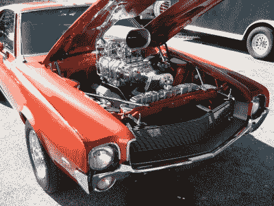
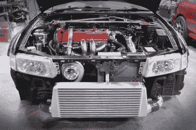
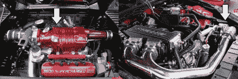
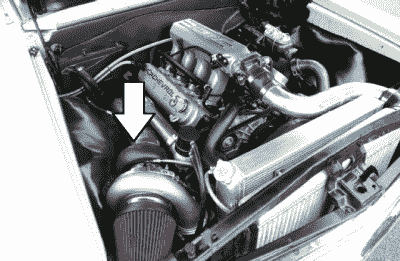

# 如何进入汽车:强制感应

> 原文：<https://hackaday.com/2020/04/16/how-to-get-into-cars-forced-induction/>

对于那些沉迷于汽车刺激的人来说，总有一种潜在的对更多动力的渴望。对于那些追逐更大数字的人来说，强制诱导是最有效的实现方式之一。除了更多咕噜声，你还会听到一大堆有趣的新声音。对于那些有自然吸气车的人来说，这里是你如何转换到强制感应的方法。

## 增压器和涡轮增压器

当我们谈到强制进气时，我们指的是在压力下迫使更多的空气进入发动机。有了更多的空气，就有可能完全燃烧更多的燃料，产生更多的动力。两种最常见的方法是增压和涡轮增压。我们将在这里使用常见的汽车术语，所以那些渴望争论 20 世纪早期飞机工业术语的人最好在评论中讨论。

A large supercharger installed on a V8 engine in a drag racing car. Note the large toothed belt which turns the supercharger – this helps avoid belt slip.

增压器本质上是空气压缩机，通过连接到发动机曲轴的皮带运转。当你的引擎旋转得更快时，增压器旋转得更快，产生更多的空气压力或增压，从而给引擎更多的空气来工作。

因为增压器的输出随着发动机转速而变化，所以它们非常适合提供动力提升，同时保持发动机可预测的线性动力输出。安装通常也很简单——包括一根进水管、几个支架和一根新皮带和滑轮。

然而，机械增压机有一个缺点——它们需要发动机提供大量动力才能运转。这显然比他们增加的功率少，但这是一个必须考虑的寄生损失。他们也倾向于有一个 powerband 问题。由于增压器的转速随着发动机转速的变化而变化，如果它被设置成只产生足够的增压，那么在低转速下它会有点乏味。总要有所取舍。

A diagram of a typical turbocharger install on a gasoline engine.

涡轮增压器也压缩空气进入发动机，但压缩机叶轮不是由皮带驱动，而是由发动机废气驱动的涡轮带动旋转。这实质上是利用浪费的能量为发动机增加动力，消除了增压中固有的寄生损失。

由于涡轮增压发动机的转速与发动机转速不同步，因此如果设置得当，涡轮增压发动机可以在整个转速范围内产生大幅提升，从而更容易提供低端扭矩，而不会牺牲太多的高端功率。

然而，涡轮增压器遭受了所谓的涡轮迟滞。这是从你踩下油门到废气推动涡轮达到产生增压的水平之间的延迟。为您的应用选择合适尺寸的 turbo 并使用现代设计有助于减少这种情况，但旧的设计或糟糕的器件选择会产生明显的滞后。80 年代的涡轮增压车就是为此而重新命名的，当加速时会有非常突然的动力输出。在街道和公路赛车应用中，这可能很难处理。

还有复杂的情况。涡轮增压器的安装需要进气和排气两方面的重大修改，并且通常是更困难的安装。你还会有一个废气门，当达到所需的增压水平时，它会倾倒多余的废气，可能会有一个增压控制电磁阀在线控制它何时打开。此外，您可能希望安装一个放气阀，以便在松开油门时释放过多的进气压力，从而避免压缩机失速，否则会造成损坏。

增压器和涡轮增压哪个更好取决于你的应用。根据你的车，你可能会发现有更多现成的增压器或涡轮增压器套件，你可能会有自己的想法，你更喜欢哪个。没有唯一正确的答案——从根本上说，它是你的构建。权衡利弊，对照你希望这辆车达到的目标来看待它们。如果你正在寻找一个简单的安装和一个中等功率的肿块，增压器可能是去。如果你想要巨大的功率数字，并能处理麻烦，涡轮可能更适合你的速度。

## 什么是中冷？

A large front-mount intercooler installed on a Mitsubishi Lancer EVO.

涡轮增压器和增压器都压缩空气，迫使更多的空气进入发动机，加热空气。较热的空气密度较低，会降低功率输出，所以理想情况下，我们希望空气尽可能保持凉爽。此外，它增加了燃料爆炸而不是平稳燃烧的机会，也称为发动机爆震。这可能会损坏发动机，所以最好避免。

为了减少这个问题，许多设置包括在充电器和发动机之间运行一个中间冷却器。这可以是空气对空气的散热器或空气对液体的装置。这有助于消除进气充量中的热量，提高功率并降低发动机爆震的可能性。中间冷却器并不总是必需的，但没有一个，进气温度和爆炸的威胁将限制你的最大功率。根据您的目标，这对于您的设置可能是问题，也可能不是问题。

## 完成安装

Superchargers come in a variety of types and styles. Left, we see a Roots-type blower that bolts directly to the engine’s intake ports, while on the right, we see a centrifugal blower mounted on an accessory bracket.

如果你想带一个增压器，除了压缩机，你可能需要一个支架把它固定在发动机上，一个皮带和滑轮系统让它旋转起来，还有一根管子把增压器的输出连接到进气歧管。皮带轮尺寸决定了曲轴和增压器之间的传动比；通常情况下，任何套件都有几种不同尺寸的皮带轮来改变增压压力。如果没有适合您的应用的套件，您可以自己组装零件。

A large single-turbo install on an LS engine. Note the air-to-air intercooler mounted in front of the radiator.

如果你选择涡轮增压，你首先需要一个涡轮。你需要一个排气歧管将气体输送到涡轮，一个排气管将涡轮的废气排出车外。你还需要用一根管子把压缩机的输出接到进气歧管上。

如果你的涡轮有一个内部废气门，你需要从进气口到废气门执行器运行一个增压参考线。如果它有一个外部废气门，你仍然需要这样做，但你也需要安装废气门到排气。你也可以选择运行一个排污阀。当你突然松开油门时，这个阀门可以释放进气歧管中积聚的压力。这种压力积聚会使涡轮增压器中的压缩机叶轮失速，从而造成损坏，因此，放气阀通过排放到大气或返回到涡轮增压器前的进气口来防止这种情况。如果你想在每次踩下油门时都发出那种美妙的“嘶嘶”声，你会想向大气中排气。

不管你用的是增压器还是涡轮增压器，你现在都在给发动机增加更多的空气。因此，你现在需要添加更多的燃料。对于燃油喷射汽车，最好的解决方法是使用售后电子控制单元。这允许为您的设置定制燃料和点火图，允许您确保空气燃料比是正确的，并且您不会运行过多的点火正时而导致爆震。一般来说，雇佣一个有经验的调音师是一个好主意，因为他们可以在不启动引擎的情况下设置你的地图。

对于化油器设置，你会想给自己一个 carby 设计的工作与升压参考，以确保正确的燃料量到达气缸。再次，一个有经验的调音师的服务是无价的，以确保你得到了正确的东西。

最后，你现在会想只运行优质燃料。当你的发动机在增压状态下运转时，使用高辛烷值的燃料来避免爆炸是很重要的。否则，在你意识到之前，引擎盖下就会有一个船锚。

## 潜在警告

将你的引擎切换到强制感应是一个重大的改变，并且伴随着许多陷阱。你可能会发现，运行到你的发动机增压导致弯曲连杆，破坏发动机。您的燃油泵可能无法提供足够的燃油来跟上额外的空气，或者您的喷油器可能流量不够。或者，你的引擎可能运行得很好，但提供了太多额外的扭矩，以至于在第一次启动时就烧坏了你的离合器或损坏了你的变速箱。

一些或所有这些可能会发生在你身上，或者另一个有趣的和可怕的灾难可能会降临到你的车上。避免所有这些的最好方法是研究。几乎每辆车的引擎盖下都有人检查过，而且有很多关于通用部件极限的知识。众所周知，福克斯车身野马的 5.0 喜欢在 500 马力左右突破障碍，正如众所周知，马自达 MX-5 的 B6 在输出 4000 转/分以下的高扭矩时往往会弯曲杆。你的社区将会是一个很好的向导。如果你正在做一件独特的事情，没有人知道，那么好消息是——你的工作就是发现并与每个人分享你的成果！

进行强制诱导并不容易。YouTubers 会向你展示一辆 150 美元的 turbo，让它看起来不在话下，但实际上，你需要在支持组件上花一大笔钱。强大的汽车改装商最近做了一件很棒的工作，打破了这个神话，[展示了他们在丰田雅力士上安装的易贝涡轮增压装置，最终以令人垂涎的 13，579 澳元成交。哦，不管怎样，它在发射几下后就爆炸了。](https://www.youtube.com/watch?v=QhI2rgR6xBM)

尽管困难重重，但如果你有钱有勇气，还是会有很多收获。做好你的研究，当事情开始出错的时候，准备好把你最初的预算翻三倍。但最重要的是，带上你的扳手和几个朋友，开始吧！