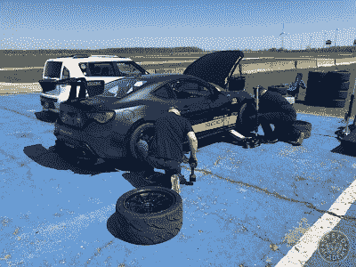
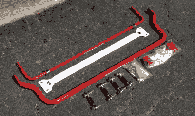
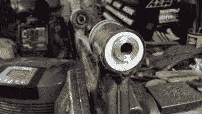
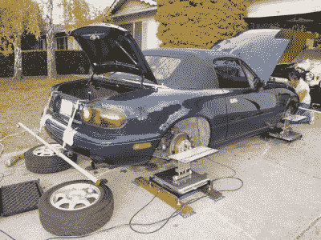

# 如何进入汽车:处理改装

> 原文：<https://hackaday.com/2020/03/10/how-to-get-into-cars-handling-mods/>

作为一名初露头角的汽车发烧友，你终于冒险为自己赢得了一辆可爱的工程车。从头到尾检查一遍之后，[你已经完成了基本的维护，现在它运行起来像陀螺一样。](https://hackaday.com/2020/02/12/how-to-get-into-cars-basic-maintenance/)现在你变得越来越舒适，你已经将目光放在将你简陋的坐骑变成一台转角雕刻机上。这里有一个让你开始的指南。

# 这都是抓地力的问题

当谈到创造一个处理怪物时，目标是创造一辆像胶水一样粘在路上的汽车，当它挣脱时是可控的。当你在赛道上奋力拼搏时，拥有一辆在极限状态下操控自如的赛车是一个很大的帮助，尤其是对于一个没有经验的车手来说。而且，无论你是在周末去峡谷，还是试图缩短你的 laptimes，有更多的抓地力总是好的。通过选择正确的零件和正确的设置，有可能磨练你的汽车的转弯能力，使它成为一种快速和艰难驾驶的有益体验。

## 车轮和轮胎

A good set of semi-slicks will shave seconds off your laptime, but beware – they’ll wear incredibly quickly in normal road use. Source: [Speed Academy](http://speed.academy/100-tread-wear-track-tire-review-nankang-ar1-maxxis-rc1-toyo-r888r/?doing_wp_cron=1582951547.7578229904174804687500)

你车上没有其他部件像你的车轮和轮胎一样对操控有如此大的影响。不管你的悬挂设置如何，不管你在引擎盖下做了什么，如果你开着光秃秃、湿滑的轮胎，一切都将化为乌有。你的轮胎是连接汽车和道路的纽带，因此当你想在弯道中跑得更快时，这是你应该首先升级的地方。

选择车轮和轮胎时，有几个因素会起作用。你会想要一套又好又宽的车轮，这样你就可以用足够的抓地力来安装大轮胎；然而，你的车的几何和警卫将限制你能走多远。高功率的轨道构建通常会切割金属板并安装过度弯曲以适应更宽的橡胶，而低功率的构建通常可以在没有这些极端措施的情况下获得通过。车轮直径取决于您汽车的悬挂设置。大多数汽车都有一定的车轮尺寸，这是性能和轮胎选择之间的最佳权衡。例如，早期的 Miatas 在 15 英寸的车轮上表现很好，而 RX-7 在 17 英寸或 18 英寸的车轮上表现更好。

Lightweight wheels are a great way to improve handling, but come at a price. Carbon fibre wheels are the latest tech in this area, but cost a fortune. Forged wheels are a more usual choice for the amateur track racer. Source: [Carbon Revolution](https://www.carbonrev.com/)

体重也起着很大的作用。车轮和轮胎算作簧下重量，即没有被悬架部件支撑的重量。由于惯性较低，重量的减轻使悬挂组件更容易保持轮胎与路面接触。此外，他们也是旋转重量，减少这有助于汽车加速和减速更快。轻质车轮价格昂贵，但性能提升却非常显著。严重的赛道爱好者将花大价钱购买一套轻质锻造车轮，更轻的碳纤维产品以更高的价格慢慢进入主流。

轮胎配方也很重要，这取决于你如何使用汽车。对于偶尔赛道日的街道使用，高性能公路轮胎是最好的——想想韩泰维恩托斯 RS4 或米其林 Pilot Sport 4。如果你正在寻找超级粘的比赛轮胎，你仍然可以在路上开车去赛道，考虑像南康 AR-1 这样的半光滑轮胎。或者，如果你开着车去参加活动，你可以全力以赴。但是，不要在正常驾驶时使用半光头胎或光头胎——它们在雨天很危险，会很快磨损。当然，如果你参加拉力赛，你将会关注专门的泥胎或砾石胎。

车轮和轮胎升级通常是在赛道上获得最大收益的最便宜的方式。如果没有好的轮胎把你粘在路上，你做的任何其他改装都不会有效，所以先做这个是值得的。

## 冲击和弹簧

很可能你要考虑的下一个领域是升级到一套更好的减震器和弹簧。通常，汽车都有一个平衡舒适性和操控性的设置。通常，爱好者愿意牺牲前者来获得更多的后者。

一种选择是采购一套降低弹簧来降低汽车的行驶高度。这降低了重心，有助于提高操控性，缺点是使颠簸和坑洼更难处理。通常情况下，这种弹簧会比普通弹簧更硬，以帮助轮胎更好地与路面接触，尽管这样做的代价是乘坐更不舒适。这种修改通常与一组为降低行驶高度而设计的高性能减震器一起完成。对于寻求更好的操控性而又不牺牲太多日常驾驶性能的车手来说，这是一个很好的选择。

Adjustable coilovers are the go-to choice for those after serious handling gains. However, there’s often a trade-off to be made with regards to comfort. Source: [KW Suspensions](https://www.kwsuspensions.net/mazdamx5)

或者，现代汽车上一个更受欢迎的选择是切换到 coilover 设置。这种情况在日本车上最为常见，在日本车上，螺旋弹簧以单一组件的形式放置在减震器上。Coilover 设置通常带有可调的行驶高度和阻尼，允许汽车以更积极的方式进行设置。通常还可以添加曲面片，进一步提高可调节性——这在尝试调节比赛应用的最终设置时非常有用。权衡是，通常，coilover 设置旨在更严重的轨道使用，并可以给相当苛刻的道路行驶。然而，对于那些花大量时间在赛道上，追逐最后一秒钟的人来说，他们是一个很好的选择。

更换减震器和弹簧是提高汽车操控性的好方法，但也很容易毁了你的车。购买高质量的零件并了解它们对你的汽车的影响是很重要的。例如，一套 200 美元的易贝爱侣，除了让你的汽车像轮子上的砖头一样好用之外，没什么作用。一套 3000 美元的奥林斯赛车避震器在赛道上会很棒，但去商店可能会有点贵。你从 Craigslist 上获得的那些降低弹簧可能会消除你汽车的车身侧倾，但你将很难进出你的倾斜车道。关键是提高你的操控性，但不要太低或太僵硬，以免破坏你的驾驶。

## 摇摆吧

Aftermarket swaybars are a great way to tune the handling balance of your car. Source: [Brian Cuison](https://bcuison.wordpress.com/2014/09/01/miata-build-well-that-was-quick-new-suspension-components-wheels-and-some-tow-hook-rice-part-three/)

防摆杆是连接左右悬架部件的部件，有助于减少车身侧倾。它们并不适用于所有的汽车，但相对来说比较常见，对操控有很大的影响。安装更硬的防晃杆有助于减少快速转弯时令人不安的车身侧倾。

此外，它们还可以根据您的喜好调节车辆的转向过度或转向不足特性。安装较硬的前 swaybar 或较软的后 swaybar 可以帮助减少转向过度，而安装较软的前 swaybar 或较硬的后 swaybar 可以减少转向不足。如果适用，也可以完全删除它们。

售后 swaybars 可用于大多数汽车的运动自命不凡。在做了一些基本的升级后，当你开始发现你的设置的弱点时，这是一个考虑调整的好地方。如果你要升级到一套售后摇摆杆，你可能已经用一套减震器和弹簧降低了你的车，所以获得一套可调节的末端连杆将有助于你正确安装东西。跳过这个步骤并使用股票交换条链接会导致预加载条的问题，并使安装变得困难。此外，一些汽车在安装升级杆时需要额外的支撑；一定要研究你的车的常见设置，以避免令人讨厌的意外。

## 轴衬

Installing a fresh set of bushings can make your car feel brand new, and reduce play in your suspension and steering. Upgrading to stiffer polyurethane parts can sharpen handling, but comes with a penalty to noise, vibration and harshness. Source: [SADfab](http://sadfab.com/)

衬套是坚硬而又柔韧的部件，将悬架的各个部件连接在一起。通常，库存衬套是由橡胶制成的，中间有一个钢套筒来定位螺栓，并允许悬挂组件移动。它们有助于将路面振动与汽车的其他部分隔离开来，并作为悬架系统中的另一种阻尼机制。

如果你有一辆车龄超过 20 年的工程车，很可能工厂的橡胶衬套已经变得很累，开始老化。用一套新的来替换它们可以帮助减少你的悬挂和转向的间隙，让你的车感觉像新的一样。

然而，也有升级选项。通常可以订购由聚氨酯而不是橡胶制成的售后衬套，这有助于显著提高操控性。这是因为聚氨酯材料的刚度更大。缺点是，如果不定期润滑，这些灌木经常会发出吱吱声，这使得它们在日常道路使用中很痛苦。对于一些受欢迎的跑车，如马自达 Miata，有可能改为采购售后衬套仍然是橡胶，但比股票硬。这些可以是一个很好的选择，那些想升级性能，而不处理聚氨酯衬套的头痛。

## 设置和校准

It’s possible to do your own alignment at home, though most elect to hand a list of specs to a dedicated alignment shop. Source: Bernice Loui

所以，你已经向你的车扔了一大堆零件，现在你准备开得更快了，对吗？不对。安装升级的悬挂组件是一回事，但如果没有正确的设置，你会有一段糟糕的时间。在可调减震器、外倾角、前束和弹簧刚度之间，你需要做很多事情来保持你的车指向正确的方向。

对于新手来说，这是向专家学习的关键。找到一家舒适的改装汽车维修店是关键；你当地的润滑油轮胎真的不能胜任这里的工作。他们将能够帮助指导你正确的对齐设置，给你一个急转弯和可预测的处理。他们还会告诉你如何设置减震器，以及你是否有足够的轮胎来完成这项工作。其他重要的信息来源是论坛和汽车俱乐部——其他拥有类似汽车的车主会很乐意告诉你如何正确设置你的汽车。他们不仅会告诉你哪些部分是好的，还会告诉你如何通过正确的设置来充分利用它们。

一个很好的实际例子就是 [SuperMiata 校准页面。](https://supermiata.com/miata-race-alignment-info.aspx)最初的马自达 Miata 是过去 30 年来最受欢迎的赛道汽车之一，关于如何在赛道上发挥车辆的最佳性能，有着丰富的知识。该页面描述了几种不同的校准设置，以及它们的预期用途和使其工作所需的其他部件或修改。这是一个有用的资源，为那些新定制的汽车处理增益。许多受欢迎的汽车也有类似的资源。如果做不到，问问你当地的俱乐部或校准店也无妨！

## 这一切都是为了妥协

当你为你的项目车选择零件时，你需要做正确的研究并决定你愿意做出什么样的取舍。你将为一辆全力以赴的轨道车做出的选择不同于那些仍然需要让你在周一上班的周末峡谷雕刻家。

虽然这些建议不会让你在第一年就赢得全国冠军，但对于初学者来说，它们是一个很好的起点。在家里的车库里，不需要太多昂贵的工具，就可以更换这些部件。通过观察其他人在他们的构建中使用了哪些部分，很容易就能知道你需要哪些部分来实现你的目标。祝你好运削减那些 laptimes，并快乐黑客！