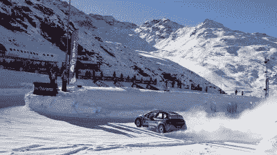
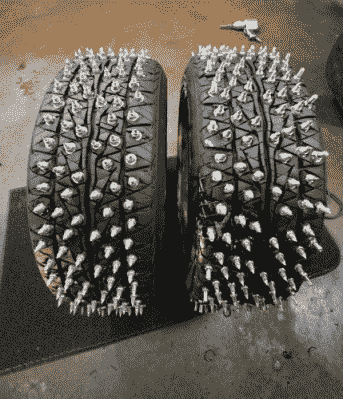
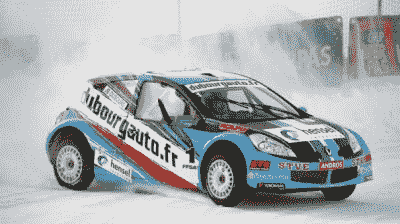
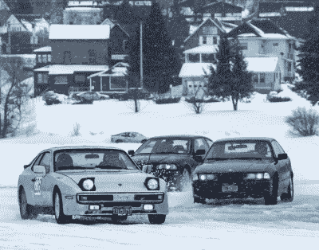

# 如何进入汽车:冰上赛车 Mods

> 原文：<https://hackaday.com/2021/06/03/how-to-get-into-cars-ice-racing-mods/>

通常，当遇到恶劣天气时，结冰是最糟糕的驾驶条件。在这种情况下，普通轮胎几乎没有抓地力，事故也很常见。然而，有些人选择对这样的挑战一笑置之，开始在冰冻的湖泊和河流上比赛。不过，冰上赛车可能是一项要求很高的运动，所以你需要适当地准备你的赛车。以下是方法。

## 冰，冰，宝贝

The highest tier of ice racing is the Andros Trophy, conducted in France each year. Competitors in the top class compete in mid-engined V6-powered cars with AWD and four-wheel steering.

冰上赛跑在很大程度上仅限于气候较冷的地方，那里的湖泊、河流甚至真正的赛马场在冬天都会结冰。虽然一些有限的冰上比赛确实在室内溜冰场进行，但很大程度上仅限于摩托车和全地形车，因为这些设施对汽车来说太小了。

冰上比赛依赖于天气和深奥的性质意味着它存在于有组织的赛车运动的边缘，大多数赛事都是基层社区举办的。通常，新的竞争对手将从“跑什么跑什么”的级别开始，未经改装的街车参加有限或无接触的比赛，如计时赛或短程加速赛。更高的级别通常需要更严格的准备和安全设备，如防滚架和灭火器，以及在更大的赛道上进行竞争性的门对门比赛。然而，一些专业比赛确实存在，运行专门定制的管框架汽车。其中最著名的是 Andros Trophy，在法国阿尔卑斯山举行，由同名的 jam 公司运营。

## 轮胎

冰很滑，这就是为什么冰上比赛如此具有挑战性，也如此令人难以置信的有趣。保持汽车指向正确的方向，或者相反，在拐角处以正确的方式滑行，这就是游戏的名称。为了最好地实现这一点，你需要能在这些条件下提供抓地力的轮胎。

对于驾驶街道车辆的入门级赛车，无钉雪地轮胎是一个受欢迎的选择，如普利司通暴雪。这些轮胎有各种尺寸，是日本在 20 世纪 90 年代设计的，用于应对雪地条件，而不会造成过度的道路磨损。使用特殊的橡胶化合物，在低温下保持柔韧，而不是像夏季轮胎那样变得僵硬和坚硬。胎面花纹旨在挖掘和压实积雪，而许多小凹槽，称为刀槽花纹，被切割到轮胎中，以增加更多的边缘，可以挖掘到冰中，以增加牵引力。专用雪地轮胎在最近几十年里有了很大的发展，并且已经走过了很长的路。

Building a set of custom studded tyres is a rite of passage for the new ice racing enthusiast.

然而，对于认真的玩家来说，防滑钉轮胎仍然是黄金标准。然而，与道路使用的钉胎不同，轮胎通常是定制的，由手工钉上长度超过 5 毫米或 10 毫米的尖钉。通常，[现成的雪地轮胎是通过钻孔并穿过胎面安装螺钉或螺栓](http://blog.365racing.net/2013/02/11/building-home-made-studded-tires-for-the-ice-generation-3/)进行改装的，随后是一层轮胎密封剂，以确保最终的组件能够保持空气。更严肃的赛车手会使用为此目的特制的硬化钢钉。不管确切的设计如何，积极的防滑钉轮胎将在性能上产生巨大的差异，粘在冰面上并推动汽车前进，大大降低了车轮打滑的可能性。

冰上比赛项目通常会为使用无钉和有钉轮胎的参赛者提供单独的课程，因为性能差异很大。对所用螺柱的确切尺寸和类型的规定也很常见。在结冰的柏油路面上进行的比赛可能会完全禁止使用防滑钉，因为随着比赛过程中冰层的磨损，防滑钉会严重损坏赛道表面。关注赛事规则和经验丰富的参赛者使用的轮胎是成功的关键。

## 雨刷

Side-window wipers are one of the cooler innovations from the ice racing community.

所有的冰雪都被你的竞争对手的轮胎踢飞，你需要一套坚固的雨刷来保持挡风玻璃的清洁。对于老车来说，这可能需要一套新的刀片，以及更换旧的雨刮电机，因为它们不再像以前那样强大。清洗器喷嘴可能帮不上什么忙，因为在冰冻条件下向挡风玻璃喷水通常只会让事情变得更糟。

对于那些在更高水平上竞争的人来说，转弯时侧滑是缩短每圈时间的关键。在这种情况下，能够看到侧窗和正前方一样重要。Andros Trophy 中的顶级赛车实际上在侧窗安装了雨刷以保持良好的能见度。对于那些在家里建造他们的冰上赛车的人来说，不难想象一些创造性的连接和垃圾场部件组装成类似的布置。这可能是你最终赢得奖杯的竞争优势。

## 性能和其他考虑因素

Ice racing is highly accessible. Street legal classes usually require little more than a set of tyres and a fire extinguisher to compete.

至于其他考虑，适用于其他赛车运动的许多东西在这里也是有意义的。可调悬挂将允许你在你的车拨号，以适应课程，是一个很大的改善股票阻尼器和弹簧。能够在崎岖不平的路面条件下将行驶高度调得更高将是一个巨大的优势，如果球场允许，还可以将高度调得更低。显然，一些适当的种族工程是这里的关键。让赛车在赛道上正确设置将会通过提高抓地力和增强车手信心来获得净收益。更多的权力也可能是一件好事，尽管前提是你有能力使用它。顶级安德罗斯奖杯车最高可达 350 马力；再多一点就可能浪费在冰上。

除此之外，通常最大的性能改进来自座位时间。这在正常的赛车运动中是很难做到的。冰上赛跑是冬季独有的运动，这让事情变得更加困难。因此，最大限度地利用你参加的赛事中的所有练习环节是很重要的，并抓住任何其他机会学习必要的驾驶技能。许多初露头角的爱好者在一个废弃的停车场做雪坚果，虽然很明显当地的法令和执法可能不会让这成为你特定地区的一个选项。

## 结论

与许多更传统的赛车运动相比，冰上赛车可以提供巨大的刺激，入门门槛较低，其强烈的草根性可以使其对初学者极具吸引力。它还教授驾驶技能，这些技能在冬天南方的条件下在现实世界中非常有用。当然，开始建造你的冰上赛车的最佳时间是在冬末，给你最大的时间在下个赛季之前做准备。如果这听起来像是你的运动，是时候开始了！和往常一样，快乐的痛苦！