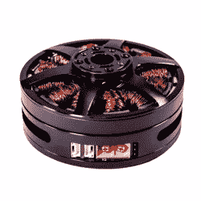

# 如何改进一台智能电机？把它变大！

> 原文：<https://hackaday.com/2020/11/07/how-to-improve-a-smart-motor-make-it-bigger/>

无刷电机可以提供令人印象深刻的扭矩大小比，当与复杂的驱动控制和传感器反馈相结合时，令人兴奋的事情成为可能，扩展了电机可以实现的通常想法。例如，要在机器人腿上使用 DC 电机，可能需要一个齿轮箱、一个电机驱动器和一个用于位置检测的编码器。如果需要平稳、自然的运动，那么也需要某种顺从的机械设计。但是像[IQ Motion Control] 提供的 [IQ Vertiq 6806 这样的电机挑战了这些假设。通过将高扭矩无刷 DC 电机、高级控制器和位置感测结合到一个集成设备中，像改进的无人机性能](https://www.crowdsupply.com/iq-motion-control/iq-vertiq-6806)[和像迷你猎豹](https://hackaday.com/2019/09/22/watch-legged-robot-run-circles-around-its-bigger-brethren/)那样的直接驱动机器人腿这样的事情成为可能。

IQ Vertiq 6806 brushless DC motor with integrated controller, driver, and position sensing.

首先，坏消息是:这些不是廉价的发动机。IQ Vertiq 6806 通过[大众供应预购](https://www.crowdsupply.com/iq-motion-control/iq-vertiq-6806)每台售价 399 美元(四台 1499 美元)，但就其本身而言并不算贵。与同级别的其他电机和控制器相比，成本更低。在人群供应页面的中间位置，通过与其他解决方案进行功能比较，[IQ Motion Control]为自己提供了一个很好的案例。尽管如此，这些不太可能是任何人的周末冲动购买。

那么这些智能电机是如何工作的呢？它们有两种基本操作模式:*速度*和*位置*，每种模式需要不同的固件，使用哪种模式取决于预期的应用。

“速度”固件的设计考虑到了驱动螺旋桨负载，其工作原理与无人机或其他无人机上的任何其他带 ESC(电子速度控制)的无刷 DC 电机非常相似。但是，虽然该装置可以像任何其他马达一样获得油门或速度控制信号，但它也可以做一些事情，如接受推力方面的命令。换句话说，飞机的飞行控制器可以直接与推力装置中的电机通信，而不是与速度控制信号通信，速度控制信号的实际效果受电机电压水平等变化的影响。

“位置”模式具有类似可调扭矩伺服系统的电机功能，非常适合机器人腿等直接驱动应用。位置感测还允许一些巧妙的技巧，比如将电机用作输入。下面嵌入了两个展示这两个特性的短视频，请查看它们。

 [https://www.youtube.com/embed/tIvcnUpQ4xI?version=3&rel=1&showsearch=0&showinfo=1&iv_load_policy=1&fs=1&hl=en-US&autohide=2&wmode=transparent](https://www.youtube.com/embed/tIvcnUpQ4xI?version=3&rel=1&showsearch=0&showinfo=1&iv_load_policy=1&fs=1&hl=en-US&autohide=2&wmode=transparent)

 [https://www.youtube.com/embed/lRX4CyElOqU?version=3&rel=1&showsearch=0&showinfo=1&iv_load_policy=1&fs=1&hl=en-US&autohide=2&wmode=transparent](https://www.youtube.com/embed/lRX4CyElOqU?version=3&rel=1&showsearch=0&showinfo=1&iv_load_policy=1&fs=1&hl=en-US&autohide=2&wmode=transparent)

如果你希望这些汽车不那么昂贵，有好消息！【IQ Motion Control】之前发布了一款功能类似的更小的电机:IQ Vertiq 2306。该装置有 [220KV(低速)](https://www.iq-control.com/vertiq-2306-220kv)和 [2200KV(高速)](https://www.iq-control.com/vertiq-2306-2200kv)版本，分别用于伺服和无人机应用。[看看我们之前对这些小型设备](https://hackaday.com/2018/03/26/iq-makes-smarter-motors/)的报道，感受一下它们的能力，也许在这个过程中你会有一些自己的想法。