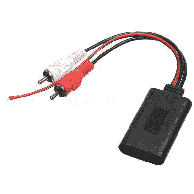
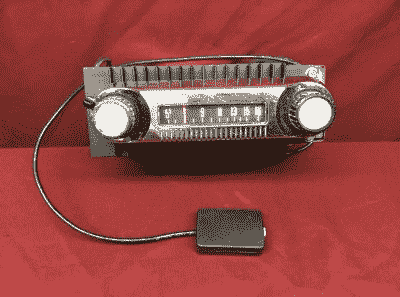
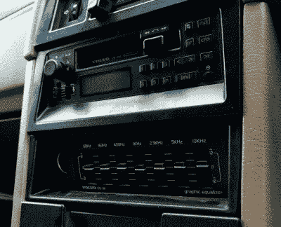
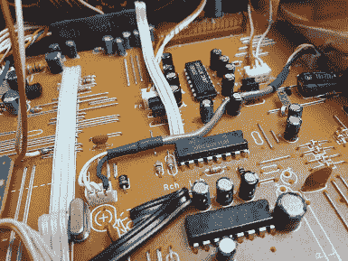
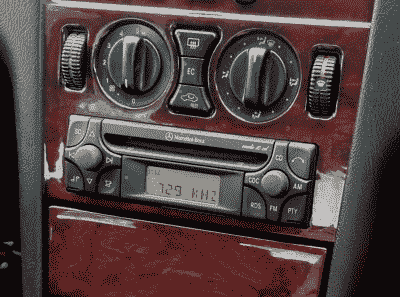
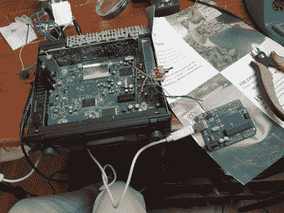
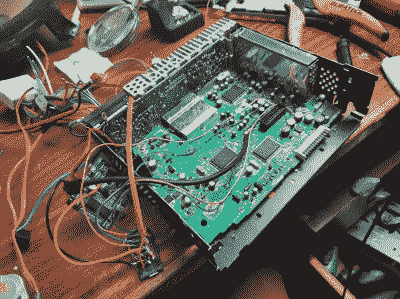
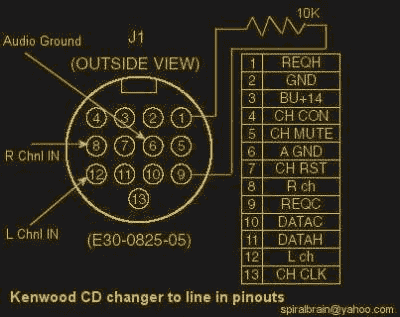

# 如何为蓝牙或 Aux-In 改装汽车音响

> 原文：<https://hackaday.com/2021/07/28/how-to-modify-your-car-stereo-for-bluetooth-or-aux-in/>

如果你是一个汽车爱好者的品味，你不能忍受的想法安装一个 janky 售后立体声到你的漂亮，干净的乘坐。浮华、现代的车头单元会破坏汽车内部的外观，特别是如果汽车是复古、经典或复古的。

因此，我们要看看如何修改您现有的股票汽车音响，以接受一个辅助电缆输入，甚至蓝牙模块。这样，您可以毫不费力地从智能手机中输入最新的音乐，同时仍然保持仪表板的原始外观。

## 基本原则

A simple Bluetooth module designed for wiring into car audio systems. There are two wires for 12 V power from the vehicle, and the audio signal is sent out over the RCA plugs. The RCA plugs can be cut off and the module hard wired inside your stereo if you have room. Cutting off the plastic case can help too.

根据你对音频播放器的选择，你可能更喜欢 3.5 毫米的 aux 插孔，或者如果你的智能手机不再有耳机端口，你可能希望使用蓝牙音频。无论你走哪条路，修改立体声的过程大体上是相同的。为了实现您的目标，您需要找到一种方法将音频信号注入主机的放大器级，同时确保没有其他音频源被发送到那里。

无论音源是 3.5 毫米插孔还是蓝牙模块，都无关紧要。唯一的区别是，在后一种情况下，你会想买一个蓝牙模块，并将其硬连线到你创建的辅助输入，同时还将模块拼接到立体声的电源。在一个简单的耳机插孔输入的情况下，你只需要在你可以拿到它的地方接上一根辅助线或 3.5 毫米插孔，就可以了。

当然，本指南不会涵盖世界上所有的音响。边缘情况是存在的，取决于你的原车收音机如何工作的细节，这些精确的方法可能对你有效，也可能对你无效。然而，本指南旨在让您从概念上思考如何实现这种调制解调器，以便您可以调查您面前的硬件，并自行决定如何集成适合您使用情况的外部音频输入。

## 指南 1:老式收音机/卡式录音机

An old two-knob AM radio from a 1970s Ford Bronco, modified with an auxiliary input. Often it’s as simple as wiring in to the back of the volume pot.

如果你有一些非常复古的东西，这个方法确实非常简单。这通常适用于 20 世纪 70 年代和 80 年代早期的收音机/盒式磁带播放器，它们的前面有一个模拟音量旋钮。在这种情况下，音频信号通过音量旋钮直接流向放大器。某种基本的开关决定了是收音机信号还是磁带信号到达音量旋钮，然后传递到放大器部分和扬声器。

因此，您可以通过多种方式在这些设备上拼接自己的音频。最简单的方法是切断立体声音频线路或连接音量旋钮的电线，将它们连接到 DPDT 拨动开关上。将音量旋钮的电线连接到开关中间的两个针脚上，将原始立体声信号连接到一侧的一对针脚上。然后，您可以将新的 aux 线缆或蓝牙输入连接到拨动开关上的其他引脚。然后，拨动开关在标准操作或外部进料之间进行选择。把开关安装在整洁地方，工作就完成了！

或者，你可能会发现在卡座上有一个按钮，不管是否有磁带插入，都可以将收音机切换到盒式模式。在这种情况下，您可以将辅助音频连接到盒式模块的音频输出，只需使用卡座上现有的开关来选择盒式模式。由于卡座中没有提供信号的磁带，只有您的外部音频将通过音量旋钮，然后到达扬声器。更简单，甚至更干净！

## 指南 2:数字时代收音机/磁带和 CD 播放器

This Volvo cassette player from 1987 is firmly in the digital era – note the LCD display.
Head units from this era are usually easy to hack, with relatively large components and traces inside and simple signal flows. The equalizer input could likely also easily be modified in a similar way to the Guide 1 method.

在数字时代，事情变得更加复杂。这是指使用数字显示和按钮控制的主机，微控制器运行整个节目。有趣的是，许多 20 世纪 80 年代和 90 年代的收音机使用简单的 4 位微控制器，其容量仅够运行简单的主机，同时可能比更常见的 8 位器件更便宜。基本上，如果你的 80 或 90 年代的立体声音响上有液晶显示器，这部分指南可能适合你。

数字控制走带设备通常使用一种称为 mux 或复用器的芯片来确定哪个信号被发送到放大器。mux 基本上是一个具有多个输入和一个输出的芯片。车头单元中的主微控制器通常通过切换几个 GPIO 引脚或使用串行、SPI、I2C 或其他接口来控制 mux 芯片。例如，当用户按下 FM 收音机的按钮时，微控制器将发送一个信号，告诉 mux 将 FM 收音机输入路由到放大器的输出。如果他们按下磁带按钮，微控制器将指示多路复用器发送磁带音频。

The Hitachi HD14052BP in the middle of this image decides which audio gets sent out to the amplifier.

因此，通过控制多路复用器，您可以控制到达放大器的音频，从而控制扬声器。根据所使用的 mux 芯片以及它与立体声系统中其他硬件的集成程度，这可能很容易，也可能相当困难。

大多数多路复用器将是 [4051/4052 系列](https://hackaday.com/2017/05/17/a-few-of-our-favorite-chips-4051-analog-mux/)的变体。例如，使用日立 HD14052BP 多路复用器的 90 年代早期立体声系统很容易用辅助输入进行修改；只需翻转几个引脚，就可以改变多路复用器的输入。因此，通过正确接线的开关，即使没有盒式磁带或 CD，也可以告诉 mux 选择盒式磁带或 CD 输入。只需将您的 aux 输入连接到这些相同的引脚，您就可以开始工作了。

## 指南 3:现代 CD 卡座

This Mercedes-branded head unit was built by Alpine.
It uses an integrated mux and signal processor, making it harder to hack an audio input into the stereo. The newer technology also uses finer-pitch surface mount parts, making it harder to work with for beginners.

然而，更现代的立体声音响可能很难做到。通常，多路复用器被集成到处理多种功能的更复杂的芯片中。为了让多路复用器切换输入，通常需要使用静音音频 CD，或者通过 I2C、串行或 SPI 等接口命令这些芯片。这是将辅助输入连接到磁带、CD 或其他音频输入子系统的首要工作。

例如，Alpine 在 20 世纪 90 年代后期生产的 Mercedes Audio 10 CD 音响主机采用了 Philips TEA688OH 信号处理器 IC。该芯片处理音量、高音和低音控制，以及某些无线电信号处理任务，同时还充当多路复用器。

将辅助输入连接到 CD 输入很简单，但让立体声系统真正切换到该输入就比较困难了。许多人选择简单地刻录一张持续一小时的无声音乐 CD。将它插入到走带设备中可以选择 CD 输入，辅助音频可以在 CD 本身的无声输出之上播放。然而，这是一个不优雅的解决方案，需要用户手头有一张光盘来切换到辅助模式，这也意味着机械光盘播放器必须保持正常工作。

Here, an Arduino is used to command the TEA688OH signal processor (QFP chip top right) to switch inputs on command. A DPDT switch is used here to switch the I2C lines between the Arduino and the stereo’s own microcontroller. If the Arduino is left connected to the I2C lines instead, volume and other settings cannot be adjusted, so the switch is necessary. A relay allows the Arduino to automate switching the I2C control back and forth.

在这种情况下，更好的解决方案是强制 TEA688OH 切换到 CD 输入或另一个输入，而不管驱动器中是否有 CD。这是很有可能的，因为芯片通过 I2C[从主微控制器接收信号，这些信号都列在芯片的数据表](https://pdf1.alldatasheet.com/datasheet-pdf/view/19752/PHILIPS/TEA6880H.html)中。然而，它需要添加一个 Arduino 或类似的可以说 I2C 语的设备、一个 DPDT 继电器和一些支持组件。

立体声微控制器和 TEA688OH 信号处理器之间的 I2C 线必须切断，并连接到继电器。在 Arduino 的命令下，继电器通常将信号从 stock 微控制器发送到信号处理器，允许对音量和其他功能进行正常控制。

然而，如果用户希望切换到连接到 CD 输入的 aux 输入，他们可以简单地按下连接到 Arduino 的按钮。Arduino 然后翻转 DPDT 继电器，将其自己的 I2C 接口连接到信号处理器。然后，可以通过 I2C 发送切换输入的命令，然后控制恢复到标准微控制器，从而恢复音量控制等的正常功能。

In final form, a Bluetooth module and Arduino Pro Micro are stuffed inside the stereo along with a DPDT relay to switch the I2C bus. An external button is used to trigger the Arduino to switch to auxiliary input on command.

显然，后一种情况要困难得多，并且需要关于使用微控制器和 I2C 通信的知识。然而，最终的结果要优雅得多，只要按一下按钮，这个装置就能切换到辅助输入。虽然给出的例子是一个具体的奔驰主机，其他 OEM 立体声使用类似的组件，并可以以类似的方式修改。只需找到一种方法，通过片上多路复用器将辅助输入输出到放大器部分。

## 附录:CD 换碟机输入

有时，你很幸运，有一个简单的附加输入已经挂在你的标准立体声系统的后面。通常，股票立体声来与 CD 换碟机输入，以便该选项可以很容易地添加到汽车上，而不必改变基本的主机。这些输入通常带有模拟音频输入，甚至还有一个电源，这是确定 CD 换碟机是否连接的基本方法。在 Kenwood 标准 CD 换碟机输入的情况下，它就像通过电阻器将某个引脚连接到另一个引脚一样简单，主机可以切换到 CD 换碟机输入，音频可以通过管道输入。

A pinout for certain Kenwood CD changer inputs. However, be wary. There are many stereos out there with 13-pin CD changer inputs with completely different pinouts that aren’t compatible at all. Ask me how I know.

然而，其他的更复杂。20 世纪 90 年代末的某些豪华汽车使用光纤数字音频输入，这很难用现成的硬件来欺骗。此外，一些主机使用串行或其他通信方法来控制 CD 换碟机，除非从硬件接收到正确的信息，否则不会切换到输入。如果你还没有 CD 换碟机，也很难想出如何欺骗这种交流方式。

不过，如果你能让它发挥作用，这是一个很好的方法。通常，它甚至允许在不打开立体声系统的情况下就可以侵入自定义输入。[老派汽车音响黑客已经在马自达 Miata 等汽车上做了几十年，](http://www.sonic.net/~fosterm/miata/wiring-for-sonycd.html)在不破坏原始仪表板布局的雅致外观的情况下，交换他们自己的音频输入。

## 摘要

总的来说，你需要做的就是接入一个辅助音频输入，无论是蓝牙还是其他方式，把你的信号送到放大器来代替其他任何东西。如果您能弄清楚信号是如何从音响主机的各种子组件(如 CD 播放器、录音机和收音机模块)中发出的，那么您就应该能弄清楚如何发送您自己的信号。希望这份指南已经阐明了所需的基本过程，这样你就可以知道如何破解任何立体声系统。祝你好运，如果你做了一个特别好的黑客，[把它发送到举报热线](http://hackaday.com/submit-a-tip)。玩得开心！