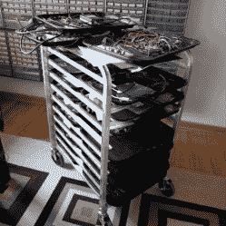

# 如何优化你的工作空间:分析你的工作方式

> 原文：<https://hackaday.com/2022/01/24/how-to-optimize-your-workspace-analyze-how-you-work/>

[Jay Carlson]分享了一些关于如何优化家庭工作空间的精彩指导，你可能想要模仿他的一些布局，尤其是如果你经常同时处理多个项目的话。他强调了一个重要的观点，即不同的人有不同的需求，因此一种尺寸并不适合所有人。优化一个人的工作空间必须首先考虑他做什么样的工作，他的许多技巧和诀窍都非常适用。

Looking online for these? A common industry term is “bun rack”. This one is “half-height” in size.

[Jay]从事嵌入式系统工作，经常在许多不同的工作和项目之间切换。准备好你的笔记本，因为有很多很棒的外卖。

例如，为了获得一个良好的自上而下的工作台上的摄像机视图，他使用了一个安装在铰接臂上的摄像机(通常末端有一盏灯的那种)。)这使得相机易于部署和收藏，他可以毫不费力地保存镜头或与同事在线共享视频。

另一个很好的建议是使用我们大多数人所说的自助餐厅托盘和配套的架子。由于每个托盘都用于不同的项目或硬件版本，因此在作业之间切换就像滑入一个托盘并拉出另一个托盘一样简单。这也是一种非常节省空间的方式来存储大量进行中的硬件。[Jay]详细介绍了他的工作空间，并解释了每个决定，非常值得一读。

节省空间总是更好，只要这样做不会对作品本身产生负面影响。如果你在寻找节省空间的小技巧，一定要看看这个小工作室节省空间的小技巧。