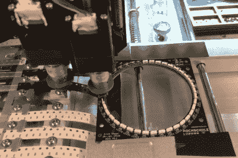

# 如何为 OpenPnP 改装一台取放机，详细说明

> 原文：<https://hackaday.com/2020/06/24/how-to-retrofit-a-pick-and-place-machine-for-openpnp-in-detail/>

[Erich Styger]拥有一台 Charmhigh CHM-T36VA 拾放机，他形容这台机器构造精良，硬件物超所值。然而，软件端就不那么令人印象深刻了，有一个专有的控制器，功能很好，但不太好。好消息是[有可能改造机器使用 OpenPnP 框架](https://mcuoneclipse.com/2020/05/03/retrofitting-a-charmhigh-chm-t36va-machine-with-openpnp/)，它是开源的，提供了更多的功能。更好的是，[Erich]已经完成并记录了所有困难的部分！

The CHM-T36VA has two heads, vision system, and uses drag feeders.

转换需要升级一些硬件部件，如摄像头，[更换控制器的固件](https://github.com/mattthebaker/Smoothieware-CHMT)，然后安装和配置 [OpenPnP](http://openpnp.org/) (在连接的 PC 上运行。)

[Erich]不建议不熟悉电子产品或担心保修无效的人进行这种转换。除此之外，他怀疑这种转换可以在一两天的集中工作中完成。他花了两周时间，包括微调第一个制作工作的时间。他说大部分时间都花在了配置上，但他已经在 GitHub 上分享了他的配置，希望这对使用相同硬件的人来说能节省很多时间。

在安装了大约 300 块电路板和 7000 多个零件后，他对结果非常满意。这台机器每小时生产 600 到 700 个零件，所以速度可能不惊人，但完全可以使用。[Erich]发现，虽然机器运行速度比原来的控制器慢了一点，但总体上运行起来更加平稳和安静。作为回报，他得到了他真正想要的东西:一台拾取和放置机器，它的操作和配置是完全开放和可访问的。你可以在下面的视频中看到它的运行。

 [https://www.youtube.com/embed/x8JsOYiH0iI?version=3&rel=1&showsearch=0&showinfo=1&iv_load_policy=1&fs=1&hl=en-US&autohide=2&wmode=transparent](https://www.youtube.com/embed/x8JsOYiH0iI?version=3&rel=1&showsearch=0&showinfo=1&iv_load_policy=1&fs=1&hl=en-US&autohide=2&wmode=transparent)

将负担得起的取放机器交到黑客和家庭商店的手中，是朝着使人们能够可靠有效地一次组装多块电路板迈出的一大步。最近在这方面已经有了一些很好的进展，例如[这些重新设想的元件进料器](https://hackaday.com/2020/05/14/printable-castable-feeders-simplify-pick-and-place-component-management/)和努力使低成本[开源取放机器](https://hackaday.com/2020/05/11/open-source-pick-and-place-has-a-450-bom-cost/)成为现实。