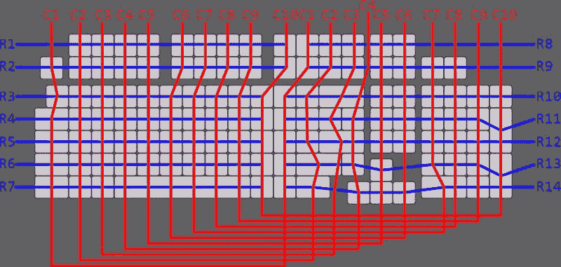
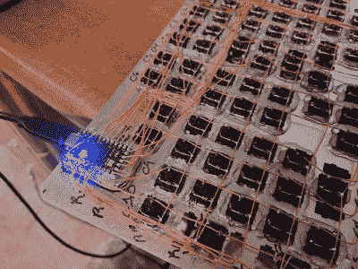

# 巨大的手工连线 Ortho 是一个美丽的战舰键盘

> 原文：<https://hackaday.com/2021/06/05/huge-hand-wired-ortho-is-a-beautiful-battleship-keyboard/>

有各种各样的理由来构建你自己的键盘，我们认为布局越定制，就越容易证明时间和费用的合理性。至少，这就是我们在这篇关于[GoldenSights]的文章中所说的“大而漂亮的定制直线性”叫做“更接近”，即“更接近完美”。看看这艘战舰吧！

[GoldenSights]长期以来一直想要一个机械 keeb，但从未涉足任何商业产品。这是双倍的，因为它们似乎都没有垂直的家庭/终端集群，由于节省空间的罗技矩形 keeb，[GoldenSights]已经变得相当重视。但如果要自己做键盘，就要全力以赴，对吧？没错。所以[GoldenSights]开始增加另外 12 个 F 键，并使其正交。然后，在 Num Lock 通常所在的地方添加了一个额外的退格键，以及用于在英语、韩语和中文之间切换的专用键，一切都变得个性化了。

[GoldenSights]想要 USB-C，所以他们使用了 Elite-C 微控制器，但有一个大问题，它只有 24 个引脚，根据矩阵数学，电路板总共需要 27 个引脚。他们没有使用 I/O 扩展芯片或第二个微控制器，而是将其连接成双工矩阵。这是连接矩阵的另一种方式，通过将行对折，将列数减半，使矩阵更接近正方形。

 我们认为【金光闪闪】在这里没有给自己足够的信任。他们说他们倾向于称之为组装而不是构建，但是我们不同意这种评价。[GoldenSights]在这个巨大的 keeb 中加入了巨大的构建，所以自己去看看吧。有大量的建筑图片和大量的热熔胶，所以要小心。

让我们讨论一下那些键帽。空格键应该是像其他人一样的黑色 PBT，但键帽制造商没有黑色的 6u 空格键，而是发送了一个灰色的。老实说，我们喜欢它的样子。我们喜欢[GoldenSights]在承诺采用激光切割金属开关板之前，在泡沫板上精心布局按键。

想要一款既节省空间又不会感觉太局促的直杆？[看看这款超薄键盘，它被设计成蹲在你劣质笔记本电脑的按键上](https://hackaday.com/2021/05/04/typematrix-ez-reach-2030-is-better-than-your-laptop-keyboard/)。

通过 [KBD](https://kbd.news/Nearer-a-118-key-ortho-703.html) 和 [r/mk](https://www.reddit.com/r/MechanicalKeyboards/comments/nnbeqj/nearer_handwired_118key_ortholinear_with_gateron/)