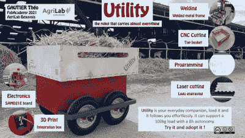

# 人类跟随实用拖车

> 原文：<https://hackaday.com/2021/07/12/human-following-utility-trailer/>

[Théo Gautier]认为跟随人类的实用拖车会对在农场工作的人有所帮助。然而，他不仅仅是想想而已，他还在法国北部联合理工大学的农业实验室设计并建造了它作为最终项目。他在六周内将这个想法从概念变成了现实。

他的构建日志很好地记录了项目，并向您展示了他的设计选择及其实现。这辆车的大脑是他自己制作的 SAMD21E 板，它对世界的感官感知由 HC-SR04 超声波传感器和一个 PixyCam 2 提供。由四个各为 100 瓦的 DC 电机/齿轮箱组件提供动力。他在建造过程中付出了很多努力，并发布了许多中间步骤的照片。引起我们注意的一条建议是，在焊接框架时，要反复测量框架的对角线——事情会发生变化。如果你不这样做，你可能不得不像[theo]那样，用一把大锤子来纠正错误。

你可以在[这个短视频](https://www.youtube.com/watch?v=XErph1KXbGM)里看最后的结果，看预告片跟着他在农场里转悠。在这个版本中，领导者必须穿红色衬衫才能被正确跟踪，但未来的版本可以跟踪各种各样的衣柜。这个项目是一个很好的学习经历，也可能是未来推车式机器人的一个很好的基线。你对扩展这个设计有什么想法吗？[Théo]已经提到他想要更大功率的马达。如果你对这种类型感兴趣，可以看看我们几年前写的[这种机动化的 3000 W 电动独轮车](https://hackaday.com/2018/09/19/electric-wheelbarrow-makes-hauling-big-loads-easier/)或者 2019 年的[无线电控制电动独轮车比赛](https://hackaday.com/2019/05/26/radio-controlled-wheelbarrows-tear-up-the-track/)(这可能会有什么问题吗？).感谢 FabAcademy 讲师[Luc Hanneuse]发送此提示。