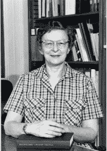
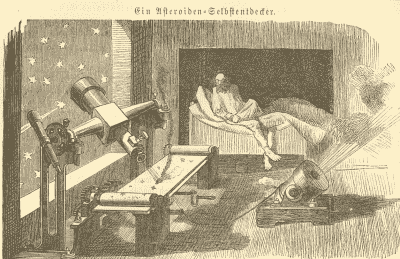

# 人类谷歌:露丝·弗莱塔格，艾萨克·阿西莫夫和书目

> 原文：<https://hackaday.com/2021/06/22/human-google-ruth-freitag-issac-asimov-and-bibliographies/>

你不会经常一开灯就想:“那家电力公司肯定能干！”你一般只有在灯毫无征兆地熄灭时才会想到它们。我觉得搜索也是如此。你不会使用谷歌或 DuckDuckGo 或任何其他搜索引擎，并认为“哇！这么多信息唾手可得，真是太棒了。”好吧。也许有一点，但是很难记起在前搜索引擎时代获取信息有多难。

前几天，当我读到露丝·弗莱塔格去年去世的消息时，我正在思考这个问题。露丝有一个不起眼但非常重要的头衔:参考馆员。但是她不仅仅是一个普通的图书管理员。她为国会图书馆工作，在某些圈子里很有名，她的崇拜者包括艾萨克·阿西莫夫和卡尔·萨根。

Ruth Freitag in 1985

你可能想知道为什么参考图书馆员会有粉丝。事实证明，高水平的图书馆员不仅仅是为你在书架上找书。他们制作了参考书目。如果你想知道，比如说，今天的哈雷彗星，你只需在谷歌上搜索一下。即使你想找实体书，也有很多地方可以搜索:谷歌图书、网上书店等等。但在 20 世纪 70 年代，你的选择要有限得多。

事实证明，露丝对天文学有兴趣和专长，但她也对一般的科学和技术有敏锐的认识。通过收集全面的带注释的书目，她可以给像阿西莫夫和萨根这样的人指出他们需要的书，就像我们今天使用谷歌一样。

作者马克·利特曼写了《超越的行星:发现外太阳系》。这本书包含了一篇 1873 年自动小行星探测器的文章和图片，利特曼写道:

> 当你在本书中发现从未在其他地方被完全识别的人名时，当你发现措辞精确时，你知道你遇到了国会图书馆的露丝·s·弗莱塔格的触摸。她对最惊人的信息了如指掌。是她贡献了自动小行星探测器上的插图。她广博的知识和始终如一的乐观精神让我非常幸运能有她这样的朋友和导师。

Automatic Asteroid Finder illustration from an 1873 work translated by Freitag

她精通几种语言，包括德语和意大利语。她甚至与计算机程序员 Henriette Avram 合作开发了一种电子图书馆格式的 MARC，为计算机时代做出了贡献。她也不仅仅是目录天文学。*例如，世纪之战*涵盖了关于一个世纪何时开始和结束的辩论。20 世纪 1900-1999 年也是如此吗？还是 1901-2000 年？你可以在参考书目中看到一点露丝的个性，从 1900 年出版的《T4》杂志的一首歌开始，这首歌被称为 1900 年的歌曲。

众所周知，露丝曾在卡尔·萨根创作《彗星》时帮助过他，并与艾萨克·阿西莫夫等人共进晚餐。她在当时是一个不寻常的女人——1945 年至 1947 年作为军队的一员在中国度过，并在伦敦和香港的美国大使馆工作了六年。1959 年，她获得了图书馆学硕士学位，并被国会图书馆录用，直到 2006 年退休。

作为一名年轻的工程师，我记得曾向工作中的老工程师寻求建议。现在，十有八九，人们会转向互联网。我想知道露丝是否和我们一样感受到了这种失落？