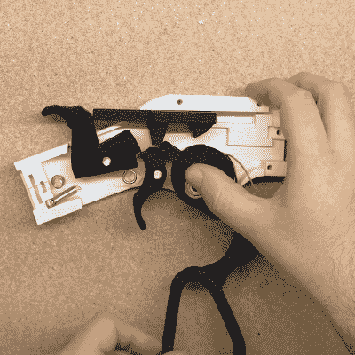

# 人力激光枪实现无电池打靶练习

> 原文：<https://hackaday.com/2020/04/26/human-powered-laser-gun-makes-battery-free-target-practice/>

[Dirk]分享了他的一个迷人的项目，该项目由几个不同的部分组成，并组合成一个令人满意的整体。这一切都是为了在室内进行打靶练习，用一个简单的红色激光点代替任何投射物。虽然可以通过闪烁红色激光笔并观察它落在纸靶上的位置来练习，但以某种方式记录击中目标更有价值(也更客观)。这就是为什么[Dirk]发明了人力驱动的无电池激光枪，并配有软件来追踪和显示击中的目标。在上图中，射手探测到红色激光击中目标并显示在屏幕上。

Right under the thumb is the pivot point for the lever, and that’s also where a geared stepper motor (used as a generator) is housed. Operating the action cranks the motor.

这个项目有几个部分，可悲的是，细节有点不完整，有点分散，所以我们将通过一次一个元素。首先是枪支本身，展会的明星是他的 [3D 打印牛仔步枪](https://www.thingiverse.com/thing:4297613)设计。当扳机被按下时，步枪用瞬时红色激光点描绘目标，但这还不是全部。[Dirk]似乎在杠杆动作中嵌入了一个步进电机，因此操作杠杆可以将电机作为发电机启动，并将少量电能储存在电容器中。扣动扳机后，电容器被倒入激光器(显然，是放入一个压电蜂鸣器作为声音提示),其电量刚好足以产生瞬间闪光。我们希望[德克]能提供更多关于这部分的细节。这里还有一些[的图片](https://imgur.com/gallery/wpIcJrf)，但是如果你想复制【德克】的作品，看起来在某种程度上你只能靠自己了。

至于目标，把一个红点放在纸靶上，用自己的眼球就能以最简单的方式完成这项工作，但[德克]走得更远。他使用 Python 和 OpenCV 以及一个摄像头来观察红点，捕捉它，然后将目标的图像(在检测到撞击的地方有一个标记)推送到射手附近的 Chromecast 支持的屏幕上。这提供了更好的反馈，并允许更容易评分。[GitHub 储存射击探测器和目标施法者的仓库在这里](https://github.com/noshbar/LaserGunTargetCaster)，虽然它可以单独用来探测任何旧的激光笔，但当它与不需要电池的 3D 打印牛仔步枪结合使用时，它真的会唱歌。

在打靶练习中不使用弹丸确实有一些好处:它很安静，很容易安全地完成，不需要逆止器，没有耗材或清洁，一旦目标出现太多洞，也不需要更换或修补目标。在下面嵌入的视频中观看这一切。

 [https://www.youtube.com/embed/fTBfgBV5P58?version=3&rel=1&showsearch=0&showinfo=1&iv_load_policy=1&fs=1&hl=en-US&autohide=2&wmode=transparent](https://www.youtube.com/embed/fTBfgBV5P58?version=3&rel=1&showsearch=0&showinfo=1&iv_load_policy=1&fs=1&hl=en-US&autohide=2&wmode=transparent)

这和[无家可归者](https://homeless-eng.webnode.com/)，一个开源的激光射击模拟器有一些共同之处。[几年前我们第一次采访了无家可归者](https://hackaday.com/2014/11/20/open-source-laser-shooting-simulator/)，这个项目仍然有效，所以如果你对这种打靶感兴趣，一定要去看看。