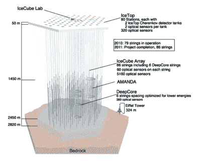
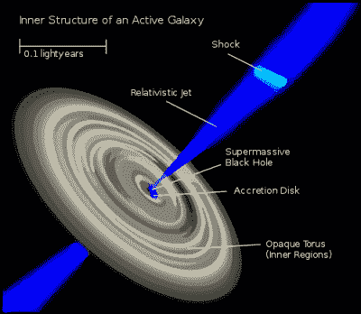
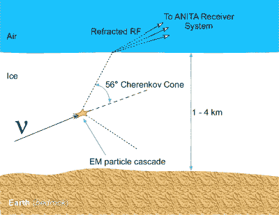
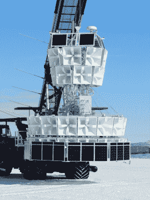

# 在南极搜寻中微子

> 原文：<https://hackaday.com/2020/06/22/hunting-neutrinos-in-the-antarctic/>

中微子是我们迄今为止遇到的最奇怪的粒子之一。每秒钟大约有 1000 亿个电子穿过地球上的每一平方厘米，但它们的相互作用率非常低，以至于它们可以轻易地穿过整个地球。这就是它们如何赢得“幽灵粒子”这个流行名称的原因。中微子是物理学中许多未解决问题的一部分。我们仍然不知道它们的质量，它们甚至可能有自己的反粒子，而它们的兄弟姐妹可以构成我们宇宙中的暗物质。此外，它们还是超新星和超大质量黑洞等最极端天体物理现象的宝贵信使。

地球上的中微子有不同的来源:太阳聚变过程中产生的太阳中微子，宇宙射线撞击大气层产生的大气中微子，核反应堆放射性衰变产生的人造反应堆中微子，地球内部自然发生的类似过程产生的地球中微子，以及超新星和其他极端过程中在太阳系外产生的天体物理中微子，其中大部分仍然未知。

## 有史以来最大的探测器

Schematic diagram of the IceCube Neutrino Observatory.
Credit: [Nasa-verve – IceCube Science Team – Francis Halzen, Department of Physics, University of Wisconsin](https://commons.wikimedia.org/wiki/File:Icecube-architecture-diagram2009.PNG), [CC BY 3.0](https://creativecommons.org/licenses/by/3.0)

因为中微子不带电荷，只受弱相互作用(和引力)的影响，所以很难被探测到。一些实验使用装满纯水的大水箱，并配备光传感器作为探测器。中微子可以从水分子中撞击出在该介质中传播速度超过光速的电子，从而产生[切伦科夫光](https://en.wikipedia.org/wiki/Cherenkov_radiation)，这也是核反应堆发出健康蓝光的原因。冰立方实验在更大的规模上利用了这种检测方法。他们没有建造一个巨大的水箱，而是将 86 根装有 5160 个光探测器的绳子埋在南极冰层下 2500 米深处。探测器的总体积为 1 立方千米，相当于 1 千兆吨的目标质量，因此是有史以来最大的探测器。

## 来自超大质量黑洞的中微子

Inner structure of a galaxy with an active galactic nucleus.
Credit: [Rothwild](https://commons.wikimedia.org/wiki/File:Galaxies-AGN-Inner-Structure.svg), [CC BY-SA 3.0](http://creativecommons.org/licenses/by-sa/3.0/)

冰立方的一大成功是 2013 年[首次探测到高能天体物理中微子](https://science.sciencemag.org/content/342/6161/1242856)。在此之前，仅有的来自太阳系外天体物理源的中微子是在 1987 年的一次[超新星爆发中被探测到的。在冰立方观测时，尚不清楚这些中微子来自哪里，但这在 2017 年发生了变化，当时另一个](https://en.wikipedia.org/wiki/SN_1987A)[高能中微子事件可以归因于已知的伽马射线 blazar](https://science.sciencemag.org/content/361/6398/eaat1378) 。布拉扎是由一个活跃的星系核(AGN)形成的，这是一个星系的中心区域，理论上是一个超大质量黑洞的所在地。落入黑洞的质量产生一对相对论喷流，当它们指向观察者时，可以被视为整个电磁波谱中的亮源。最近，俄罗斯研究人员在识别天体物理中微子来源方面又取得了一项进展。他们将冰立方事件与来自射电望远镜网络的数据进行了比较，发现它们与几个射电亮活动星系核有关。像这样的多信使天文学是一个努力奋斗的领域，自从我们在游戏中加入引力波后，它变得更加有趣。为了能够同时观测来自天体物理源的中微子、电磁辐射、宇宙射线和引力波，世界各地的不同望远镜通过[天体物理多信息观测网络](https://www.amon.psu.edu/)连接起来

## 用无线电脉冲探测中微子

Detection principle of the ANITA experiment.
Credit: [The ANITA collaboration](https://www.phys.hawaii.edu/~anita/new/html/science.html)

冰立方并不是南极唯一的中微子实验。南极脉冲瞬态天线(ANITA)是一个气球载实验，旨在检测高能中微子撞击冰层产生的无线电波，即所谓的阿斯卡里安效应。安妮塔探测到无线电脉冲在大气中向上传播，因为它们是由穿过地球的中微子产生的。上行无线电脉冲也可以由来自上方的宇宙射线产生，当信号从冰表面反射时，然而，在反射过程中，它改变了偏振。安妮塔因此可以通过观察探测信号的相位来区分这些无线电脉冲。

## 意外的信号

The ANITA-IV experiment in Antarctica, prior to being launched on a balloon.
Credit: [Drummermean](https://commons.wikimedia.org/wiki/File:ANITA-4_prior_to_launch.jpg), [CC BY-SA 4.0](https://creativecommons.org/licenses/by-sa/4.0)

当他们在 2006 年和 2014 年的两次独立飞行中检测到两次异常事件时，这项实验成为头条新闻。这两个事件都与中微子穿过地球产生的向上传播的无线电脉冲相一致。问题是测得的中微子到达角度和能量比预期的中微子流量高得多。中微子肯定穿越了地球 5700 多公里，能量大约为 0.5 EeV。由于我们从其他实验以及 ANITA 本身和它们的相互作用速率中知道这些能量的中微子流量，它们根本不可能在穿过那么多岩石时幸存下来。

一个可能的解释是中微子来自一个强烈的点源。某种宇宙加速器，像超大质量黑洞，射出一束狭窄的高能中微子。这个解释在今年早些时候被 IceCube 合作组织推翻，该组织在 ANITA 事件的方向上进行了一次这样的点源搜索，但是一无所获。如果这两个安妮塔事件源自一个点源，冰立方应该探测到更多，但他们没有。

对异常事件仅存的两种解释是系统误差或新物理学。事实上，当 ANITA 的结果第一次出来时，一名合作成员抢先发推特说，他认为他们刚刚打破了粒子物理学的标准模型。这是科学家的典型行为，他们认为自己意外地取得了重大发现，你不能真的责怪他们过于兴奋。然而，在许多情况下，当结果证明只是侥幸时，会导致尴尬。最近的一些例子包括在宇宙微波背景下错误探测到超光速中微子和引力波信号。

## 当小报解读物理学时

4 月[《新科学家》发表了一篇关于安妮塔异常的文章](https://www.newscientist.com/article/mg24532770-400-we-may-have-spotted-a-parallel-universe-going-backwards-in-time/)，其中他们引用了另一组理论物理学家在 2018 年发表的[旧论文，该论文将这些事件解释为一种理论的证据，该理论认为我们的宇宙是大爆炸前存在的另一个宇宙的镜像。这篇报道立即被几家小报转载，比如英国](https://arxiv.org/abs/1803.11554)[每日星报](https://www.dailystar.co.uk/news/weird-news/nasa-scientists-detect-parallel-universe-21996849)的标题

> “美国国家航空航天局科学家探测到平行宇宙‘在我们的旁边’，时间倒流”

人们可以立即看出这个标题有什么问题。首先，它将创立 ANITA 的 NASA 与另一个完全不同的团体的理论论文联系起来。其次，它假装这个理论是一个事实，而不仅仅是数据的众多解释之一，甚至不是一个非常可能的解释。来自夏威夷大学的安妮塔研究人员显然对虚假的媒体报道感到恼火，[发布了新闻稿](https://www.hawaii.edu/news/2020/05/21/media-incorrectly-connects-uh-research/)澄清他们与关于平行宇宙的理论论文没有任何关系。人们不得不指出，这篇理论论文是由受人尊敬的物理学家写的，不应被视为可疑。

尽管这绝对不是媒体第一次将科学推测当真。例如，在过去的几年里，每当一项实验发表了包含一些无法解释的事件的结果时，暗物质的发现就被重大新闻报道错误地宣布了几次。像安妮塔的研究人员一样，在这些情况下，科学家们也非常小心，不要在他们的出版物中声称有任何发现。通常，这需要通过另一个实验来证实，就像希格斯玻色子的发现必须被 ATLAS 和 CMS 探测器看到一样。记者们不太注意做出这样的声明，因为这只是为了更好的标题。

那么安妮塔的结果最可能的解释是什么呢？有许多论文试图用超越标准模型的物理场景来解释这些事件，但一些人也提出了更平凡的解决方案。一组研究人员指出，稍微低于冰面反射的无线电信号不会发生相位反转。还有一种可能的解释是由于宇宙射线与地球磁场的[相互作用。未来的实验，如提议的超高能观测(PUEO)的](https://arxiv.org/abs/1903.08750)[有效载荷](https://arxiv.org/abs/1908.00923)，ANITA 计划的继承者，可能会在这个问题上提供更多的信息。此外，ANITA 合作组织仍在分析他们最近一次飞行的数据，我们急切地等待着结果。

横幅图片:[麦迪逊-威斯康星大学](https://icecube.wisc.edu/)。