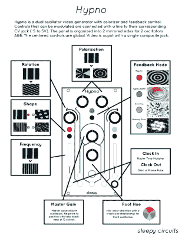

# 催眠视觉合成器

> 原文：<https://hackaday.com/2019/09/26/hypnotic-visuals-synthesizer/>

有没有想过制作一些非常迷幻的复古图形来配合你的高保真嘻哈节拍？现在，您可以使用[teafella]的名副其实的 [Hypno 视频合成器](https://hackaday.io/project/76075-hypno-video-synthesizer-sleepy-circuits)，这是一款基于 Raspberry Pi 的视频合成器，它通过彩色化、形状生成和反馈来数字模拟和扩展模拟视频工作流，并将修改修补到一个紧凑的界面中。该设备允许音乐创作者进行现场视觉表演，或者为视频设置创建独特的视觉源。一旦 CV 输入被插入，它需要的只是一个复合显示器和电源来开始工作。

Hypno 通过 SPI 使用 MCP3008 ADC 通过控制电压(CV)插孔获取输入，电压范围为-5-5V 至 0-5V。该设备附加在 Raspberry Pi 之上，使用 Raspbian 作为操作系统，使用 Pi Zero GPIO 与 OpenGL 引擎接口。输入参数从旋钮通过多路复用器进入 ADC 的单个通道，其值在软件中根据 CV 输入进行偏移。

使用 Hypno 非常简单，因为控制被组织到两个振荡器 A & B 的两个镜像面上，全局控制在中间。有控制偏振、旋转、形状、反馈模式(常规、超数码、缩放、旋转缩放)、打卡入/打卡出、频率、根色调和主增益的旋钮，以及提供视觉反馈的 RGB LEDs。

单个插孔输出复合结果，尽管背面也可以使用微型 HDMI 插头。对于高级功能，Hypno 允许进行修补，将效果混合在一起，并允许振荡器交叉调制等形状。也有 alt 控制打开自我调制和其他形状。示例包括双极漂移(平滑滚动振荡器)和镜像(以不同的模式镜像振荡器的形状，形成万花筒-等同于平铺的疯狂)。

该软件是用 C++和 GLSL 编写的，主引擎在 OpenGL 中运行一个平面，绘制 GLSL 着色器的输出。CV 和旋钮输入被送入着色器制服，用于改变引擎中的视觉效果。

自称 Arduino 用户的[teafella]使用 WiringPi 进行 GPIO 交互。着色器系统的灵感来自模拟视频合成，每个形状都有一个模拟的屏幕“扫描”和映射到它的函数，可以转换为极坐标。

Hypno 的设置与 Eurorack 合成器等模拟 CV 设备完全兼容，这使得音乐创作者可以轻松即插即用。以下是输入到 Hypno 的一些音轨的几个样本输出:

太多的组合以至于无法想象？查看 Hypno 的运行演示！

 [https://www.youtube.com/embed/IGAs0O8df-c?version=3&rel=1&showsearch=0&showinfo=1&iv_load_policy=1&fs=1&hl=en-US&autohide=2&wmode=transparent](https://www.youtube.com/embed/IGAs0O8df-c?version=3&rel=1&showsearch=0&showinfo=1&iv_load_policy=1&fs=1&hl=en-US&autohide=2&wmode=transparent)

The [HackadayPrize2019](https://prize.supplyframe.com) is Sponsored by:     