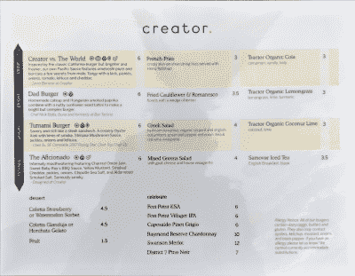
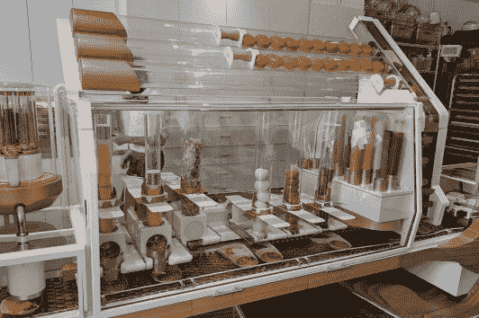
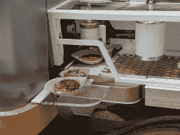
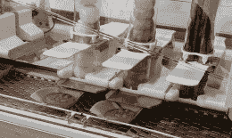
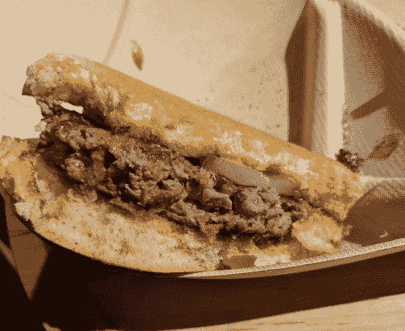
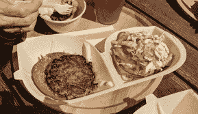
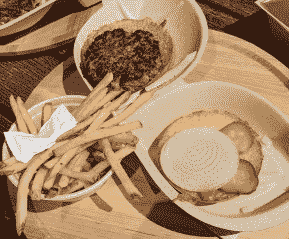
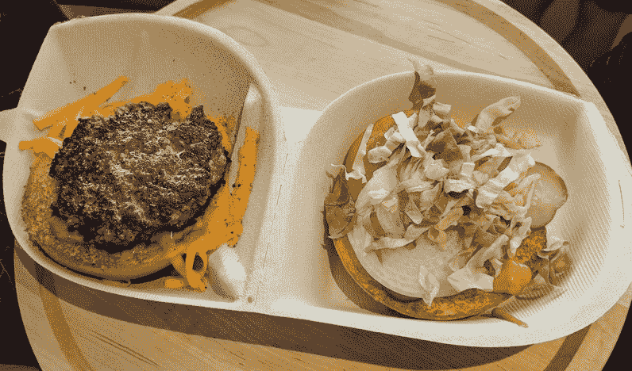
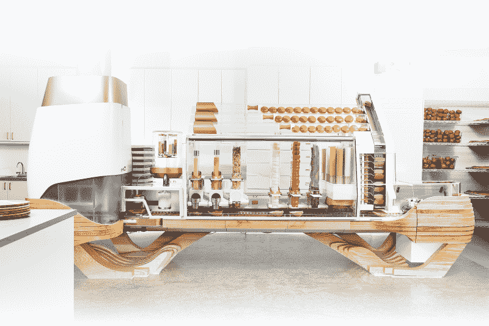

# 在餐馆倒闭前，我吃了一个机器人汉堡

> 原文：<https://hackaday.com/2018/10/11/i-ate-a-robot-hamburger-before-the-restaurant-went-out-of-business/>

未来就在我们面前，机器人将很快接管。自动化汽车会让优步的司机和出租车司机都失业。像麦当劳柜台后面的工作人员这样的低薪工人将被烙牛肉饼的机器人取代。Spacely Space 链轮公司的整个运作由一个人按下一个按钮，一天工作四个小时。这个卡通未来是如此完全自动化，以至于大多数人都失业了，所有的生产性工作都由机器人来完成。

首先被取代的工作将会是青少年得到的第一份工作。这些都是低技能的工作，当你想到低技能的工作(当然不是低努力的工作，顺便说一下)，你会想到烙牛肉饼。[这就是创造者进入](http://creator.rest/)的原因。他们是一家烹饪机器人公司，在旧金山有一家餐厅。他们被 NPR 、[商业内幕](https://www.businessinsider.com/robot-made-burger-restaurant-creator-review-2018-7)和[美国消费者新闻与商业频道](https://www.cnbc.com/video/2018/07/01/creators-new-autonomous-robot-makes-a-burger-in-5-minutes.html)描述为[。TechCrunch](https://www.npr.org/sections/thesalt/2018/08/24/640511068/fad-or-the-future-robot-made-burgers-wow-the-crowds-in-san-francisco) [得到了一个预览](https://techcrunch.com/2018/06/21/creator-hamburger-robot/)宣称这是六美元汉堡的未来。这是一个工程能力的奇迹，其商业模式我认为还没有验证。这不是会抢走你工作的机器人，我很自豪地说，在餐馆倒闭前，我吃过一个机器人汉堡。

## 你将经历的最奇怪的用餐体验

The menu of burgers

当我在那里的时候——一个星期三——Creator 关门了。他们只在周四和周五营业，直到“正式”开业。一周后，我回到那里，发现一排技术人员正在拐角处排队，外面有两个工作人员在分发层压纸菜单。显然，像美国的每一家麦当劳一样，在柜台上放一个巨大的电视，太单调了。

在和我的几个同事排队等候之后，我们被允许进入 Creator，在那里，带着平板电脑和读卡器的服务员为我们点餐。这个系统没有设置为一次点几个汉堡，所以我和我的同事单独点餐，我把我的卡交给每个汉堡的点餐员。不接受现金。

## 自动化和所有的牛肉饼

下单后，你需要等待大约六分钟，机器人就会为你制作汉堡。无论如何，这台机器很漂亮。聪明的是，这个机器人汉堡机的发明者选择隐藏将碎牛肉做成肉饼，然后将这些肉饼变成熟汉堡的过程——这是因为整个过程看起来很恶心，不管机器人是否制作它。没有人需要看到一大桶肉被切碎、加工和烹饪。

除此之外，整个过程被密封在玻璃后面，由一些我见过的最伟大的工业自动化技术推动。小圆面包沿着一个气动管道移动，在那里它们靠着一把刀振动。一半的面包落在一个垂直的烤面包机上，落在一个一次性的，可回收的盘子上，这个盘子是由一个真空夹子分发的。这个盘子沿着传送带移动，在这里生菜被切碎，泡菜被切碎，西红柿被涂抹，奶酪被融化。在这条装配线的末端，烤好的肉饼被放在剩下的三明治上，由一名等待的工人送到柜台。制作一个汉堡需要六分钟，机器每三十秒左右可以输出一个汉堡。

  Buns to the top, sauces to the right, and pickles, tomatoes, onions, lettuce, and cheese on the conveyor  Open-faced burgers dispensed to the customer  Onions and tomatoes sliced for each burger

从那里，你只需拿起你的汉堡，找一张桌子。汉堡怎么样？他们没事。它是肉，用火烹制，放在烤面包上，有配料。

这没什么特别的，主要的卖点当然是看两个巨大的机械机器吐出煮熟的馅饼，切西红柿，切泡菜，分配酱料，并把浇头撒在三明治上的场景。他们在前窗展示了一台机器，另一台就在你等待汉堡的地方旁边。毫无疑问，这是一次经历。

        

## 未来的数学

这是机器人汉堡店出轨的地方。我想不通这个地方是怎么赚钱的。当然，一家总部位于旧金山的初创公司把钱冲进厕所并不是什么新鲜事，但必须有赚钱的计划，对吗？有两个人接受订单，一个看门人，有人在外面打扫卫生，有人在里面打扫卫生，至少有六个人在操作机器。他们中的大多数人都戴着苹果手表，这是制服的一部分，因为这可以告诉员工机器出了什么问题。

Creator’s automated hamburger line. Patties are made and cooked in the refrigerator-sized unit to the left. Source: [Creator](http://creator.rest/)

相比之下，麦当劳在午餐高峰期只有十个人工作。你会有一个售货亭，在那里你可以点一个带触摸屏的汉堡，麦当劳也能赚钱。不多，请注意——最好的、最容易得到的数据是，一家麦当劳连锁店每年销售额为 200 万美元，净利润在 10 万到 20 万美元之间。

当然，如果这家餐厅扩展到一个以上的位置，一些问题将会得到解决(例如，每次信用卡交易不能点一个以上的汉堡，每次可以组合但没有组合的门票可能会花费 Creator 大约 0.80 美元的费用)。我不知道 Creator 机器要花多少钱，但它的复杂性以及需要人工操作来装载、清洁和维护都表明价格不菲。除非他们能够控制成本，否则他们将会比麦当劳的特许经营者花更多的钱，而赚更少的钱。

## 是关于机器人，还是关于汉堡？

这并不是说机器人餐厅不能成为一个目的地景点；拉斯维加斯有一家机器人酒吧可能会赚钱。不过，那是人流量和新奇感；在旧金山工作的人只有这么多，一旦新鲜感消失，就只有会展中心和 Dreamforce 吸引顾客了。

那么，创造者汉堡值得吗？在 Creator 的几个街区内至少有两家超级汉堡店。在那里，你可以花 16 美元买到汉堡、薯条和啤酒。在 Creator，汉堡六块，薯条三块，啤酒六块，一共 15 美元。因为自动化技术，你节省了整整一美元。这太奇怪了，我不知道即使机器人真的真的很酷，这个地方怎么还能继续营业。至少在他们关门前我在那里吃过。