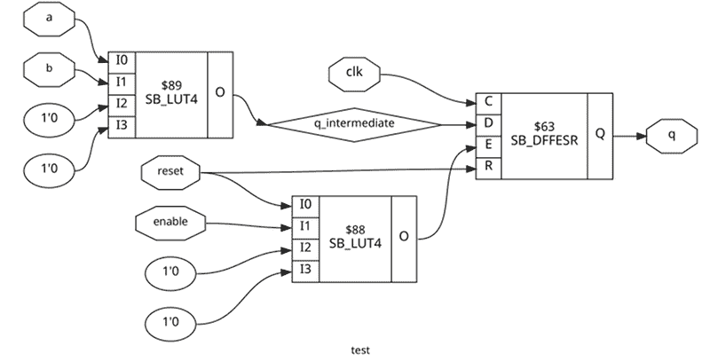

# Icestorm 工具综述:开源 FPGA 开发指南

> 原文：<https://hackaday.com/2018/10/03/icestorm-tools-roundup/>

我们喜欢 Lattice 的 ICE40 FPGA 有两个原因:有像 Icestick 这样的廉价开发板可供使用，还有[开源工具](https://github.com/YosysHQ)。我们在 Icestorm 工具链上做了几个教程，效果很好。然而，开源工具并不总是展示你从商业工具中看到的一切。有时你必须挖掘一点来找到合适的工具或选项。

有时候这是件好事。我不需要学习另一个花哨的 IDE，我们有很多好的模拟工具，所以为什么要重新发明轮子呢？然而，如果你只使用基本的工作流程`Yosys`、`Arachne-pnr`、`icepack`和`iceprog`，你可能会错过一些最有趣的功能。让我们深入了解一下。

## Yosys 选项

`Yosys`是将你的 Verilog 转换成代表伯克利逻辑交换格式的 [BLIF](http://www1.cs.columbia.edu/~%20cs6861/sis/blif/) 文件的软件。它有一个交互式的命令行，但是大多数人使用它作为脚本的一部分。例如:

```
yosys -p "synth_ice40 -blif demo.blif" demo.v
```

然而,`synth_ice40`是一种脚本，它为你做了相当多的操作。你也可以使用其他命令:

*   check——check 命令查找到目前为止您加载的任何内容中的错误。
*   显示–使用 graphviz 生成一个“原理图”(见下文)。
*   write _ verilog–如果您有一个 FPGA primatives 的仿真库，您可以写出一个中间 Verilog，它可能有助于仿真运行综合问题。
*   write _ spice–如果你愿意，你也可以写一个 Spice 网络列表。

请注意，在我写这篇文章的时候，在文档页面中有一个[错误，从`attrmvcp`开始，描述是一次性的。也就是说，例如，对`chparm`的描述应该是对支票的描述。也许现在已经修好了。您可能还会注意到通过翻译器自动读取 VHDL 的命令。不要激动，因为这在最近的版本中已经被删除了，因为所有的翻译者在某些 VHDL 上都有一些问题。当然，如果对你有用的话，如果你愿意的话，可以在调用`yosys`之前进行转换。如果你够勇敢，还有一个使用 vhdl2vl 的插件。或者坚持使用 Verilog。](https://github.com/YosysHQ/yosys/issues/621)

## 一个例子

只看其中的几个特性，这里有一个不会赢得任何奖项的非常简单的 Verilog:

```

module test(input clk, input reset, input a, input b, input enable, output reg q);
wire q_intermediate;
assign q_intermediate=a^b;

// enable next line to see an error

// always @(posedge clk) q&lt;=1'b1;
always @(posedge clk)
if (reset)
q&lt;=1'b0;
else
if (enable) q&lt;=q_intermediate;

endmodule

```

该模块对 a 和 b 输入进行异或运算，如果输入使能为高电平，则在时钟上升沿锁存 q 上的值。简单。

不要给`yosys`一个命令行，只需不带选项地运行`yosys`。你会得到一个提示。如果您尝试输入 check 命令，您会得到一条消息，提示您需要先运行`proc`。所以试试看，然后运行检查。您应该看不到任何问题。

也许你想看到一个问题。取消对 assign 和 always 语句之间的代码行的注释:

```

always @(posedge clk) q&lt;=1'b1;

```

现在如果你加载代码，运行`proc`，然后运行`check`，你会看到程序知道你有太多的东西在驱动 q，一定要把线收回来。

一旦你又有了好的代码，你可以试着做一个`synth_ice40`后跟一个`write_verilog`命令。以下是命令的完整列表:

```
read_verilog test.v
proc
check
synth_ice40
write_verilog int.v
```

现在您有了一个表示合成代码的文件。它相当长，部分是因为有注释来跟踪源文件，但您会看到这样的 FPGA 原语:

```

(* src = &quot;/usr/bin/../share/yosys/ice40/cells_map.v:43&quot; *)
SB_LUT4 #(
.LUT_INIT(4'b0110)
) _2_ (
.I0(a),
.I1(b),
.I2(1'b0),
.I3(1'b0),
.O(q_intermediate)
);
(* src = &quot;test.v:6|/usr/bin/../share/yosys/ice40/cells_map.v:8&quot; *)
SB_DFFESR _3_ (
.C(clk),
.D(q_intermediate),
.E(_0_),
.Q(q),
.R(reset)
);

```

LUT 是一个查找表。因为只使用了两个输入，所以该表的初始化只有四位，可以看到，驱动 q_intermediate 的是我们的 XOR 门的真值表。SB_DFFESR 模块是一个 D 触发器，“很明显”。

更有用的是`show`命令。选项不少，但像这样简单的电路，输入`show`就可以了。假设您的计算机上安装了图形软件，您应该会看到类似这样的内容:

 [](https://hackaday.com/wp-content/uploads/2018/09/show.png)

这很容易解决，尤其是如果您也查看输出 Verilog 代码的话。最上面的 LUT 是 XOR 门，而最下面的是 OR 门，它为触发器 enable (E)供电。这允许复位信号也使能触发器。

另一件你可能会感兴趣的事。还记得我提到过`synth_ice40`是一个脚本吗？尝试键入以下内容:

```
help synth_ice40
```

您可以看到执行了哪些命令。如果您愿意，也可以使用标签来跳过一些过程。您还可以设置许多其他选项。

## 定时分析

做任何类型的 FPGA 设计都有一个问题，那就是定时关闭。例如，在上述示例中，您必须假设 a 和 b 输入与时钟同步。如果不是，我们就需要更多的人字拖。然而，想象你有三个这样的电路。假设一个电路处理 A0 和 B0 以产生 Q0，另一个电路从 A1 和 B1 产生 Q1。然后，第三个门将 Q0 连接到 A，将 Q1 连接到 B，以产生最终的 q。大概是这样的:

```

module test_blk(input clk, input reset, input a, input b, input enable, output reg q);
wire q_intermediate;
assign q_intermediate=a^b;

always @(posedge clk)
if (reset)
q&lt;=1'b0;
else
if (enable) q&lt;=q_intermediate;

endmodule

module test(input clk, input reset, input A0, input B0, input A1, input B1, input enable, output q);

wire Q0;
wire Q1;

test_blk block0(clk,reset,A0,B0,enable,Q0);
test_blk block1(clk,reset,A1,B1,enable,Q1);
test_blk block2(clk,reset,Q0,Q1,enable,q);
endmodule

```

尽管 FPGAs 速度很快，但它们并不是无限快。因此，如果时钟非常快，Q0 变化到 A 的时间可能会比时钟更长。这将导致不良操作。那么时钟能有多快呢？

用这个简单的设计，非常快。你可以使用`icetime`来找出到底有多快。假设您正在使用 hx1k 设备，并且已经运行了`yosys`和`arachne-pnr`:

```
icetime -d hx1k test.asc
```

您将看到以下输出:

```
// Reading input .asc file..
// Reading 1k chipdb file..
// Creating timing netlist..
// Timing estimate: 2.81 ns (355.34 MHz)
```

由于我没有对设计进行约束，所以您的数字可能会略有不同。

如果您添加了-t 选项，该工具将向您显示导致最高延迟的链，如果您想提高时钟速度，这就是您需要做的工作。

## PLL 配置

说到时钟速度，Ice40 FPGA 有一个很好的片上 PLL，可以将时钟输入转换为一定范围内的几乎任何频率。有相当多令人困惑的配置选项，但您可以使用 icepll 来帮助您。假设您想要一个来自 12 MHz 输入时钟的 100 MHz 时钟。运行以下命令:

```
icepll -m -f pll.v -i 12 -o 100
```

您将得到一份很好的报告，pll.v 文件将如下所示:

```

/**
* PLL configuration
*
* This Verilog module was generated automatically
* using the icepll tool from the IceStorm project.
* Use at your own risk.
*
* Given input frequency:        12.000 MHz
* Requested output frequency:  100.000 MHz
* Achieved output frequency:   100.500 MHz
*/

module pll(
input  clock_in,
output clock_out,
output locked
);

SB_PLL40_CORE #(
.FEEDBACK_PATH(&quot;SIMPLE&quot;),
.DIVR(4'b0000),         // DIVR =  0
.DIVF(7'b1000010),      // DIVF = 66
.DIVQ(3'b011),          // DIVQ =  3
.FILTER_RANGE(3'b001)   // FILTER_RANGE = 1
) uut (
.LOCK(locked),
.RESETB(1'b1),
.BYPASS(1'b0),
.REFERENCECLK(clock_in),
.PLLOUTCORE(clock_out)
);

endmodule

```

只需将它包含在您的项目中，并在顶层模块中创建 PLL 模块。例如:

```

module top(input clk, output led);
wire fastclock, locked;
pll mypll(clk,fastclock,locked);
...
endmodule

```

## 平面规划

show 的输出可能是有用的，但是它没有向您显示芯片级发生了什么。不过，有一件事你不能做，那就是很容易地查看设计的平面图。但是现在多亏了[knielsen],你可以在你的浏览器中做到这一点。

平面布置图就像一张地图，显示了你的设计在芯片上的位置和连接线路。举例来说，这通常可以告诉你哪里有瓶颈。然而，您实际上不能使用该工具进行更改。在大多数工具中，您可以设置约束来移动特定的逻辑块，但是我们不认为`arachne-pnr`现在除了 I/O 块之外还支持它。

## 改进的剧本

过去，我使用一个简单的 shell 脚本来驱动这个过程。考虑到所有这些新工具，我把它变得更复杂了。你可以在 [GitHub](https://github.com/wd5gnr/ice40flow) 上下载这个脚本，但是这里有一些亮点:

*   查找模块的库路径
*   `-noautowire`添加到`yosys`命令行。这样做的效果是在所有文件的顶部指定`default_nettype none`，这对于捕捉信号名称中的拼写错误非常有用
*   如果您需要传入额外的内容，则为`yosys`和`arachne-pnr`选项提供环境变量
*   `icetime`现在生成定时报告(假设 hx1k)
*   更好的错误检查

你可能想根据自己的喜好修改脚本。您可以在文件、当前目录下的`.env`文件、环境和命令行中更改选项。这允许你为一个文件夹配置选项，然后只需发出命令(名义上是`ice40flow`，但有时我把它别名为`go`)就可以得到一个完整的工作流程。

## 包裹

这只是你可以用这些伟大的开源工具做的一些事情。甚至像`icepack`和`iceprog`这样的工具也有有趣的选项。例如，`icepack`可以设置该位，防止 FPGA 在配置后将 SPI EEPROM 置于睡眠状态，这样您就可以在设计中使用未使用的部分。或者，如果您曾经想尝试 FPGA 的多配置选项，请在`icemulti`工具上寻求帮助。

如果一个工具运行良好，不去想它太多是很有诱惑力的。然而，这些工具是变化的，值得不时地看看有什么可用的。甚至还有一个新的[布局和布线工具](https://github.com/YosysHQ/nextpnr)正在开发中。阅读 [Ice40 数据表](http://www.latticesemi.com/~/media/LatticeSemi/Documents/DataSheets/iCE/iCE40LPHXFamilyDataSheet.pdf)，了解你可能在这个硬件上使用的功能也没有坏处。