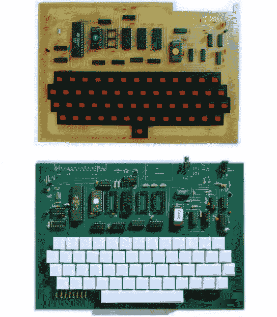

# 标志性的南斯拉夫 Galaksija 电脑重生，还有一部纪录片

> 原文：<https://hackaday.com/2020/10/25/iconic-yugoslavian-galaksija-computer-reborn-with-a-documentary-too/>

为 Hackaday 写作的一个令人羞愧的事情是，我们的同事经验丰富，尽管他们有自己的技能或成就，但当我们看他们的作品时，我们所有人都可能有一定程度的冒名顶替综合症。本周提醒了我们这一点，同时我们仔细观察了一部关于 Galaksija 的纪录片的众筹，Galaksija 是我们的同事[Voja Antoni]在 20 世纪 80 年代设计的南斯拉夫 8 位计算机。不仅会制作纪录片，而且他们还会将 Galaksija 重新制作成一个套件，这样你就可以亲自体验这台具有历史意义的计算机了。这场运动已经超过了它的目标几次，但是还有几天时间，所以如果你感兴趣就加入吧。

Freshly made original Galaksija (top), and new double-sided Galaksija (bottom).

作为一名同事，有了能够接触到[Voja]的优势，是时候获得项目的直接信息了。虽然他不是先锋，但除了出现在纪录片中，他还制作了新的 Galaksija PCB，以利用双面制造，并消除了原来的电线连接。

从这个意义上说，这与其说是原版的克隆，不如说是来自同一设计师的更新版本，只有少数其他更新，如按键开关和连接器，而精确的原始组件已不再是来源。一个特别引人入胜的故事来自第一份 Galaksija 杂志的再版。原始印刷图片的照片复制没有产生良好的效果，所以[Voja]从头开始建立了一个完全原始的 Galaksija，仔细地重现了原始照片中显示的每个步骤的框架。

这个项目在推出大众供应之前已经面临了相当大的障碍，所以看到它在剩余时间内获得资金确实非常好。我们期待着看到结果，同时你可以看到一个塞尔维亚语的宣传片，视频下方有 Youtube 的英文字幕。你可以在过去的 Hackaday 文章中阅读[【Voja】在机器](https://hackaday.com/2015/08/03/hacking-the-digital-and-social-system/)上的文字，但不要错过在现场活动中与他见面的机会——他是在 Hackaday 活动上获得多个[硬件徽章的](https://hackaday.com/2017/01/10/what-makes-the-perfect-hardware-badge/)[幕后策划者。](https://hackaday.com/2019/02/07/voja-antonic-designing-the-cube/)

 [https://www.youtube.com/embed/889uQzEQmoQ?version=3&rel=1&showsearch=0&showinfo=1&iv_load_policy=1&fs=1&hl=en-US&autohide=2&wmode=transparent](https://www.youtube.com/embed/889uQzEQmoQ?version=3&rel=1&showsearch=0&showinfo=1&iv_load_policy=1&fs=1&hl=en-US&autohide=2&wmode=transparent)

