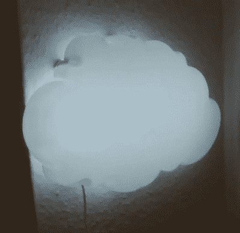

# 宜家云灯通过 ESP8266 显示天气

> 原文：<https://hackaday.com/2019/06/12/ikea-cloud-lamp-displays-the-weather-with-esp8266/>

IKEA DRÖ MSYN 是一款壁挂式云夜灯，非常适合放在孩子的房间里。对于 10 美元来说，这只是*乞求*某人在里面塞一些电子设备，让它做一些很酷的事情。幸运的是，[乔德森]决定接受挑战，[将这个曾经简单的灯变成了一个聪明的天气显示器](https://imgur.com/gallery/8B8pMMk)。如果你喜欢这种东西，它甚至还可以作为 LED 灯使用。

 在剥离掉原来的硬件后，【约格森】安装了一个 Wemos D1 Mini 和一串 14 个 SK6812 RGB LEDs，它们沿着云的内部结构延伸。使用 OpenWeatherMap API 下拉天气数据，并通过各种照明颜色和效果显示天气状况。

晴天用漂亮的黄色光芒表示，多云的天气预报看起来像……好吧，它已经是一朵白云了，所以这很容易。如果预计会下雨，云会变成蓝色，底部的发光二极管会闪烁一下，表示有雨滴。当有雷雨时，云会间歇地闪烁随机的发光二极管，比同类的亮一点；一种非常巧妙的效果，能立即表达观点。

这不是我们第一次看到有人[从宜家拿了一盏便宜的灯，用 ESP8266 把它变成更令人印象深刻的东西](https://hackaday.com/2019/05/27/esp8266-upgrade-gives-ikea-leds-udp-superpowers/)。就像之前的项目一样，我们不会惊讶地看到这种特殊的修改在未来更多地出现。