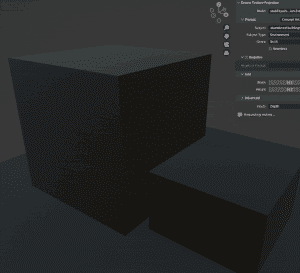

# 图像生成人工智能可以在 Blender 中纹理化整个 3D 场景

> 原文：<https://hackaday.com/2022/12/18/image-generating-ai-can-texture-an-entire-3d-scene-in-blender/>

[Carson Katri]有一个奇妙的解决方案，可以在 Blender 中轻松地将纹理添加到 3D 场景:[让一个图像生成人工智能按需创建纹理，并为您完成它](https://github.com/carson-katri/dream-textures/releases/tag/0.0.9)。

It’s not perfect — the odd door or window feature might suffer from a lack of right angles — but it’s pretty amazing.

如此处所示，通过将 3D 物体包裹在合适的图像中，无特色平原上的两个无特色街区变成了破败的建筑。这一切都是在[搅拌机](https://www.blender.org/)的*梦幻纹理*附件的帮助下完成的。

该解决方案使用[稳定扩散](https://hackaday.com/2022/09/06/stable-diffusion-and-why-it-matters/)基于文本提示(例如“科幻废弃建筑”)为场景生成纹理，并利用对场景深度的理解来获得最佳效果。人工智能生成的结果并不总是完美的，但这个过程非常令人惊讶。更不用说与从零开始创造相比快得惊人。

人工智能图像生成能力正在以极快的速度发展，让人们能够访问可以在本地运行的工具是驱动像这里这样有趣和有用的应用程序的原因。

好奇想知道更多像稳定扩散这样的系统是如何工作的？这里有一个很好的技术入门，华盛顿邮报最近发表了一篇不那么技术化(但准确)的互动文章，解释了[人工智能图像生成器如何工作](https://www.washingtonpost.com/technology/interactive/2022/ai-image-generator/)，以及它们正在产生的影响。