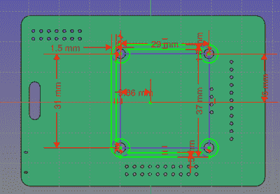

# 使用 3D 打印改进会议徽章

> 原文：<https://hackaday.com/2019/05/10/improving-a-conference-badge-with-3d-printing/>

对超越硬件的会议徽章的痴迷意味着我们作为与会者可以享受一系列怪异而精彩的电子设备。但对于举办这些会议的人来说，及时为活动设计和制作徽章可能是一项既紧张又昂贵的任务。为了让事情走上正轨，设计往往会偷工减料，采取你在商业产品中从未见过的自由。当然，这也是他们魅力的一部分。

 举个例子，2019 款 KiCon 徽章上的有机发光二极管显示屏仅用四个焊接头引脚固定，很容易弯曲甚至折断。因此[【何塞·伊格纳西奥·罗梅罗】承担起开发 3D 可打印支架](https://hackaday.io/project/165254-3d-printed-kicon-2019-badge-screen-standoff)的责任，它与 PCB 集成在一起，并为显示屏提供一些机械支撑。任何希望长期保持最佳战斗状态的 KiCon 与会者可能会希望开始预热他们的挤出机。

由于 KiCon 徽章是(自然)开放的硬件，这次升级的设计变得更加容易。这意味着[Jose]可以将 PCB 文件直接导入 FreeCAD，并拥有徽章的虚拟模型。这让他可以检查组件的间隙和位置，而不必拿出卡尺测量实物。

在玩虚拟装配时，[Jose]很快意识到有机发光二极管显示器上的安装孔实际上并不与 PCB 上的孔对齐；这可能是为什么屏幕没有安装在最终的硬件上。一旦这种错位被描述出来，他就能够把它考虑到他的设计中:PCB 侧被拧紧，屏幕卡入底座顶部的印刷“小块”中。

Hackaday 主编[Mike Szczys]出席了 KiCon 2019，他非常友好地[与我们这些无法亲自参加的人分享了经验，](https://hackaday.com/2019/04/30/kicad-community-shines-at-first-ever-kicon/)包括他自己黑这个徽章的经历。