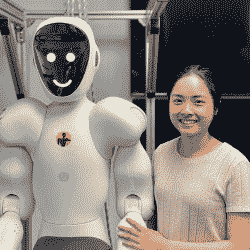

# 以我们自己的形象:我们需要人形机器人吗？

> 原文：<https://hackaday.com/2022/10/17/in-our-own-image-do-we-need-humanoid-robots/>

科幻小说里充满了你不想过多思考的东西。为什么有传送器的星舰会有带力场的禁闭室？为什么不直接把犯人传送到一个封闭的空间？为什么赛昂人驾驶人类控制的飞船？为什么不在他们的…嗯，你知道的。就这一点而言，为什么赛昂人(还有凯龙和戈特)看起来像人类呢？为什么有些赛昂人不只是飞船？

当然，真正的原因是我们可以认同他们，演员可以用一些角色扮演装备和化妆来扮演他们。但是现实生活中实用的机器人很少长得像人类。

没有人会把机器人工厂手臂或 Roomba 与人混淆，但它们完全适合它们的用途。然而，我们对长得像人的机器人很着迷，并继续制造它们，就像下面视频中 IHMC 机器人公司的 Nadia 一样。

 [https://www.youtube.com/embed/_mQJw8VhZ7w?version=3&rel=1&showsearch=0&showinfo=1&iv_load_policy=1&fs=1&hl=en-US&autohide=2&wmode=transparent](https://www.youtube.com/embed/_mQJw8VhZ7w?version=3&rel=1&showsearch=0&showinfo=1&iv_load_policy=1&fs=1&hl=en-US&autohide=2&wmode=transparent)

认为人类的形态对一切都是理想的是一种傲慢。看自然。虽然有些动物看起来像我们，但其他动物则完全不同，因为它们适合不同的生态位。如果你要制造一台智能机器，为什么不让它飞、跳、游泳，甚至呆在一个地方，如果那是它需要做的？例如，机器人快餐油炸厨师[倾向于乘坐在天花板安装的轨道上](https://hackaday.com/2020/08/12/the-ever-accelerating-automation-of-fast-food/)，为什么他们不应该呢？尽管我们喜欢想象机器人，但一大群金属工人问我们是否想要薯条，这可能会有点令人不安。

毫不费事地挑出哪个是机器人。最近有人呼吁不要武装机器人。我们不得不对此窃笑，因为机器人已经武装起来了。除了武装机器人，巡航导弹或者自主无人机是什么？自动驾驶汽车本身就是武器。一颗子弹并不比被一辆 3000 公斤重的汽车撞上更危险。然而，看起来像携带武器的人的机器人比非拟人化的自主武器更让人不安。

一个用例可能是在人类交互领域。也许你真的希望你的机器人护士或翻译(C3PO)看起来有点像人类。被制造来代替一个人的机器人有时可能需要看起来有点像人类，但一般来说，这不是一种有效的方法。(《星球大战》完全正确吗？)对于长得像人但不伪装成人的机器人，你能想到哪些用例？

让我们面对现实吧。像索菲亚、T2、阿西莫或 T4 这样的机器人能制造好的新闻故事。油嘴滑舌的咆哮可能不那么性感，但它更实际，你更有可能在现实生活中遇到。

不是说人形机器人看起来不酷。想造一个吗？现在已经有一个开源软件了，至少是其中的一半。如果你想要全部，去看看[罂粟](https://hackaday.com/2014/03/25/open-source-humanoid-robot-is-awesom-o/)。