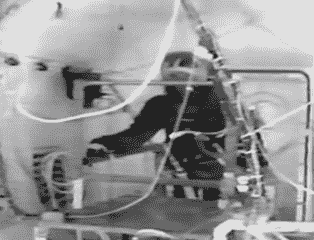
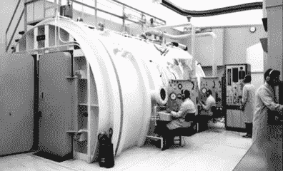

# 在太空，没有人能听到你爆炸:拜福德海豚事件

> 原文：<https://hackaday.com/2019/02/15/in-space-no-one-can-hear-you-explode-the-byford-dolphin-incident/>

“现实生活中不会发生这种事。”真正进入科幻“sci”的人最讨厌的习惯之一就是对电影中的科学不准确之处吹毛求疵。事实是，有些事情只是让电影变得更好，即使它们是错的。

如果没有太空中一场史诗般的战斗的声音，星球大战会是什么样子？但是还有很多其他的例子，事情是错误的，纠正它们也是一样容易的——例如，电影*重力*中太空垃圾的方向。但是爆炸性减压这个古老的比喻呢？一些电影显示身体的大部分到处乱飞。其他照片显示遇难的太空旅行者至少在太空中存活了很短一段时间。

事实证明，将压力从一个大气压降到接近零并不像你想象的那样对你有好处。但这不足以让你像肉气球一样爆炸。你更有可能死于肺栓塞或简单的窒息。但是如果你经历更大的压力变化，你就是一个肉气球。我们怎么知道？这不是理论上的。这些事情在现实生活中都有发生。

1966 年，美国宇航局宇航服技术员吉姆·勒布朗艰难地发现了第一个问题。穿着双子座宇航服，他进入一个真空室[压力软管意外断开](https://youtu.be/KO8L9tKR4CY)。10 秒钟内，他的宇航服内的压力从 3.8 磅/平方英寸下降到几乎为零。

    

勒布朗报告说，在他昏过去之前，他可以感觉到唾液从他的舌头上滚落。事实上，他可以报告这应该告诉你，这一切都结束了。虽然他在 25 秒后才得到紧急氧气，但工程师们在 87 秒内就恢复了舱内的空气供应，而不是正常的 30 分钟抑制程序。除了耳痛，他很好。他保持了 14 秒的清醒。

## 爆炸

那么这是否意味着爆炸的人只是一种电影现象？不完全是。只是需要更大的压差。1983 年，一个名为 Byford Dolphin 的钻井平台发生了事故。五名船员死亡，第六名受重伤。

Photo credit: [Byford Dolphin in Dry Dock](https://commons.wikimedia.org/wiki/File:ByfordDolphinAtInvergordon2008.jpg) by Josef Pavlik CC-SA 3.0.

该平台在北海的弗丽嘉天然气田钻井。四名潜水员在压力为 9 个大气压的两个相连的舱室中。其中一个房间还连接着一个潜水钟。钟用一个夹子把它和房间隔开。然而，夹具过早打开，导致 9 个大气压的压力流向 1 个大气压的钟形罩。

钟声被吹走了，受害者遭受了各种各样的影响，从循环系统突然被不溶性脂肪堵塞到剧烈减压，使体内部分远离 30 英尺。

新的钻机有更多的安全系统和连锁装置来防止这种事情发生。官方称，事故原因是人为失误，尽管也有人认为是设备故障造成的。26 年后，受害者家属确实收到了挪威政府的赔偿。

## 空间

所以像戴夫·鲍曼在《2001 年 T1:太空奇遇记》中那样在几分钟的真空中幸存下来，可能比阿诺·施瓦辛格在《全面回忆》中爆炸更现实。然而，这不会令人愉快。在 20 世纪 60 年代，空军确实给一群黑猩猩减压，只有一只死亡——一只有其他健康问题的老黑猩猩。

这是一部罕见的把一切都做对的太空电影。爆炸看起来与你想象的不同，宇宙飞船不会在引擎运行时不断加速，还有许多其他问题影响着大多数电影。

然而，由一位非常老的中尉来指挥航天飞机，重力可能是最难接受的。这可能不是科学，但仍然很难想象你到了 50 岁，还在指挥航天飞机，但仍然只是一名中尉。当然，看到桑德拉·布洛克穿着太空服摇摆着，看上去完美无缺，至少值得一笑。在被关在一个房间里出汗的本质和内置厕所系统的现实之间，现实生活中的宇航服只是很恶心。

但是，嘿！这只是一部电影。