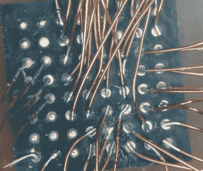

# 以硬件支持的名义进行难以置信的焊接

> 原文：<https://hackaday.com/2020/09/05/incredible-soldering-in-the-name-of-hardware-support/>

如果你正在开发一个基于 Raspberry Pi 的高性能 IP-KVM，一个插入主板 CSI 端口的 HDMI 捕捉设备肯定会是你梦寐以求的外设。事实证明，这种设备确实存在，而且有点令人惊讶的是，它们以合理的价格出售。不幸的是，他们使用的芯片组的文档有点缺乏，如果你试图尽可能多地利用他们的性能，这是一个问题。

作为 Pi-KVM 的创造者，[Maxim Devaev]需要真正了解这些捕捉设备中使用的东芝 TC358743 芯片是如何工作的，[因此他决定从头开始构建自己的版本](https://www.reddit.com/r/raspberry_pi/comments/ie0cbi/handmade_hdmi_capture_card/)。以权宜之计的名义，他没有制作合适的分线板，而是决定将微小的 BGA 芯片直接手工焊接到 bin 找到的一些部件上。由此产生的 perfboard 捕捉设备是艺术和疯狂的平等部分，但更重要的是，实际上即使在 1080p 视频信号下也能按预期工作。

 最终，在这个实验中吸取的教训将导致一个[专用 KVM 板，它将插入 Pi 的扩展头](https://github.com/pikvm/pikvm#the-future-v3-platform-work-in-progress)，并一次性提供所有必要的硬件。正如[Maxim]在 Pi-KVM 文档中解释的那样，与使用 USB 捕获设备相比，使用 CSI 连接的东芝 TC358743 将延迟减少了一半。也就是说，USB 捕获设备将仍然完全支持任何人谁只是需要一个快速的方式让事情工作。

这张 DIY 捕获卡是一个完美的例子，说明在项目工作中展示的技能如何能和最终结果一样令人印象深刻。[Maxim]并没有着手手工焊接 BGA HDMI 捕获芯片，这只是创造更好东西的过程中的一步。那些中间的成果经常在匆忙记录最终项目的过程中丢失，所以当人们花时间分享它们时，我们总是很高兴。

感谢埃里克的提示。]