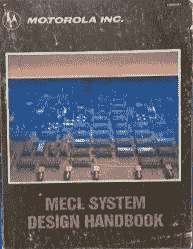
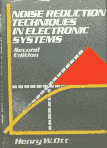
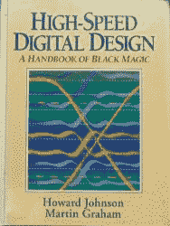
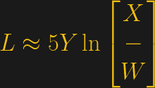
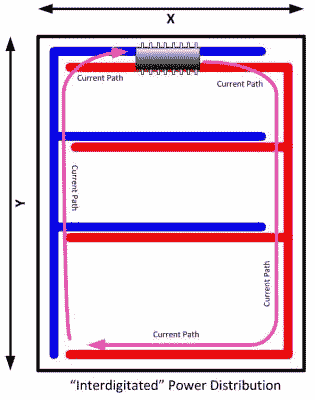
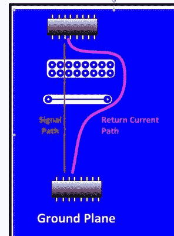
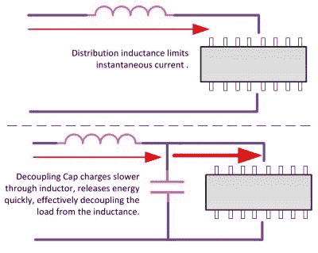
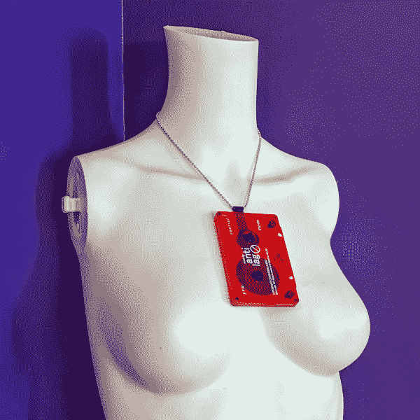
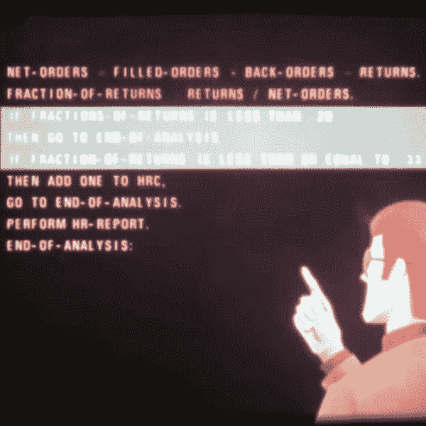

# PCB 布局中的电感:好的、坏的和不稳定的

> 原文：<https://hackaday.com/2018/09/28/inductance-in-pcb-layout-the-good-the-bad-and-the-fugly/>

当电流流过导体时，导体就变成了感应器，当有感应器时，就有了电磁场。如果规划不当，这可能会在 PCB 布局过程中导致各种问题，有时我们甚至会在认为*已经为不必要的电感及其带来的影响*做好规划的情况下受到伤害。

在进行高速逻辑运算时，如果我们想要获得适当的开关时间和逻辑电平，就需要能够将电流的突然变化传递给器件。不幸的是，在这种情况下，电感通常不是好朋友，因为它会阻碍电流的突然变化。如果高速器件驱动容性负载，而容性负载本身会阻止电压变化，则需要更大的瞬时电流。

简而言之，电感会阻止电流变化，当与信号或电源流串联时，可以充当低通滤波器。电感通过在导体周围的磁通量中储存能量来实现这一点。或者，电容器抵抗电压变化(再次通过存储能量),并且当与信号串联时可以充当高通滤波器。这使得它们成为电源分配中对抗无用电感的宝贵工具。

在下面的视频和本文的其余部分，我将深入探讨电感的概念，以及它如何影响电路板布局时的设计选择。

 [https://www.youtube.com/embed/OQm0aBw_ep8?version=3&rel=1&showsearch=0&showinfo=1&iv_load_policy=1&fs=1&hl=en-US&autohide=2&wmode=transparent](https://www.youtube.com/embed/OQm0aBw_ep8?version=3&rel=1&showsearch=0&showinfo=1&iv_load_policy=1&fs=1&hl=en-US&autohide=2&wmode=transparent)

这可能是你以前从未考虑过的事情，但随着电子元件速度的不断提高，PCB 走线的电气特性非常重要。走线中的电阻会导致电压下降，也会减缓容性负载的充电速度。感抗(X [L)] ，在供应电流时，可视为频率相关电阻，这进一步增加了我们的设计挑战。但是，对我们面临的问题有一个基本的了解，将有助于你在设计时认识到问题，而不是在组装原型板之后。

MECL System Design Handbook – Motorola

Noise Reduction Techniques in Electronic Systems – Henry Ott

High Speed Digital Design – Johnson & Graham

在这里你可以看到我最喜欢的三本书，如果你想深入研究这些话题，它们是很好的资源。在视频中，我浏览了这些文本中的几个主题，从《痕迹》中的 DC 抵抗开始，最终形成了下表。这里可以看到，一英寸的平均 PCB 走线可能具有 0.1ω至 15ω的阻抗，具体取决于信号的频率或上升时间。如果我们将阻抗代入欧姆定律，我们会发现 0.1A 时的 10ω电压降为 1V。

| 频率(兆赫) | 上升时间(纳秒) | 阻抗(ω) |
| --- | --- | --- |
| one | Three hundred and eighteen | Zero point one |
| Ten | Thirty-one point eight | One |
| Thirty | Ten point six | Two point eight |
| Fifty | Six point four | Four point seven |
| Seventy | Four point five | Six point six |
| Ninety | Three point five | Eight point five |
| One hundred and ten | Two point nine | Ten point four |
| One hundred and sixty | Two | Fifteen |

Impedance of a One Inch Long Printed Circuit Board Trace (15 nH Inductance). Recreated from *Noise Reduction Techniques* by Henry Ott

知道电路板走线中的压降通常是不需要的，我们可以得出结论，这些走线中的电感也是不需要的。因此，电感越大，对电路的影响就越大。

大家可能不太直观的是，导体回路越大，电感就越大。换句话说，电源和接地回路形成的环路面积越大，电感越高，高速电流需求的电阻也就越大。

知道这个关系多年，却不知道具体的计算公式，在*高速数字设计*这本书里找到了这个公式:

该公式使用以下变量将电感显示为面积的函数:

*   L =电感
*   x，Y =尺寸
*   W =导体宽度

简而言之，电源和接地回路应尽可能靠近。这使电感最小化，限制了随之而来的电压降，并有助于保持电流响应需求的快速变化。

了解了这一点，你就可以看到一些原型板上的常见做法，即所谓的“交叉指型”，到底有多糟糕。您经常会看到电压总线在原型板的一侧，而接地总线在另一侧(如下所示)。实际上，电源环路面积接近整个电路板的尺寸。由于导体在等式中的位置，增加导体的宽度并不会真正降低整体电感。最佳答案是通过创建电源和接地路径网格等技术，或者明智地使用接地层和电源层，来减小面积。

Interdigitated power distribution results in a larger area and higher inductance.

Apertures in ground plane can increase current path area and increase inductance.

使用接地层并不自动意味着电感问题最小化；必须注意不要在地面或电源层上放置障碍物，以免无意中造成问题。随着信号频率的上升，接地层(或电源层)上的返回路径会越来越近。如果信号穿过平面中的间隙，例如可能由连接器或平面层上的信号走线造成的间隙，则返回路径可能不得不绕道而行，从而增加环路，有时甚至出乎意料。

图中显示了接地层中的孔洞如何影响返回路径的示例。实际上，接地层或电源层通常被掩埋，因此这个问题可能不容易发现。如果两个单身者最终挤过两个障碍物之间的同一个小区域，那么串扰也会成为一个问题。

Capacitor “decouples” load from distribution inductance.

您可能对去耦电容很熟悉，这种小电容往往靠近集成电路(IC ),并尽可能靠近 IC 本身跨接在电源上。其思想是，电源走线中的电感仍然存在，但 IC 附近有一个电流源，因此去耦电容和 IC 之间的电感会因接近而大大降低。

最后，你应该熟悉“诱导踢”的效果。这一点在我小时候学过的视频中有所展示。我用一个大线圈和 9V 电池点亮了一个数码管。该演示旨在表明电感器确实不喜欢电流的变化，并使用存储在其通量中的能量来保持电流流动，甚至达到点燃谢妮所需的 100 伏以上的电压。

了解电感和电容的基本知识对于 PCB 设计人员至关重要。你已经知道 IC 需要去耦电容，但知道为什么更重要。了解一些等待布线不良的高速走线的陷阱，将为您节省大量时间和麻烦。

*   [**](https://www.facebook.com/sharer/sharer.php?u=https%3A%2F%2Fhackaday.com%2F2018%2F09%2F28%2Finductance-in-pcb-layout-the-good-the-bad-and-the-fugly%2F)
*   [**](https://twitter.com/intent/tweet?text=Inductance%20In%20PCB%20Layout:%20The%20Good,%20The%20Bad,%20And%20The%20Fugly%20via%20@hackaday&url=https://hackaday.com/2018/09/28/inductance-in-pcb-layout-the-good-the-bad-and-the-fugly/)
*   [**](https://www.linkedin.com/shareArticle?url=https%3A%2F%2Fhackaday.com%2F2018%2F09%2F28%2Finductance-in-pcb-layout-the-good-the-bad-and-the-fugly%2F)
*   [**](mailto:?subject=Inductance+In+PCB+Layout%3A+The+Good%2C+The+Bad%2C+And+The+Fugly | Hackaday&body=https%3A%2F%2Fhackaday.com%2F2018%2F09%2F28%2Finductance-in-pcb-layout-the-good-the-bad-and-the-fugly%2F)

Posted in [Featured](https://hackaday.com/category/featured/), [hardware](https://hackaday.com/category/hardware/), [Misc Hacks](https://hackaday.com/category/misc-hacks/), [Slider](https://hackaday.com/category/slider/), [Tech Hacks](https://hackaday.com/category/tech-hacks/)Tagged [bil herd](https://hackaday.com/tag/bil-herd/), [ground plane](https://hackaday.com/tag/ground-plane/), [henry ott](https://hackaday.com/tag/henry-ott/), [High Speed Design](https://hackaday.com/tag/high-speed-design/), [inductance](https://hackaday.com/tag/inductance/), [MECL](https://hackaday.com/tag/mecl/), [pcb](https://hackaday.com/tag/pcb/), [pcb layout](https://hackaday.com/tag/pcb-layout/), [self-inductance](https://hackaday.com/tag/self-inductance/)

# 后期导航

[← FPGA Jacked Into Pinball Machine Masters High Scores](https://hackaday.com/2018/09/28/fpga-jacked-into-pinball-machine-masters-high-scores/)[Maker Faire NY: Developing For The Final Frontier →](https://hackaday.com/2018/09/28/maker-faire-ny-developing-for-the-final-frontier/)

## 39 对“PCB 布局中的电感:好的、坏的和不稳定的”的思考

1.  **Jonathan Bennett** says:[Septe Mber28, 2018 at 7: 15am](https://hackaday.com/2018/09/28/inductance-in-pcb-layout-the-good-the-bad-and-the-fugly/#comment-5165111)

    This is really great! I look forward to watching the whole video and reading it more carefully later today.

    [Report comment](javascript:void(0);)[Reply](https://hackaday.com/2018/09/28/inductance-in-pcb-layout-the-good-the-bad-and-the-fugly/?replytocom=5165111#respond)
2.  **x vs y** says:[September 28, 2018 at 7: 15 am](https://hackaday.com/2018/09/28/inductance-in-pcb-layout-the-good-the-bad-and-the-fugly/#comment-5165112)

    The latest edition of Ott's book has been renamed Electromagnetic Compatibility Engineering
    , and it's quite good to read (although the previous chapters are a bit dry with the old basic knowledge of rehashing electromagnetics).
    I am currently reading the latest edition of Morrison (Grounding and Shielding: Circuit and Interference). I must say that I prefer Ott.

    [Report comment](javascript:void(0);)[Reply](https://hackaday.com/2018/09/28/inductance-in-pcb-layout-the-good-the-bad-and-the-fugly/?replytocom=5165112#respond)
    1.  **Bil**说:[2018 年 9 月 28 日上午 7 点 25 分](https://hackaday.com/2018/09/28/inductance-in-pcb-layout-the-good-the-bad-and-the-fugly/#comment-5165129)

        是的,我的点燃上有你提到的新版本,但我喜欢灰色的小书

        [报道评论](javascript:void(0);)[回复](https://hackaday.com/2018/09/28/inductance-in-pcb-layout-the-good-the-bad-and-the-fugly/?replytocom=5165129#respond)
    2.  **[The Current Source (@TCurrentSource)](http://twitter.com/TCurrentSource)** says:[September 28, 218 at 8: 14 am](https://hackaday.com/2018/09/28/inductance-in-pcb-layout-the-good-the-bad-and-the-fugly/#comment-5165246)

        Ott's book is a bee's knee, but it's also a great condensed message. I've been thinking about making a video with horrible layout and a video with EMI conscious layout, and comparing them in my TEM cell to see the visual differences. I'll find time to do it one day!

        [Report comment](javascript:void(0);)[Reply](https://hackaday.com/2018/09/28/inductance-in-pcb-layout-the-good-the-bad-and-the-fugly/?replytocom=5165246#respond)
        1.  **Bil Herd** says:[September 28, 218 at 8: 26 AM](https://hackaday.com/2018/09/28/inductance-in-pcb-layout-the-good-the-bad-and-the-fugly/#comment-5165268)

            Besides, things like this never seem to go the way I planned, and it's hard to do anything wrong on purpose.

            [Report comment](javascript:void(0);)[Reply](https://hackaday.com/2018/09/28/inductance-in-pcb-layout-the-good-the-bad-and-the-fugly/?replytocom=5165268#respond)
            1.  **[The Current Source (@TCurrentSource)](http://twitter.com/TCurrentSource)** says:[September 28, 218 AT 8: 33 AM](https://hackaday.com/2018/09/28/inductance-in-pcb-layout-the-good-the-bad-and-the-fugly/#comment-5165282)

                I always see the comparison chart of curve line, 45-degree line and sharp curve line, which shows that sharp curve is the worst. I really want to test how bad it is … for this reason, I made a trigger with a fairly fast rise time, and I just can't find the personal time to do it!

                [Report comment](javascript:void(0);)[Reply](https://hackaday.com/2018/09/28/inductance-in-pcb-layout-the-good-the-bad-and-the-fugly/?replytocom=5165282#respond)
                1.  **Pat** says:[September 28, 218 at 11: 41am](https://hackaday.com/2018/09/28/inductance-in-pcb-layout-the-good-the-bad-and-the-fugly/#comment-5165816)

                    To a large extent, this is the same as the effect of placing a capacitor on the line, because the extra copper is important. For 90-degree bending, this is equivalent to placing a 1.6 fF/mil wide capacitor on FR4 with a 50-ohm microstrip line (the capacitance is 3.3 pF/in because of the extra capacitance of about half the line width). Therefore, a 10-mil-wide trace adds 16 fF capacitance.

                    How important this is obviously depends on the frequency. At 1 GHz, the impedance to the ground is 1 kOhm, while the impedance to the ground is 50 ohm, so the reflection is only a few percentage points.

                    [https://www . edn . com/electronics-blogs/all-on-board-/4438573/ When-to-worry-trace-corners–Rule-of-Thumb-24](https://www.edn.com/electronics-blogs/all-aboard-/4438573/When-to-worry-about-trace-corners--Rule-of-Thumb--24)

                    [Report comment](javascript:void(0);)
                2.  **Bil Herd** says:[September 28, 218 at 12: 37 PM](https://hackaday.com/2018/09/28/inductance-in-pcb-layout-the-good-the-bad-and-the-fugly/#comment-5165976)

                    Yes, if you take a 90-degree angle and straighten it, you will get a straight line with basically a triangle on its side. The increase of width is equivalent to the change of impedance, and may cause some part of the signal to be reflected. What's more, a bunch of corners will have a cumulative effect.

                    For slow-moving signals such as I/O lines, a 90-degree angle is usually not a big problem.

                    Regarding the teardrops on the pads, although they seem to allow "smoother flow", they are actually intended to increase the output of PCB manufacturing, because it allows the holes to deviate slightly from the center sometimes, depending on the direction.

                    [Report comment](javascript:void(0);)
                3.  **[加思威尔逊](http://wilsonminesco.com/)** 说:[2020 年 1 月 30 日下午 1 点 39 分](https://hackaday.com/2018/09/28/inductance-in-pcb-layout-the-good-the-bad-and-the-fugly/#comment-6215540)

                    见 [https://web。存档。org/web/20110910025458/http://www。sigcon。com/Pubs/edn/bigbadbend。htm](https://web.archive.org/web/20110910025458/http://www.sigcon.com/Pubs/edn/bigbadbend.htm) 医生的文章《谁怕那个又大又坏的弯》

                    [报告评论](javascript:void(0);)
    3.  **fonz** says:[September 28, 218 at 12: 38 pm](https://hackaday.com/2018/09/28/inductance-in-pcb-layout-the-good-the-bad-and-the-fugly/#comment-5165979)

        Is OTT still very expensive? Many years ago, when I was in college, The price of the books I have to buy is 2-3 times that of other books

        [Report comment](javascript:void(0);)[Reply](https://hackaday.com/2018/09/28/inductance-in-pcb-layout-the-good-the-bad-and-the-fugly/?replytocom=5165979#respond)
        1.  **Bil Herd** says:[October 1, 218 at 7: 31 am](https://hackaday.com/2018/09/28/inductance-in-pcb-layout-the-good-the-bad-and-the-fugly/#comment-5186024)

            I think my new and old mobile phones are bought from eBay or Amazon. In the past, this was a week's salary for a junior engineer, so we have a departmental copy to share.

            [Report comment](javascript:void(0);)[Reply](https://hackaday.com/2018/09/28/inductance-in-pcb-layout-the-good-the-bad-and-the-fugly/?replytocom=5186024#respond)
            1.  **fonz**说:[2018 年 10 月 5 日下午 4:28](https://hackaday.com/2018/09/28/inductance-in-pcb-layout-the-good-the-bad-and-the-fugly/#comment-5214873)

                我在 90 年代初买的,我想大概是 140 美元

                [举报评论](javascript:void(0);)[回复](https://hackaday.com/2018/09/28/inductance-in-pcb-layout-the-good-the-bad-and-the-fugly/?replytocom=5214873#respond)
3.  **tgt** says:[September 28, 218at7: 23am](https://hackaday.com/2018/09/28/inductance-in-pcb-layout-the-good-the-bad-and-the-fugly/#comment-5165126)

    is indeed a "Handbook of Dark Arts". I have great respect for those who understand these things at a higher level.

    [Report comment](javascript:void(0);)[Reply](https://hackaday.com/2018/09/28/inductance-in-pcb-layout-the-good-the-bad-and-the-fugly/?replytocom=5165126#respond)
    1.  **Bil Herd** says:[September 28, 218 at 7: 30 am](https://hackaday.com/2018/09/28/inductance-in-pcb-layout-the-good-the-bad-and-the-fugly/#comment-5165139)

        I tend to avoid the term "magic" because I have seen the management abuse this term, and I tend to use the term "art/art"

        [Report comment](javascript:void(0);)[Reply](https://hackaday.com/2018/09/28/inductance-in-pcb-layout-the-good-the-bad-and-the-fugly/?replytocom=5165139#respond)
    2.  **Carl** says:[September 28, 2018 AT 8: 45 AM](https://hackaday.com/2018/09/28/inductance-in-pcb-layout-the-good-the-bad-and-the-fugly/#comment-5165315)

        Harry Potter also uses magic, but he spends time studying it and figuring out how it works. This is how you control your design.

        [Report comment](javascript:void(0);)[Reply](https://hackaday.com/2018/09/28/inductance-in-pcb-layout-the-good-the-bad-and-the-fugly/?replytocom=5165315#respond)
        1.  **RetepV** says:[October 3, 218 at 7: 19 am](https://hackaday.com/2018/09/28/inductance-in-pcb-layout-the-good-the-bad-and-the-fugly/#comment-5207239)

            You are mistaken. Hermione studies and figures out how it works. Harry just relies on talent, brute force and luck.

            And Hermione, if none of his things work.

            [Report comment](javascript:void(0);)[Reply](https://hackaday.com/2018/09/28/inductance-in-pcb-layout-the-good-the-bad-and-the-fugly/?replytocom=5207239#respond)
4.  **伊森·斯朗伯里** 说:[2018 年 9 月 28 日上午 7 点 30 分](https://hackaday.com/2018/09/28/inductance-in-pcb-layout-the-good-the-bad-and-the-fugly/#comment-5165138)

    伟大的视频 Bil！！看这些总是很兴奋

    [报道评论](javascript:void(0);)[回复](https://hackaday.com/2018/09/28/inductance-in-pcb-layout-the-good-the-bad-and-the-fugly/?replytocom=5165138#respond)
5.  **BobH** says:[September 28, 218at7: 39am](https://hackaday.com/2018/09/28/inductance-in-pcb-layout-the-good-the-bad-and-the-fugly/#comment-5165161)

    Xilinx documents also have some good materials about high-speed routing, including differential pair routing and controlled impedance routing.

    [Report comment](javascript:void(0);)[Reply](https://hackaday.com/2018/09/28/inductance-in-pcb-layout-the-good-the-bad-and-the-fugly/?replytocom=5165161#respond)
    1.  **Bil Herd** says:[September 28, 2018 at 8: 05 am](https://hackaday.com/2018/09/28/inductance-in-pcb-layout-the-good-the-bad-and-the-fugly/#comment-5165221)

        Yes, FPGA company has strengthened the documentation on the environment of the device. I tried to mention this in https://hackaday.com/2016/03/29/when-difference-matters/'s post, where there is no shortage of available information.

        [Report comment](javascript:void(0);)[Reply](https://hackaday.com/2018/09/28/inductance-in-pcb-layout-the-good-the-bad-and-the-fugly/?replytocom=5165221#respond)
6.  **托马斯·沃尔什** 说:[2018 年 9 月 28 日上午 11 点 25 分](https://hackaday.com/2018/09/28/inductance-in-pcb-layout-the-good-the-bad-and-the-fugly/#comment-5165743)

    干得好。谢谢你。我特别喜欢你把它绑在去耦电容上

    [报道评论](javascript:void(0);)[回复](https://hackaday.com/2018/09/28/inductance-in-pcb-layout-the-good-the-bad-and-the-fugly/?replytocom=5165743#respond)
7.  **Flint** says:[September 28, 218 at 2: 19 pm](https://hackaday.com/2018/09/28/inductance-in-pcb-layout-the-good-the-bad-and-the-fugly/#comment-5166130)

    Two of these books can be found in Internet archives, but unfortunately Henry Ott's is not.

    [Report comment](javascript:void(0);)[Reply](https://hackaday.com/2018/09/28/inductance-in-pcb-layout-the-good-the-bad-and-the-fugly/?replytocom=5166130#respond)
8.  **jtlien** says:[September 28, 2018 at 3: 50 pm](https://hackaday.com/2018/09/28/inductance-in-pcb-layout-the-good-the-bad-and-the-fugly/#comment-5166274)

    In addition, you can download Li Ruiqi's book "Being Right the First Time" online for free. Explained many questions about high-speed design.

    [Report comment](javascript:void(0);)[Reply](https://hackaday.com/2018/09/28/inductance-in-pcb-layout-the-good-the-bad-and-the-fugly/?replytocom=5166274#respond)
    1.  **道格** 说:[2018 年 9 月 28 日下午 6:50](https://hackaday.com/2018/09/28/inductance-in-pcb-layout-the-good-the-bad-and-the-fugly/#comment-5166881)

        [http://www.thehighspeeddesignbook.com/](http://www.thehighspeeddesignbook.com/)那么它可能是给黑客日的访问者看的,因为他并不像书名暗示的那样庆祝典型的黑客精神

        [举报评论](javascript:void(0);)[回复](https://hackaday.com/2018/09/28/inductance-in-pcb-layout-the-good-the-bad-and-the-fugly/?replytocom=5166881#respond)
9.  **[JWhitten](http://makeme.blog)** says:[September 28, 2018 at 4: 59 pm](https://hackaday.com/2018/09/28/inductance-in-pcb-layout-the-good-the-bad-and-the-fugly/#comment-5166420)

    Now, if he can add a function, By the poacher blowing up a hole, he may have something …

    [report comment](javascript:void(0);)[reply](https://hackaday.com/2018/09/28/inductance-in-pcb-layout-the-good-the-bad-and-the-fugly/?replytocom=5166420#respond)[
10.  **Doug** says:[September 28, 2018 at 7: 20 PM](https://hackaday.com/2018/09/28/inductance-in-pcb-layout-the-good-the-bad-and-the-fugly/#comment-5167255)

    Great demonstration bill. Thank you for taking the time to make it .. There is no doubt that there is a good video on your electronic tube to explain why both capacitors and inductors exist. When a group of computer geeks and I outnumbered me when the computer speed increased, I mentioned that board designers would have their thinking hats. I was fired because I was the electronic and electrical guy. Fines; I'm thick-skinned enough to stand it. This video tells me that I don't know how right I am.

    [Report comment](javascript:void(0);)[Reply](https://hackaday.com/2018/09/28/inductance-in-pcb-layout-the-good-the-bad-and-the-fugly/?replytocom=5167255#respond)
    1.  **[Garth Wilson](http://wilsonminesco.com/)** says:[January 30, 2020 at 1: 45 pm](https://hackaday.com/2018/09/28/inductance-in-pcb-layout-the-good-the-bad-and-the-fugly/#comment-6215542)

        When I first started doing this work, some engineering students entered the digital field to avoid the heavier mathematical burden in the analog field; But with the increase of speed, digital has become the worst form of analog-radio frequency and microwave!

        [Report comment](javascript:void(0);)[Reply](https://hackaday.com/2018/09/28/inductance-in-pcb-layout-the-good-the-bad-and-the-fugly/?replytocom=6215542#respond)
11.  **Dan Miller** says:[September 2 8, 2018 at 10: 30 pm](https://hackaday.com/2018/09/28/inductance-in-pcb-layout-the-good-the-bad-and-the-fugly/#comment-5168704)

    It's interesting to read this. We have a distributed clock signal project. Everything is a daisy chain. In theory, it works. They started the system, and the clocks of some devices were lost. I told the engineer,' The cable is too long.' He ignored me and began to troubleshoot the system. Next, he pulled out the cable and put it on the floor. A quick tape measure to check the cable and some quick calculations made him curse. It's 1/4 wavelength long, and the length is such that it hits the current node. No signal. He looked at me and said,' You can tell without looking?' I told him' I see it is being assembled, and the people who assembled it don't need any help.'

    [Report comment](javascript:void(0);)[Reply](https://hackaday.com/2018/09/28/inductance-in-pcb-layout-the-good-the-bad-and-the-fugly/?replytocom=5168704#respond)
    1.  **Bil Herd** says:[October 1, 218 at 7: 57 AM](https://hackaday.com/2018/09/28/inductance-in-pcb-layout-the-good-the-bad-and-the-fugly/#comment-5186052)

        I like the "detuning" wiring very much, and mentioned in one of my FPGA videos that I hate stubs, even if they are short, and try to make all power wiring a loop. I have seen the "standing wave", that is, the point where reflected interference continues to appear, which has a very real effect. On C128, there is a line on the PCB that is redundant for the existing A10 signal. This is what we run when Z80 communicates with DRAM. In this case, there is a burr at the address multiplexer of DRAM, and adding wires can eliminate the reflection, because there is no short line to reflect.

        The worst thing I saw was the spiral formed by a power trace plugged into a tab many years ago. Another engineer changed the EPROM of NMOS to CMOS, but it didn't work. I asked to have a look and start removing all other chips while testing EPROM in a cycle. CMOS EPROM is the only load. On the 8-inch -10-inch route (spiraling up, which may not make the problem worse, it just indicates not to take shortcuts on the option board), it rings like a bell! 4V oscillation on the 5V power line! NMOS draws enough current to terminate the end of the line, and CMOS is like a feather. A wire from the end of the wire to the entry point on the board changed the symptoms in a way that allowed it to work.

        [Report comment](javascript:void(0);)[Reply](https://hackaday.com/2018/09/28/inductance-in-pcb-layout-the-good-the-bad-and-the-fugly/?replytocom=5186052#respond)
12.  **Mac** says:[September 29, 218 at 3: 28 am](https://hackaday.com/2018/09/28/inductance-in-pcb-layout-the-good-the-bad-and-the-fugly/#comment-5170522)

    I know this article focuses on numbers, but the role of inductors in non-digital design cannot be underestimated. Just trying to design a good switching power supply, And ignore these concepts …

    [report comment](javascript:void(0);)[reply](https://hackaday.com/2018/09/28/inductance-in-pcb-layout-the-good-the-bad-and-the-fugly/?replytocom=5170522#respond)
    1.  **Bil Herd** says:[October 1, 2018 AT 8: 00 AM](https://hackaday.com/2018/09/28/inductance-in-pcb-layout-the-good-the-bad-and-the-fugly/#comment-5186059)

        That's right, this article only discusses useless inductors in PCB layout. For example, I discussed transmission lines before. Inductors and capacitors combine to form a transmission line, which, if handled properly, transmits digital and analog/analog.

        [Report comment](javascript:void(0);)[Reply](https://hackaday.com/2018/09/28/inductance-in-pcb-layout-the-good-the-bad-and-the-fugly/?replytocom=5186059#respond)
    2.  **[Garth Wilson](http://wilsonminesco.com/)** says:[January 30, 2020 at 1: 47 PM](https://hackaday.com/2018/09/28/inductance-in-pcb-layout-the-good-the-bad-and-the-fugly/#comment-6215543)

        I worked in the UHF power transistor application engineering department in the mid-1980s. I can tell you that most electronics enthusiasts have no idea what happened there. Surprisingly, after working in digital power supplies or even switching mode power supplies, my understanding of high-frequency behavior is further improved. Compared with digital power supplies, the rise time of these power supplies is not particularly significant, but di/dt is astronomical.

        [Report comment](javascript:void(0);)[Reply](https://hackaday.com/2018/09/28/inductance-in-pcb-layout-the-good-the-bad-and-the-fugly/?replytocom=6215543#respond)
13.  **George** says:[September 29, 2018 AT 10: 35 AM](https://hackaday.com/2018/09/28/inductance-in-pcb-layout-the-good-the-bad-and-the-fugly/#comment-5171594)

    This is a good article and an important topic for anyone engaged in real circuit board design. Discussions like this are a good starting point for thinking about EMC/EMI and other issues.

    However, I think it is worth clarifying that the approximate formula of loop inductance given in the article and video is only valid in some layouts (such as grid or cross layout), where "x" and "y" have clear physical meanings (in the more general case of a single trace in a rectangular loop, you can see which dimension x you choose will affect your results). I didn't read through the high-speed digital design, but I spent some time reading the latest version of Ott's book ("Electromagnetic Compatibility Engineering", also recommended by some other reviewers), which listed some approximate methods for calculating mutual inductance/self inductance in various physical scenarios. To make a long story short, in the real world, it becomes very complicated and fast.

    However, fortunately, for many aspects of actual EMC/EMI, I found that it is not particularly important to be able to calculate the inductance of a specific trace. Bil said at the end of the video that it is important to be able to infer the path of current through the layout at the signal frequency. If you can do this, then you can use tools such as inductance, capacitance and layout to adjust the paths at different frequencies, thus reducing radiation and noise without affecting the target fundamental signal.

    [Report comment](javascript:void(0);)[Reply](https://hackaday.com/2018/09/28/inductance-in-pcb-layout-the-good-the-bad-and-the-fugly/?replytocom=5171594#respond)
14.  **Neil** says:[September 29, 2018 at 8: 25 pm](https://hackaday.com/2018/09/28/inductance-in-pcb-layout-the-good-the-bad-and-the-fugly/#comment-5172063)

    Most of them are entertaining, but sometimes they are also educational! Thank you! I counted three things I learned in five minutes, and I didn't even watch a video or read a book.

    [Report comment](javascript:void(0);)[Reply](https://hackaday.com/2018/09/28/inductance-in-pcb-layout-the-good-the-bad-and-the-fugly/?replytocom=5172063#respond)
15.  **Alan** says:[October 1, 218at4: 18am](https://hackaday.com/2018/09/28/inductance-in-pcb-layout-the-good-the-bad-and-the-fugly/#comment-5185436)

    I have seen the basic inductance measurement kit, which usually runs below 1MHz. As the frequency increases, what is the best method? I suspect that checking PCB wiring at hundreds of MHz will be creepy.

    [Report comment](javascript:void(0);)[Reply](https://hackaday.com/2018/09/28/inductance-in-pcb-layout-the-good-the-bad-and-the-fugly/?replytocom=5185436#respond)
    1.  **Bil Herd** says:[October 1, 218 at 8: 14 am](https://hackaday.com/2018/09/28/inductance-in-pcb-layout-the-good-the-bad-and-the-fugly/#comment-5186080)

        For PCB routing, it is a bit complicated because there are many points and different sources happening at the same time, that is, It is not a simple inductor, and we often pay attention to what happens at different lengths of conductors .. There are expensive simulators, but they are the best mathematical guesses in the end.

        There are some tools for RF, such as vector network analyzer, which may provide insight, but they are also expensive. The parallel grid inclinometer can sometimes provide clues in a simpler situation. It is the frequency source you mentioned, but you must couple it to the circuit under test. It's actually good at finding out things like resonant circuits. If you know the capacitance (or at least guess), you can start making some assumptions about the inductance.

        [Report comment](javascript:void(0);)[Reply](https://hackaday.com/2018/09/28/inductance-in-pcb-layout-the-good-the-bad-and-the-fugly/?replytocom=5186080#respond)
16.  **说:****[2018 年 10 月 1 日凌晨 5 点 44 分](https://hackaday.com/2018/09/28/inductance-in-pcb-layout-the-good-the-bad-and-the-fugly/#comment-5185511)**

    **是啊！基本脉冲电平的另一个视频。谢谢大家！**

    **[举报评论](javascript:void(0);)****[回复](https://hackaday.com/2018/09/28/inductance-in-pcb-layout-the-good-the-bad-and-the-fugly/?replytocom=5185511#respond)**
***   **[阿兰 w2ew](http://www.youtube.com/w2aew)**说:[2018 年 10 月 1 日上午 10:35](https://hackaday.com/2018/09/28/inductance-in-pcb-layout-the-good-the-bad-and-the-fugly/#comment-5186426)

    是的——我有这三本书——每一本都用得很好,也很旧！印刷电路板图像电流可视化的好例子. . .
    下面是我做的几个相关主题的视频:
    电源去耦:【https://www.youtube.com/watch？v=9EaTdc2mr34
    电感反冲（继电器线圈):[https://www.youtube.com/watch?v=c6I7Ycbv8B8](https://www.youtube.com/watch?v=c6I7Ycbv8B8)电容自谐振:[https://www.youtube.com/watch?v=vi24SpKYYoQ](https://www.youtube.com/watch?v=vi24SpKYYoQ)示波器探头接地线电感:[https://www.youtube.com/watch?v=zodpCuxwn_o](https://www.youtube.com/watch?v=zodpCuxwn_o)自制高性能探头插座:[https://www.youtube.com/watch?v=-4q8geE5ef8](https://www.youtube.com/watch?v=-4q8geE5ef8)

    [报道评论](javascript:void(0);)[回复](https://hackaday.com/2018/09/28/inductance-in-pcb-layout-the-good-the-bad-and-the-fugly/?replytocom=5186426#respond)*   **Donald Spade** says:[October 2 , 2018 at 11: 10 AM](https://hackaday.com/2018/09/28/inductance-in-pcb-layout-the-good-the-bad-and-the-fugly/#comment-5190730)

    We have a big box (used for space flight) on Skylab, which has multiple clock signals distributed to provide clocks to avoid competition. We found that if the clock signal becomes negative, 66 Wiring the clock line around the chassis causes this problem, and we have to terminate the line with a terminal to suppress any ringing. Production personnel are reluctant to run the clock line in this controlled way, but this solves the problem.

    [Report comment](javascript:void(0);)[Reply](https://hackaday.com/2018/09/28/inductance-in-pcb-layout-the-good-the-bad-and-the-fugly/?replytocom=5190730#respond)*   **Glen** says:[November 12, 219 at 3: 12 pm](https://hackaday.com/2018/09/28/inductance-in-pcb-layout-the-good-the-bad-and-the-fugly/#comment-6194538)

    I have been a board for 30 years … You have clarified many answers about "why" I do what I have been doing in a very easy-to-understand and concise way. Very cool guy … thanks for sharing! Keep it up!

    [Report comment](javascript:void(0);)[Reply](https://hackaday.com/2018/09/28/inductance-in-pcb-layout-the-good-the-bad-and-the-fugly/?replytocom=6194538#respond)**

 **### 留下回复 [取消回复](/2018/09/28/inductance-in-pcb-layout-the-good-the-bad-and-the-fugly/#respond)

请友好和尊重地帮助评论区变得更好。([评论策略](https://hackaday.com/policies/))

这个网站使用 Akismet 来减少垃圾邮件。[了解如何处理您的评论数据](https://akismet.com/privacy/)。**  **# 搜索

# 从不错过任何一次黑客攻击

[Follow on facebook](https://www.facebook.com/pages/Hack-a-Day/136115233068429) [Follow on twitter](https://twitter.com/hackaday) [Follow on youtube](https://www.youtube.com/user/hackaday) [Follow on rss](https://hackaday.com/blog/feed/) [Contact us](mailto:tips@hackaday.com)

# 订阅

# 如果你错过了

*    

    ## [Amazing and simple ways to steal cryptocurrency](https://hackaday.com/2023/01/06/the-surprisingly-simple-way-to-steal-cryptocurrency/)

    [51 Comments](https://hackaday.com/2023/01/06/the-surprisingly-simple-way-to-steal-cryptocurrency//#comments)
*    

    ## Sorry, your tie is not fastened properly

    [90 Comments](https://hackaday.com/2023/01/05/excuse-me-your-tie-is-unzipped//#comments)
*    

    ## [Everything about USB-C: resistors and electronic markers](https://hackaday.com/2023/01/04/all-about-usb-c-resistors-and-emarkers/)

    [15 comments](https://hackaday.com/2023/01/04/all-about-usb-c-resistors-and-emarkers//#comments)
*    

    ## [2022: With the transformation of the hardware world](https://hackaday.com/2023/01/03/2022-as-the-hardware-world-turns/)

    [28 Comments](https://hackaday.com/2023/01/03/2022-as-the-hardware-world-turns//#comments)
*    

    ## [Put on this 3D printing adapter and put your favorite tape as a necklace](https://hackaday.com/2022/12/29/wear-your-fave-cassette-tapes-as-a-necklace-with-this-3d-printed-adapter/)

    [46 Comments](https://hackaday.com/2022/12/29/wear-your-fave-cassette-tapes-as-a-necklace-with-this-3d-printed-adapter//#comments)

[More from this category](https://hackaday.com/category/featured/)

[//search.supplyframe.com/partner/31/464/<search term>](//search.supplyframe.com/partner/31/464/<search term>)

# 我们的专栏

*    

    ## [Hacker Day Link: January 8, 2023](https://hackaday.com/2023/01/08/hackaday-links-january-8-2023/)

    [3 Comments](https://hackaday.com/2023/01/08/hackaday-links-january-8-2023//#comments)
*   

    ## hack aday，新年快乐！

    [2 评论](https://hackaday.com/2023/01/07/happy-new-year-hackaday//#comments)
*    

    ## [This week is safe: Lastpass take-out, bitcoin loss and pytorch](https://hackaday.com/2023/01/06/this-week-in-security-lastpass-takeaway-bitcoin-loss-and-pytorch/)

    [9 Comments](https://hackaday.com/2023/01/06/this-week-in-security-lastpass-takeaway-bitcoin-loss-and-pytorch//#comments)
*    

    ## [Hackaday Podcast 200: Happy New Year, Ultimate Game Boy, and all things Python](https://hackaday.com/2023/01/06/hackaday-podcast-200-happy-new-year-the-ultimate-game-boy-and-python-all-the-things/)

    [1 Comment](https://hackaday.com/2023/01/06/hackaday-podcast-200-happy-new-year-the-ultimate-game-boy-and-python-all-the-things//#comments)
*    

    ## [Anti-technology: key code reading, 1970s style](https://hackaday.com/2023/01/05/retrotechtacular-critical-code-reading-70s-style/)

    [27 comments](https://hackaday.com/2023/01/05/retrotechtacular-critical-code-reading-70s-style//#comments)

[More from this category](https://hackaday.com/category/hackaday-columns/)**