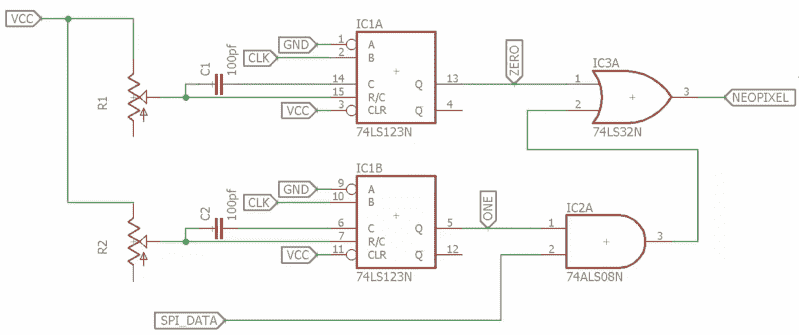

# 通过硬件黑客解决低效的新像素控制

> 原文：<https://hackaday.com/2019/02/18/inefficient-neopixel-control-solved-with-hardware-hackery/>

人人都爱 NeoPixels。价格低廉，可单独寻址的 RGB LEDs。只需连接一个 Arduino，加载演示代码，享受你的闪光灯。

但是事实证明演示代码并不是非常高效。[Ben Heck]当他发现用于 NeoPixels 的 ESP32 样本代码使用 uint32 来存储每一位数据时，他几乎要吐口水了。这意味着每个 LED 需要 96 字节的 RAM。有了 4k 的 RAM，你可以控制 42 个 led。这相当于阿波罗导航计算机到达月球所需的内存量！

他的冒险是基于这样的想法:你应该能够用硬件 SPI 产生这些信号。首先，他看了一下 Adafruit 的 [DMA 驱动的新像素](https://learn.adafruit.com/dma-driven-neopixels/overview)的例子。虽然这比 ESP32 演示代码效率高得多，但新像素数据的每一位仍需要 3 个 SPI 位。[Ben]最终为我们提供了一个使用几个 7400 系列芯片的[高效 SPI 控制解决方案:](https://github.com/benheck/SPI-Neopixel)

[Ben]的解决方案使用一些外部硬件来降低软件需求。74HC123 双多谐振荡器用于产生新像素所需的两种脉冲长度。每个多谐振荡器的时序由外部电阻和电容设置，选择这些电阻和电容是为了满足 NeoPixel 时序规格。

74HC123s 由 SPI 时钟信号提供时钟，SPI 数据通过长脉冲馈入与门。(在新像素术语中，长脉冲是逻辑 1。)当 SPI 数据为 1 时，长脉冲被传递到新像素。否则，只有短脉冲通过。

该解决方案只需要一个 74HC123、一个与门和一个或门。总成本远低于一美元。任何希望用资源受限的微控制器驱动新像素的人都可以尝试一下这种设计。它还提醒我们，有些问题最好用硬件而不是软件来解决。

 [https://www.youtube.com/embed/aCK0SpZ2ueg?version=3&rel=1&showsearch=0&showinfo=1&iv_load_policy=1&fs=1&hl=en-US&autohide=2&wmode=transparent](https://www.youtube.com/embed/aCK0SpZ2ueg?version=3&rel=1&showsearch=0&showinfo=1&iv_load_policy=1&fs=1&hl=en-US&autohide=2&wmode=transparent)

【感谢 Baldpower 的提示！]