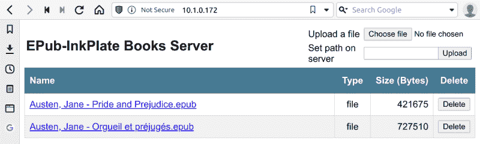

# 墨水瓶兜了一圈，成为真正的开放阅读器

> 原文：<https://hackaday.com/2021/08/20/inkplate-comes-full-circle-becomes-true-open-reader/>

普通读者可能会记得 Inkplate，这是一种开放式硬件电子纸开发板，结合了 ESP32 和回收的 Kindle 屏幕。Inkplate 为 Arduino IDE 和 MicroPython 提供了细致的文档和功能齐全的支持库，使得黑客和制造商可以非常轻松地为高质量的 epaper 显示器编写自己的代码。

现在，由于[Guy Turcotte]的努力， [Inkplate 系列设备现在可以拥有功能丰富且完全开源的电子书阅读器固件](https://github.com/turgu1/EPub-InkPlate)。该项目始于去年 10 月，从那时起，代码库一直在稳步更新和完善。临近 1.3 版本， *EPub-InkPlate* 拥有你所期待的现代电子书阅读器的大部分功能，还有一些可能会让你大吃一惊。

首先，[Guy]充分利用了 Inkplate 核心的 ESP32 微控制器，并实现了一个 web 服务器，让您可以从浏览器管理读者的图书馆。这使得 EPUB v2 和 v3 格式的书籍可以上传并保存在 Inkplate 的 SD 卡上，而无需任何特殊软件。目前支持 JPG，PNG，BMP 和 GIF 图像，以及嵌入的 TTF 和 OTF 字体。

在撰写本文时， *EPub-InkPlate* 支持 6 英寸和 10 英寸的 InkPlate 变体，并使用屏幕侧面的触摸板进行导航。虽然它在最终 1.3 版本的愿望列表中，但该项目目前不支持 Inkplate 6PLUS[使用 Kindle Paperwhites 的背光和触摸兼容显示器](https://hackaday.com/2021/06/21/review-inkplate-6plus/)。据报道，新的 6PLUS 型号将于 11 月发货，希望它的增强功能不久将得到支持。

随着电子书越来越受欢迎，我们拥有按照我们的方式工作的开放硬件和软件阅读器比以往任何时候都更重要。虽然它们可能永远不会在销量上与 Kindle 竞争，但我们渴望看到像*epu b-ink plate*和[Joey Castillo](https://hackaday.com/2019/10/31/building-an-open-hardware-ebook-reader/)的 Open Book 这样的项目成熟起来，成为不想生活在亚马逊掌控下的主流用户的有效选择。

 [https://www.youtube.com/embed/qNAjbnEax8k?version=3&rel=1&showsearch=0&showinfo=1&iv_load_policy=1&fs=1&hl=en-US&autohide=2&wmode=transparent](https://www.youtube.com/embed/qNAjbnEax8k?version=3&rel=1&showsearch=0&showinfo=1&iv_load_policy=1&fs=1&hl=en-US&autohide=2&wmode=transparent)

感谢[内森]的提示。