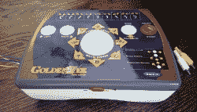
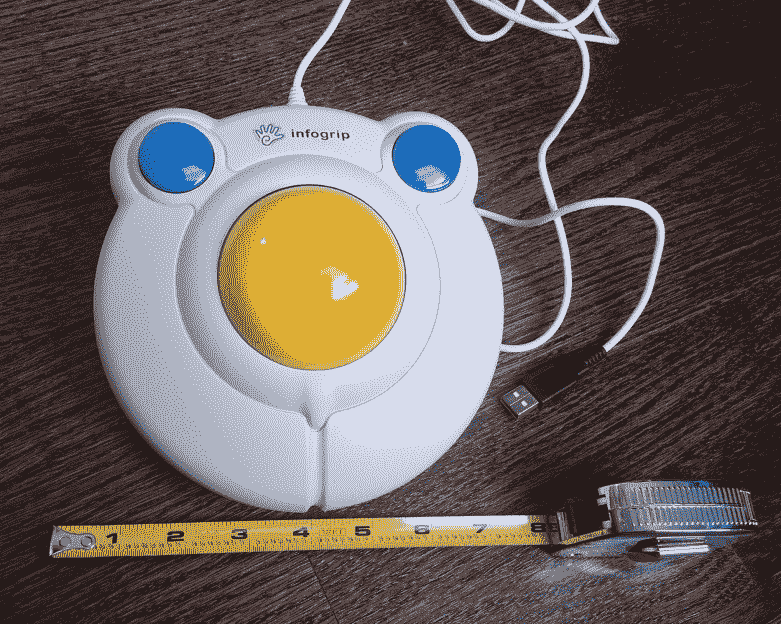
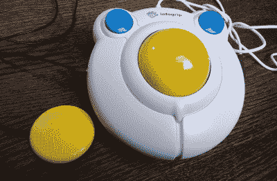
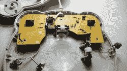
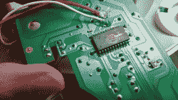

# 感兴趣的输入:BIGtrack 鼠标可能会让你尖叫

> 原文：<https://hackaday.com/2020/09/22/inputs-of-interest-bigtrack-mouse-might-make-you-squeal/>

你知道我的，[当我使用电脑的时候，我喜欢让我的脚参与其中](https://hackaday.com/2019/12/20/macro-foot-stool-helps-me-get-a-leg-up-on-work/)，这几乎每天都在这个时候发生。我的踏板输入缓存像黑暗中的蘑菇一样在我的桌子下不断增长:这篇文章中的每个大写字母和几十个以上的字母都用换档踏板大写！

 自然而然，我想到了用脚趾头点鼠标会是什么样子。双手放在键盘上的时间越多越好。我开始四处寻找英尺大小的轨迹球，心想也许我可以用普通的鼠标内脏做一个。然后我在旧货店找到了一台 15 年的 Golden Tee 家庭版主机。它有一个大球和四个按钮，所以它似乎已经成熟，可以照原样变成鼠标，或者只是偷球来做我自己的。到目前为止，这还没有发生，虽然我确实焊接了一些电线来测试控制。

然后我发现了这种近乎完美的现存老鼠，它看起来像一个单面朝上的鸡蛋。它的轨迹球比金色球座的大得多，甚至可能是两倍大。而且更多的球暴露在外，所以它比控制台上的球更容易滚动，不管用什么附肢。

这是一只大尾鼠。你说得对，这看起来像是费雪公司向幼儿推销的东西。但这是一个辅助装置，适合所有年龄段的人。它有一个 3 英寸的轨迹球和直径略大于 1 英寸的按钮。这种友好的鸡蛋鼠标重量刚刚超过一磅，大部分在轨迹球中。我想它会很好地生活在我脚下的地板上——它的外壳是由厚塑料制成的，看起来很结实。

这款鼠标为行动不便、无法以传统方式拖放的人提供了一个很酷的功能。他们称之为拖拉锁。如果将光标悬停在要移动的项目上并双击鼠标右键，将启用拖动锁定。将它拖到您想要的任何位置，然后点按任一按钮以放开它。

电子湾挤满了 BIGtrack 鼠标，有老有少，经过几个月的电子邮件提醒，我找到了一个在我价格范围内的。它们最初是由 Infogrip 制造的，也是这家公司制造了我在本专栏的上一期文章中提到的蝙蝠和弦键盘。

我们当时了解到，Infogrip 已经倒闭，他们的旧股票正在被 unlimited AT 和其他可能的公司出售。但与 BAT 键盘不同的是， [AbleNet 似乎正在制造新的 BIGtrack，并在几个地方以 BIGtrack 2](https://www.ablenetinc.com/bigtrack-2) 出售，包括水果手机商店的在线版本。AbleNet 对这款鼠标进行了一点改进，为按钮使用了两种不同的颜色，这使得它们很容易区分。还有一款无线版，可以使用 USB 加密狗或蓝牙。如果你想一直保持拖动锁定功能，它的背面有一个滑动开关。

据我所知，BIGtrack 有一个致命的缺陷——没有滚轮。作为一个鼠标替代品，对我来说完全是个失败。如果我想把它作为我的日常驱动，我必须添加一个可点击的旋转编码器。当然，当我这么做的时候，我可能会添加两个额外的按钮来覆盖我已经依赖的复制/粘贴快捷方式，以[帮助保存我的小指和尺神经](https://hackaday.com/2018/05/28/stretching-my-skills-how-and-why-i-made-my-own-compression-sleeves/)。

The switch actuator is that little red sprinkle.

## 这些按钮触动了我的按钮

尽管声音很大，发出咔嗒声，而且是蓝色的，但这些按钮并不令人满意。事实上，它们需要相当大的力量来驱动。对于辅助设备上的按钮来说，对于缺乏精细运动技能或行动不便的人来说，这些按钮似乎不太友好。我认为按钮和开关都有问题。

按钮的问题是，如果你想让点击注册，他们几乎必须按下死点。沿着边缘按压大约有一半的时间是有效的，顺便提一下，它会让弹簧在释放时发出一点声音，就像 M 型键盘一样。

但是这些都是辅助技术上的大按钮，所以应该很容易操作。难道你不应该期望能够从死点到边缘的任何地方按压它们，并让它们点击和释放而没有问题吗？我同意。

然后是按下按钮需要多长时间的问题。在按钮接触到开关致动器之前，有一段很长的移动距离。当阀杆最终到达开关时，它会碰到一个尺寸为 4 毫米 x 1 毫米的致动器。

The Buddy Button wire is six feet long!

## 更大更好的按钮

这些按钮问题可能是他们推出“开关适配”版本的部分原因，这是我所拥有的。这两个按钮内部都连接到 1/8”唱机插孔，允许您插入好友按钮:特别设计的辅助技术按钮，它们要大得多，几乎可以毫不费力地激活。

这不是令人窒息的夸张——我有一个，它们设计得相当好。在任何地方按下它，它就会发出咔哒声，整个过程都是一样的。这些按钮贵得离谱，但可以很容易地用连接到 1/8”插头并放置在坚固外壳中的低行程拱廊开关来模拟。

我很想看看好友按钮里面到底发生了什么，但我犹豫要不要拆开它，因为它不是我的。我怀疑它优于 BIGtrack 鼠标按钮，因为从按钮到开关的力分布更好。

## 解剖

另一方面，BIGtrack 很容易打开——六个一圈的螺丝中有三个在显眼的地方，另外三个藏在有粘性的橡胶底脚下面。由于这是开关适配版，我还必须拧松唱机插孔上的螺母，才能将两半分开。

在里面，它是一只球鼠。三个中等质量的滚轴连接到光遮断器上，剩下的由赛普拉斯鼠标芯片完成。塑料滚轴有点令人失望，因为塑料上的塑料只能持续这么长时间，一个沉重的轨迹球骑在上面，上面有一条腿的部分重量，不会延长寿命。

尽管如此，我认为这是一个很好的辅助技术鼠标，因为轨迹球太大了。希望 AbleNet 在新版本中使按钮更加用户友好。不幸的是，这些类型的设备成本一样高，但至少选择是存在的。