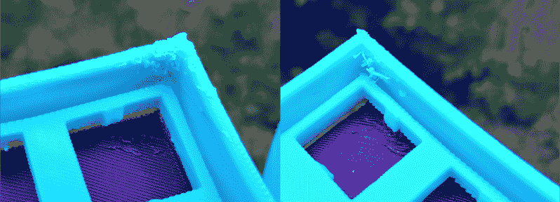
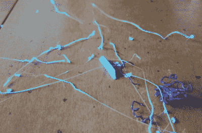
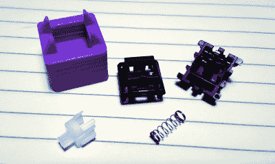
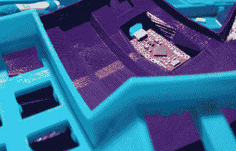
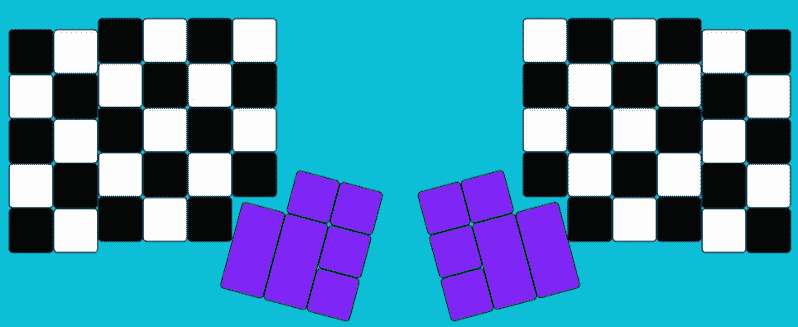

# 兴趣输入:曲线是我喜欢的类型的关键

> 原文：<https://hackaday.com/2020/06/18/inputs-of-interest-curves-are-the-key-to-my-type/>

虽然我可能从审美角度爱上了我制作的 ErgoDox，但美丽只是表面的。这很有趣，因为你可以看穿它。但问题是，它太大了，太锋利了，不适合做我的日常司机。我一直怀念空格键和拇指集群和大陆之间的丙烯酸荒地拇指重击。

重点是做一个漂亮的便携式 keeb，即使在可预见的未来我所有的旅行都将被限制在床上或沙发上。但它必须是舒适的，而目前状态的麦角新碱根本不能长期舒适。我会在任何一天把它放在一个长方形上，但它可能会变成半天。

因此，对我来说，与其说这是一种偏好，不如说这是一种必要。我觉得我可以诚实地说，如果没有 [Kinesis](https://hackaday.com/2020/03/03/inputs-of-interest-my-first-aggressively-ergonomic-keyboard/) ，我现在可能不会给你打这些字。我不希望我的手指做不必要的跑腿工作，或者降低凹键给我的打字质量。所以我只想说[使用 ErgoDox](https://hackaday.com/2020/06/02/inputs-of-interest-ergodox-post-mortem/) 让我比以前更想造一个 dactyl。

## 迷人的印花

让我概括一下:手指是比基尼里的一种运动。据我所知，唯一能让一个 dactyl 出现在你桌子上的方法就是打印一个案例，手工布线。我很想看到一个用铝加工出来的，但这似乎是一个很难减法制造的形状，而且完全不可能成型。

我从[创作者的回购](https://github.com/adereth/dactyl-keyboard/tree/master/things)中得到我的案例文件，并在 0.25 层高度的 TAZ 6 上打印出来。这四张照片都是垂直打印的，每张都花了大约 11 个小时。然后，每片花了大约 90 分钟的时间，仅仅是破坏掉大部分支撑材料。我计划用 X-Acto 刮掉所有边缘，但我不认为我会用砂纸打磨它。

在木卫一上，[Simon Merrett]建议我倒着打印，以减少所需的支持材料，并尽可能缩短打印时间。如果外壳内部有更多的空间来放置电线，我可能会喜欢，但就目前情况而言，我不想在底部进行数小时的后处理来使内部光滑。也许我会在未来的版本中尝试一下。

Left: final print layers left unchecked. Right: I tried to minimize the bird’s nest with a toothpick.

这些照片出来的效果非常令人惊讶，因为这些照片是黑带级别的。我觉得它们看起来很美，除了一点。每张纸在 90°角的顶端完成打印，因此打印机会在最后 15 或 20 层之间悬挂  ，喷出塑料，然后将其拖回打印中，造成混乱。

在最后一次打印时，我终于做了些什么。每次热的一端移动到休息，我让灯丝锁在一根牙签上，慢慢地轻轻拉开。灯丝就像太妃糖一样伸展了一秒钟，然后在打印头返回角落的途中折断了。在下一次拔牙签之前，我刚好有足够的时间把它清理干净。

虽然下半场的最后一个角球看起来确实比上半场干净，但看起来也更瘦——没有那么结实，可能也没有那么结实。我可能只是把收回的设置搞乱了，但这是我的第一张史诗照片，我太害怕它们在最后一刻失败。

## 开关开关

一旦指纹被清理干净，就该把所有的开关推到位，开始接线了。就像使用 ErgoDox 一样，我考虑过使用樱桃棕色，特别是在它们最终回到我喜欢买东西的地方之后。但是现在我有了 80 个樱桃色的透明圈，就像一个更硬的棕色圈和一个更长的凸起。

I found a toothy little [switch opener](https://www.thingiverse.com/thing:2815698) on Thingiverse, and it works pretty well. I wonder if it will make it through 70 of them without breaking.

我担心我会后悔这个选择，因为如果这个 keeb 成为我的日常司机，他们会让我的手很累。我决定试着为 39g boingers 更换弹簧，这样会使它们更容易启动。

当最后一张打印出来的时候，我用开关填满了左半边，看看它们是否合适。它们都扣得很好，而且如果我把它们翻过来，它们一点也不会松脱，也不会有掉出来的危险。即便如此，当我取下测试仪的键帽时，一些开关也随之而来。一旦所有东西都连接好了，就不能让这种情况发生，所以我的计划是把它们都用强力胶粘在一起。

另一种选择是为每个开关使用[单独的 PCB。在这些问题上我完全矛盾。它们是专为弯曲的 keebs 设计的，但看起来它们会占用很多宝贵的空间，而且所有这些坚硬的边缘可能会伤害电线。好处是它们自带二极管，并且在更换键帽时可能会提供足够的电阻，因此将每个开关粘在适当的位置并不重要。](https://keeb.io/products/amoeba-single-switch-pcbs)

##  没有胆量，没有键盘

曲线之后，麦角新碱和 dactyl 之间的差异变得不太明显。主要区别是 dactyl 在每一半的内部没有修饰键，所以总共有 70 个键而不是 76 个。dactyl 的布局就像一个 Kinesis 减去 F 键，但它从 ErgoDox 的底部外角携带了两个额外的 1u 键。

ErgoDox 使用 Teensy 2.0 和 I/O 扩展芯片来处理密钥矩阵。如果没有更好的理由，我宁愿使用一双 Pro Micros，因为这样会更干净，而且它会有 micro-USB 而不是 mini-USB。箱子的底部都有一个舒适的小床，可以放一块微控制器板，为什么不呢？此外，[迄今为止我见过的最清晰、最有用的布线指南](https://medium.com/@sachee/building-my-first-keyboard-and-you-can-too-512c0f8a4c5f)使用了两个 Pro Micros。

## 开始吃饼干吧

当我构建 ErgoDox 时，我有点害怕使用空白的键帽，但迄今为止我没有遇到任何麻烦，我真的很喜欢它们的外观。“空白”瓶盖几乎总是更便宜的选择，因为你可以一点一点地购买。

dactyl 键帽也将是空白的。我开始认为黑色或白色会很好看，但我不能决定两者之间，所以它是方格的。我最近买了一套厚 PBT 中的普通白帽来做一些工匠键帽实验，如果那些去任何地方，将来肯定会有一个关于它的帖子。

我会在 dactyl 上使用它们，但它们是雕刻的，这意味着顶部在上面的行 caps (number 和 QWERTY 行)中向下倾斜，在 home 行上平坦，在 ZXCVB 和空格键行上向上倾斜。我不得不买两套完整的帽子，否则我会一文不名地去买。

老实说，我离键帽还远着呢。我的新弹簧现在才交付，我还需要自学 QMK 固件和 T2 键盘矩阵。但是照片已经印好了，感觉就像成功了一半。