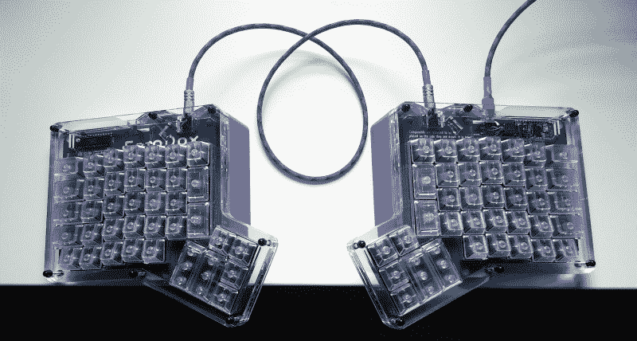
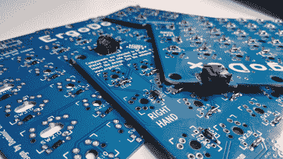
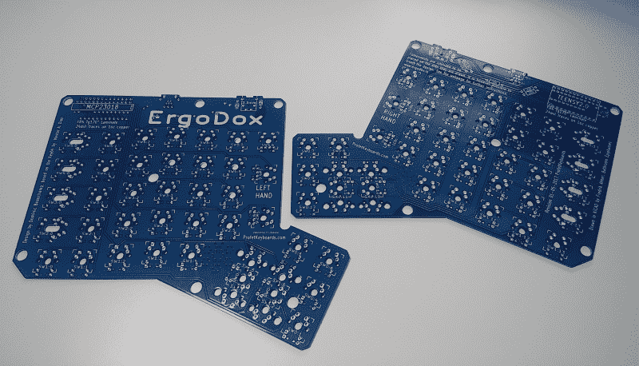
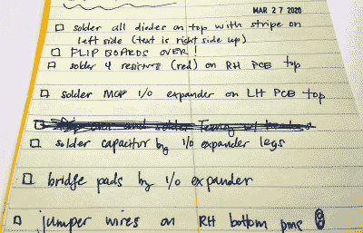
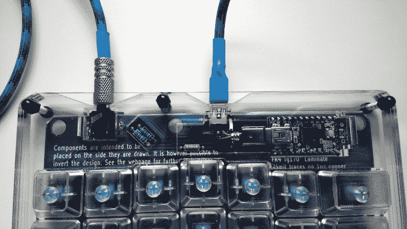
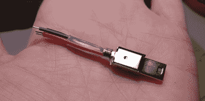
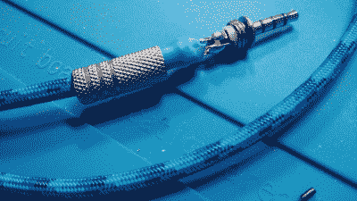

# 感兴趣的输入:ErgoDox 验尸

> 原文：<https://hackaday.com/2020/06/02/inputs-of-interest-ergodox-post-mortem/>

在上一期中，我告诉过你我正在构建一个开源的、分离的、线性的键盘，叫做 ErgoDox。我这样做是因为虽然我完全喜欢我的 Kinesis 优势，但它让我想掰断我的指关节，探索分离键盘的世界。很明显，你们中有几个人也想这么做，从你们对[我正在构建一个 ErgoDox 的兴趣就可以看出！](https://hackaday.io/project/171481-im-building-an-ergodox)IO 上的项目。谢谢大家！

好了同学们，尘埃落定，烙铁冷却，键帽就位。ErgoDox 已经造好了，正在工作。既然该说的都说了，该做的都做了，那就让我告诉你事情的进展吧。剧透:不太好。但我熬过来了，它的键盘就像它应该的那样。我会一步一步地讲述这段旅程，这样你就可以通过我的经历来感受生活。

My big blue pile of fail.

## 二极管颂歌

一切都始于二极管。每个开关都有一个二极管，因为键盘控制器检测按键的方式。当每个开关都有一个二极管时，屏幕上应该不会有任何意外的按键，这就是所谓的重影问题。您还应该能够同时按下您想要的任意多个键，并且它们都将正确注册，没有遗漏。如果你的键盘这样做，它有 n 键翻转。

如果我一开始就冷静地将我的元件套件附带的 SMD 二极管放在一边并使用通孔，我就可以更快地完成这个键盘。但是不行，我不得不尝试在没有焊膏的情况下手工焊接其中的 76 个。考虑到我的凿尖和 0.32 直径的焊料，一切都很顺利。连续性检查表明，我没有设法用热油炸它们中的任何一个。但后来我开始担心它们焊接不好。为什么要从 152 个可能的失败点开始构建呢？

在我说服自己改用通孔之前，我穿过了一个半板。我很高兴我这样做了，因为我根本不介意焊接 THT，二极管无论是哪种形式都很便宜。你知道还有什么吗？通孔二极管的透明主体只是增加了 a e s t h e t i c。是的，让我们继续吧。

## 翻转。董事会。完毕。

 我希望我能在这一节插入魔女表情符号。因为如果你从这个故事中吸取任何东西，那应该是这一部分。还记得我在第一篇文章中说过，两半的 PCB 是完全一样的，你用一边做左手，一边做右手吗？

一旦二极管被焊接，最重要的是你翻转电路板，并在继续之前交换它们，因为所有其他元件都在另一边。我知道这会发生。在我开始之前，我看了几遍这个构建视频，甚至写下了所有的步骤，包括关于组件应该在哪个板的哪一面的注释。我还是搞砸了。

Bonus mistake in the first step: the diodes aren’t oriented the same way on both PCBs, because they’re two sides of the same PCB.

我能说什么呢？我处于焊接模式，很高兴能从二极管上移开。夜深了。我的笔记在另一个房间里，上面有我用活板明确写下的所有步骤，我太粘在椅子上了，拿不到。

此外，我已经检查了我的笔记，看了大约五遍的视频。等我意识到自己在做什么的时候，我已经把所有五个电阻和两个 TRRS 插孔都焊错了。电阻没什么大不了的，但 TRRS 插孔不可能在不损坏它们或电路板或两者的情况下脱焊。

所以我给你的忠告是:拿四块遮蔽胶带或其他低粘性胶带，给你的板子明确贴上标签。甚至不要称它们为“顶部”和“底部”，因为这些名称会改变。写下类似“左侧开关插入侧”和“左侧二极管插入侧”的内容，以真正说明问题。帮你自己一个忙，把这些直接放在丝网印刷的左手和右手标签上。

## 其余组件 

至此，我已经用效用可疑的 SMD 二极管覆盖了一个半板。当我决定去通孔，我脱焊的一半板，清理，并重新使用它。在我未能翻转电路板后，我有两个装满 THT 二极管的电路板，每个电路板的 TRRS 插孔都在错误的一侧。幸运的是，当我开始的时候，我总共有五块电路板可以使用。我现在只剩下最后两个了。

构建的其余部分进行得相当顺利。二极管之后是五个电阻。然后是 I/O 扩展芯片及其在从端的小电容伙伴，接着是 TRRS 插孔、Teensy 和从 Teensy 到电路板边缘的迷你 USB 扩展。与连接 mini-USB 扩展器相比，剩下的事情就简单多了。

## 你好，世界？

It might look nice, but it’s just plain wrong. Also, this wire is way too stiff for the application. I ended up using stranded wire with a silicone jacket.

我并不指望它第一次就能完美运行，但我认为它至少能做*一些事情*。回想起来，我应该用真正的 USB 和 TRRS 电缆做第一次测试，但我对自己做的测试感到兴奋。

Teensy 应该进入闪烁模式，但它什么也没做。我将它插入一个通电的 USB 集线器，每个端口都有单独的开关，我的第一个线索是，端口的灯在应该亮的时候熄灭了。我拔掉了 USB 扩展器，发现我一定是把 mini-USB 图旋转了 180°什么的，因为只有一根线在正确的位置。

在我修好它并换上工厂制造的 USB 线后，我又试了一次。键盘的两半都正常工作，但时间不长。我把家里所有的迷你 USB 线都试过了，又买了三根新的，结果还是一样的诡异。我还尝试了不同的情况，比如让从设备半断开，关闭所有其他 HID(我插了一堆 HID)然后完全绕过集线器。它仍然不能可靠地工作。

Make sure those conductors are socially distanced.

## 不稳定电缆

当我完成了 TRRS 电缆，我测试了四个导体的连续性，一切都没问题。一天早上，我发现了一根带铁氧体磁珠的迷你 USB 线，我想，为什么不试试呢？我把两半都放在桌子上，但没有把它们连在一起。第一次成功了，所以我把 USB 接口关了又开了几次，又把插头拔了又换了几次。每次，三个指示层的发光二极管都亮了，而且工作正常。

然后，我把我做的 TRRS 电缆插入主半部分，小的重新启动。啊哈！最后，我决定去拿我唯一的另一个 TRRS——我车上的辅助电缆。当我把它插上电源时，它没有反应，所以我又做了一些测试。在这一点上，我意识到我的错误:没有交叉检查所有的导体，就像在一端将探针固定在尖端，并探测另一端的环和套管。这正是问题所在。经过蜂鸣测试确认后，我拧开电缆的一端，发现四根导线中有三根接触。制作自己的电缆很有趣，但并不容易，这是一个添加 bug 的机会。

构建工具是令人兴奋的——你想继续下去，因为它很有趣，但你也想完成它，这样你就可以使用它了。这种矛盾会导致问题。有几次我想把木板掰成两半，但我很高兴我坚持了下来。即使我不经常使用这个键盘，我也有比标准矩形更好的东西来使用。