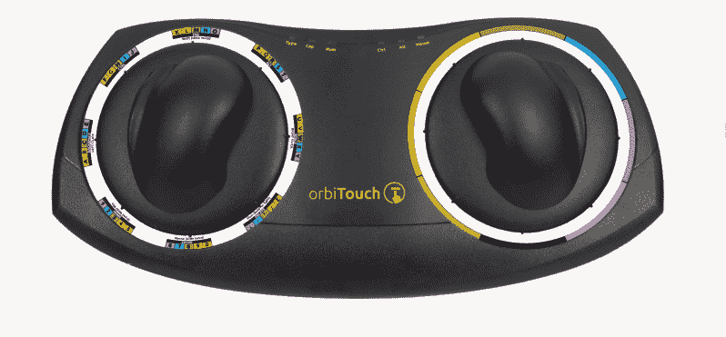
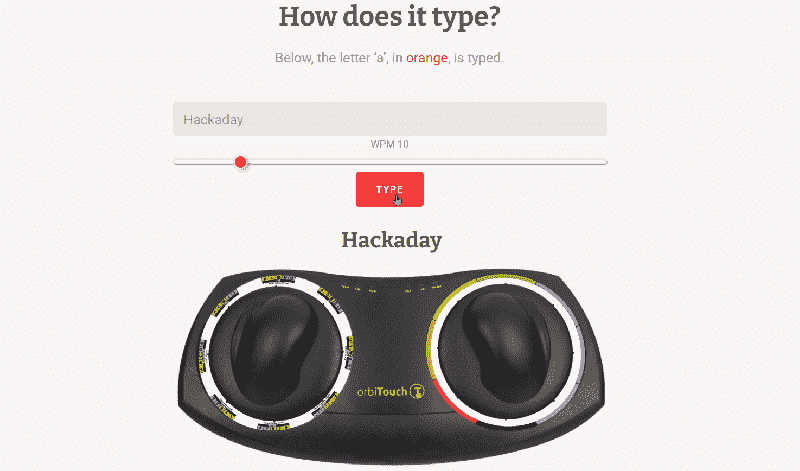
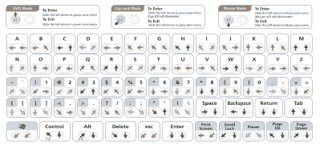

# 感兴趣的输入:OrbiTouch 无键键盘和鼠标

> 原文：<https://hackaday.com/2020/10/12/inputs-of-interest-the-orbitouch-keyless-keyboard-and-mouse/>

我不记得我是如何偶然发现 OrbiTouch 键盘的，但它在我的清单上已经存在很长时间了。于 2003 年推出的 OrbiTouch 集键盘和鼠标于一身。它是为那些不能经常使用键盘的人设计的，或者只是想有一种不同的体验。

OrbiTouch 是由一名博士生构思的，他在写论文时开始体验腕管。他花了 15 年时间开发 OrbiTouch，发现它可以帮助许多上半身有各种缺陷的人。那么，它是如何工作的呢？

## 就像用双手打空气曲棍球一样

要使用这个键盘，你需要将双手放在滑块上并来回移动。它们本质上是相同的八路操纵杆或 D-pad。手柄有点像鼠标，看起来像是为你的小指提供了一个特殊的休息场所。

一个滑块指向一组字母、数字和特殊字符，另一个滑块从特殊的轨道触摸彩虹中选择一种颜色。Pink 包括圆括号和它们的表亲，以及代字号、冒号和分号。黑色代表像 Tab、Alt、Ctrl、Shift 和 Backspace 这样的修饰符。这些特殊的字符和修饰语不会显示在象形文字滑块上，你只需要将指南放在手边，直到你记住了圆圈周围所有东西的位置。

You’re gonna need a decent amount of desk space for this. Image via [OrbiTouch](https://orbitouch.com/)

字母表分为五个字母组，以橙色开始的彩虹顺序进行颜色编码，因为红色是为 F 键保留的。举例来说，A 是橙色，B 是黄色，C 是绿色，D 是蓝色，E 是紫色，然后从橙色的 F 开始。例如，如果你想输入 *cab* ，你可以首先将象形文字滑块移动到第一个字母组，将颜色滑块移动到绿色。

## 沿着彩虹滑行

关于这个键盘和这个特别的单词有趣的事情是所有的字母都在第一组。如果你有重复的颜色或字母组，键盘会让你保持其中一个滑块不动，所以你可以保持 alpha 滑块不动，只需移动彩虹滑块从绿色到橙色再到黄色，就可以拼出 *cab* 。让我们看着它一遍又一遍地输入“Hackaday ”:

A selection from the slide guide. Image via [OrbiTouch](https://orbitouch.com/)

每个字母、数字和特殊字符都有一个等价的方向对，可能容易也可能不容易记忆。根据常见问题，最大输出你可以期待从这个东西是 30-40WPM。虽然是组合键盘鼠标，但是如果玩什么游戏比说，扫雷，
更严重的，还是算了吧。你必须不停地在键盘和鼠标模式之间切换，这是一个整体，你会死得很快。

我认为颜色代码是个好主意，但是如果你是色盲，它可能不适合你。此外，你必须双手并用，并有相当好的协调能力才能驾驶这种键盘/鼠标混合生物。从好的方面来说，每个手势都需要同等的力量，这是相当低的。

## 结论

显然，这种键盘在自闭症患者中评价很高，因为输入是按字母顺序排列的彩虹般美味的方式。那些审美选择绝对是我书中的一个亮点。我认为它与其他键盘完全不同，这很棒。尝试看起来很有趣，至少暂时如此。虽然我无法想象在一台电脑上输入一整篇 Hackaday 文章，但它看起来比 Dvorak 更有趣。有一天我可能会买一个，但 OrbiTouch 399 美元有点贵，或者你可以花 200 美元左右买一个二手的。在撰写本文时，它们在 OrbiTouch 网站上的黑白版本实际上都已售罄，但电子版上还有一些。

那么这个键盘真的是辅助技术吗？这取决于你的功能水平。如果打字很痛，但你仍然需要做，这可能是你的可取之处。考虑到所有的事情，我会认为所有的操纵杆运动都会加剧手腕的问题，甚至导致它们，但由于我没有尝试实际尝试过，我不能肯定地说。你们有人尝过吗？