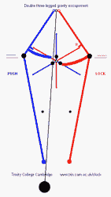

# 在一个 11 吨重的钟里有 1000 个零件

> 原文：<https://hackaday.com/2022/04/07/inside-an-11-ton-clock-with-1000-pieces/>

我们并不羞于承认这一点，但我们喜欢时钟。我们已经构建了相当多的时钟项目，它们定期出现在 Hackaday 的页面上。但是有一个钟是世界上最著名的:英国的大本钟。它已经得到了一些修复，英国广播公司很好地制作了一个巨型机械装置的视频。

其实钟不叫大本钟。这是自 2012 年以来伊丽莎白塔五个钟之一的名字。在那之前它是钟楼，但每个人都叫它大本钟。这座巨大的钟重达 11 吨，有 1000 多块。很难想象在 1859 年建造这样一个东西需要什么。

 大本钟本身——钟——甚至比钟还重，超过 15 短吨。但是，当然，我们最感兴趣的是时钟本身。这个设计显然来自一位律师和一位天文学家，他们都喜欢钟表。然而，建筑落到了一个专业钟表匠的手里，在他死后，落到了他的继子手里。律师丹尼森开发了一种[高级重力擒纵装置](http://trin-hosts.trin.cam.ac.uk/clock/main.php?menu_option=escapement)，这种装置很快成为未来塔钟的标准，并被誉为 19 世纪最伟大的钟表发明之一。

时钟现在有了一个电动马达，可以作为备用。然而，它通常是每周手动上弦三次。上发条大约需要 90 分钟。调整时钟也是一件有趣的事情。钟摆的顶部是一叠便士硬币。增加一便士会让时钟走得快一点，减少一便士会让它慢下来。每一分钱价值约 0.2 秒/天。

很高兴看到这样一个公认的 19 世纪的技术得到它的 15 分钟的名气。不是说这座塔不出名，而是很少有人知道里面有什么。这座旧钟充满了奇怪的故事。当丹尼森想用一个更大的锤子测试时，原来的钟坏了。由旧金属制成的新钟也有裂缝，但仍然可以使用。

你可能不会复制这个时钟，但是你可以做一个[以同样的原理](https://hackaday.com/2022/03/09/building-a-pendulum-clock-out-of-lego/)工作的东西。或者，尝试一些[更蒸汽朋克](https://hackaday.com/2021/05/07/this-pov-clock-combines-a-nixie-with-a-pendulum/)。

 [https://www.youtube.com/embed/TVLYtiunWJA?version=3&rel=1&showsearch=0&showinfo=1&iv_load_policy=1&fs=1&hl=en-US&autohide=2&wmode=transparent](https://www.youtube.com/embed/TVLYtiunWJA?version=3&rel=1&showsearch=0&showinfo=1&iv_load_policy=1&fs=1&hl=en-US&autohide=2&wmode=transparent)

