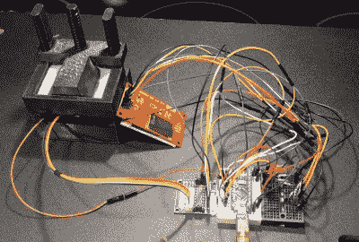

# Inspire 开发套件将 MSLA 打印机的价格降至仅 30 美元

> 原文：<https://hackaday.com/2021/03/04/inspire-dev-kit-drops-price-of-msla-printer-to-just-30/>

在过去的几年里，我们已经看到基于掩模立体光刻(MSLA)技术的消费级 3D 打印机大幅降价。顾名思义，这些机器使用标准的 LCD 面板来选择性地屏蔽来自 led 阵列的紫外线。再加上一个电动 Z 台，你就有了一个简单而廉价的方法将 UV 树脂变成三维形状。如今，200 美元就可以买到分辨率远远超过基于灯丝的 FDM 打印机的交钥匙 MSLA 打印机。

但是[JD]仍然认为我们可以做得更好。他的项目旨在以 30 美元的价格生产一台全功能的 MSLA 打印机，如果质量够好，价格可能低至 15 美元。他认为，通过让高分辨率 3D 打印变得更容易实现，它将允许全球各地的用户将他们的想法变为现实。难怪他称自己的机器为 *Inspire 3D 打印机*。

A test fixture for the LCD module.

这也不仅仅是在[JD]头脑中滚动的一些天上掉馅饼的概念。你现在只需 30 美元就可以订购 *Inspire 开发套件*，尽管他明确表示你将收到的不是一台功能齐全的 MSLA 打印机。通过利用一个常见的 LCD 模块，ESP32 和几个 3D 打印部件，他证明了他的套件价格点是可以实现的；但是在这台机器面向大众之前，还有大量的工作要做。

首先，他仍然在解决 Z 运动的问题。目前的设计是 3D 打印的，但[JD]表示，他对机芯的倾斜量不太满意，正在考虑用光驱的线性致动器取代整个设计。[我们已经看到这些部件被重新用于精确定位激光器](https://hackaday.com/2018/03/01/review-neje-dk-8-kz-laser-engraver/)，因此这肯定是有先例的。ESP32 的固件也处于起步阶段，目前仅允许用户从一系列简单的硬编码形状中打印，作为概念验证。

[我们在过去已经看到树脂打印机的 DIY 尝试](https://hackaday.com/2014/03/22/home-made-resin-based-3d-printer-is-incredible/)，但它们通常基于[更复杂的技术，包括投影仪或紫外激光器](https://hackaday.com/2014/05/28/openexposer-the-diy-sla-printer/)。对于家庭游戏玩家来说，掩模立体平版印刷术要容易得多，像 *Inspire 3D 打印机*这样的项目展示了从一滩粘糊糊的东西中取出固体是多么简单。