# 介绍低劣的附加版本 1.69bis 标准

> 原文：<https://hackaday.com/2019/03/20/introducing-the-shitty-add-on-v1-69bis-standard/>

在过去的几年里，艺术印刷电路板越来越多。无论是丝网印刷上有一点点图形的一次性项目，还是制造和供应链的艺术，这些花哨的 PCB 都会留下来。这一点在 Badgelife 爱好者的松散联盟中表现得最为明显，这是一个硬件集体，致力于为各种黑客会议制作富有表现力和令人印象深刻的电子小玩意。在这里，每年都会创建数百个不同的硬件徽章。这是电子艺术，由一个社区支持。

这些徽章中的一些从技术上来说并不是徽章，而是小而闪亮的附件，旨在连接到主徽章，这些附件都由社区衍生的标准支持。[低劣的附加标准](https://hackaday.io/project/52950-shitty-add-ons)是如何将较小的 PCB 安装到较大的 PCB 上。它由成千上万的徽章支持，所有花时间设计电子会议徽章的人都在使用这个标准。

自从低劣的附加标准创建以来已经一年多了，在这段时间里，工作背后的人已经看到了第一版标准的缺点。从机械上来说，它真的没有那么强，如果有几个引脚来驱动 RGB LEDs 就很整洁了。这导致了最新版本的低劣附加标准 V.1.69bis 的诞生。现在，这个标准第一次向全世界展示。

## 低劣附加标准的口述历史

[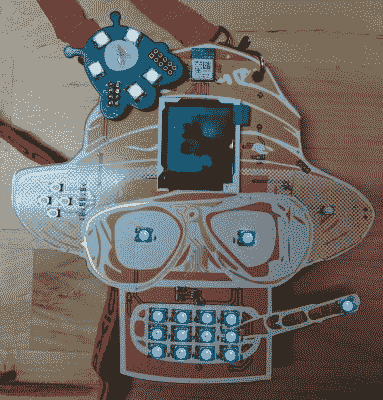](https://hackaday.com/wp-content/uploads/2019/02/dfbqxk9xyaalczw.jpg)

The DC25 AND!XOR badge, with Brain Slug, partial inspiration for the Shitty Add-On Standard

在傻逼附加标准之前，有几个独立的会议徽章，有自己的帽子和附加。[2016 款 Queercon 徽章自带帽子](https://hackaday.com/2016/08/10/what-we-learned-from-the-2016-queercon-badge/)，由这个墨鱼徽章顶部的两个小型扩展端口供电。扩展端口在 1×4 连接器上提供电源、接地和 I2C 总线，给这些乌贼墨鱼独角兽角、emo 发型或镶有 led 的大礼帽。

2017 年，显然需要一个徽章插件标准，甚至需要创建更多的标准。Luke Jenkins [发布了 SaintCon](https://github.com/lukejenkins/minibadge/blob/master/minibadge-footprint.png) 的 MiniBadge 标准，这是一个令人印象深刻的标准，在不到一平方英寸的地方实现了 5V、3V3、I2C 和 SPI。[结果令人印象深刻](https://twitter.com/wifiluke/status/917779398383644672)，十几个迷你酒吧为主要的 SaintCon 徽章而建。

最后，我们来到[2017/DEF CON 25 和！XOR 徽章](https://twitter.com/ANDnXOR/status/889156153787138048)上面有猎人 S. Rodriguez 和一个 [*【未来派】*脑残](https://futurama.fandom.com/wiki/Brain_Slug)。这个大脑芯片的原理图非常简单，只是一个 ATtiny85 微控制器和一些 WS2812b LEDs。这是 blinky，这是 bling，因为每个板房可以做绿色阻焊膜，你可以很容易地做出一个大脑蛞蝓 PCB。只有大约 10 个这样的脑残被制作出来(虽然 Gerbers [就在这里](https://github.com/ANDnXOR/ANDnXOR_DC25_Badge/tree/master/Brain%20Slug)所以请自便)，但这是附加珠宝的先例。

DEF CON 25 来了又走了，少数幸运的人带着脑蛞蝓走了。大约在 2018 年 2 月的某个时候——中国新年的时候，因为这显然是开始任何类型的电子项目的最佳时间 Badgelife 集体的一些成员开始问一些问题。前两年的徽章制作表明，每个人都可以添加徽章。未来将会有迷你广告，或者其他怪异的多氯联苯挂在大徽章上。如果 Badgelife 插件有一个标准会怎样？如果这些独立的电子艺术作品可以承载来自多个创作者的类似大脑蛞蝓的附加组件会怎么样？那个和！XOR 徽章实际上只为 Brain Slug 提供电源，但在徽章上添加引脚接头孔实际上是免费的。你唯一需要做的就是让整个团队就标准引脚排列达成一致。

[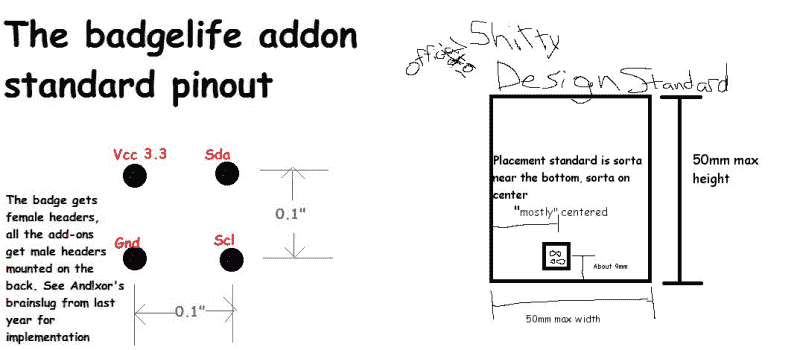](https://hackaday.com/wp-content/uploads/2019/02/standard1.png)

The official documentation of the Shitty Add-On V.1 standard. This was made in Microsoft Paint.

经过几分钟的讨论，[我们有了一个标准的](https://twitter.com/MrRobotBadge/status/962043056781324289)。它决定，低劣的附加引脚应包括 3.3V，地面，和一个 I2C 总线上的四个标题安排在一个 0.1 英寸的网格。徽章将有母插座(或只是通孔)，而附加将有公引脚。这是第一个，也是唯一一个，狗屎附加标准的电气和机械规格的官方文件。没有人遵循标准，但最后一切都解决了。

[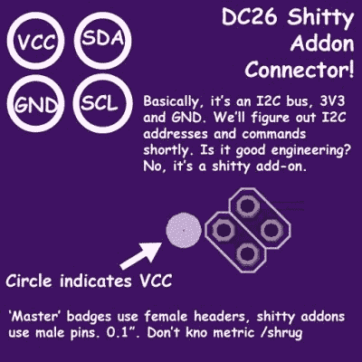](https://hackaday.com/wp-content/uploads/2019/02/dct0r5pw0aa24or.jpg)

The SAO documentation everyone used. It’s wrong, because the headers are rotated 45 degrees.

为什么我说没有人遵循标准？因为我是个白痴。在使用了微软画图三分钟后，我很快就做好了一个快速板，它可以为四个糟糕的插件供电。这是低劣的附加图腾，可以在 OSHPark 上找到。这款主板非常简单，有两个 AA 电池座和四个 2×2 接头。这个设计比它需要的要聪明得多；两个收割台顺时针旋转 45 度，另外两个收割台逆时针旋转 45 度。这意味着更多的附件将适合你的图腾。

因为低劣的附加标准的第一次出版是…缺乏…我迅速改进。标题(现在在 PCB 上有一个丝网印刷的圆圈)是从图腾的 OSHPark 渲染中复制和粘贴的。不幸的是，这是每个人都使用的文档。不，标题从来没有打算旋转 45 度，我只是懒，没有旋转我从 OSHPark 渲染复制粘贴的内容。但是，即使机械性能的低劣附加头是不正确的，至少每个人都得到了 VCC，GND，SDA 和 SCL 在正确的地方。

徽章和插件之间的互操作奠定了基础。该标准于 2 月份最终确定，距离 DEF CON 只有 6 个月的时间。几十个 PCB 工匠会创造他们自己的低劣附加产品。[官方 DEF CON 26 徽章支持傻逼附加标准](https://hackaday.com/2018/08/09/first-look-at-def-con-26-official-badge/)。对每个 DEF CON 与会者的徽章产量的最佳估计是这样的:在 DEF CON 26 上，大约有 25，000 名与会者。大约有 50，000 个徽章和附件支持低劣的附件标准。以任何标准衡量，低劣的附加产品都是成功的标准。数百种不同的低劣附加产品被创造出来。大多数都有发光二极管。[一个是区块链上的人吃潮荚游戏](https://hackaday.com/2018/07/19/using-pad-printers-to-add-color-to-artistic-pcbs/)。看一看:

  What up!!! We’re three cool guys looking for other cool guys who wanna hang out in our party mansion. Nothing sexual. Dudes in good shape encouraged, if you’re fat you should be able to find humor in the little things. Again, NOTHING SEXUAL. from @cromulonb  Baby Bender from sqearlsalazar [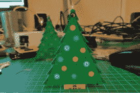](https://hackaday.com/2019/03/20/introducing-the-shitty-add-on-v1-69bis-standard/2018-11-29t00_11_24-909z-img_20181129_001640/) The Christmas Tree from Brian Lough  Twinkle Twinkie produced hundreds of badges, ranging from Krusty the It to Pikachu [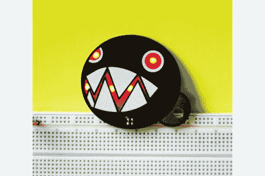](https://hackaday.com/2019/03/20/introducing-the-shitty-add-on-v1-69bis-standard/2018-08-10t13_56_28-410z-chain-chomp-front/) Chain Chomp from Potato Nightmare  The official Shitty Dev Board from Zapp [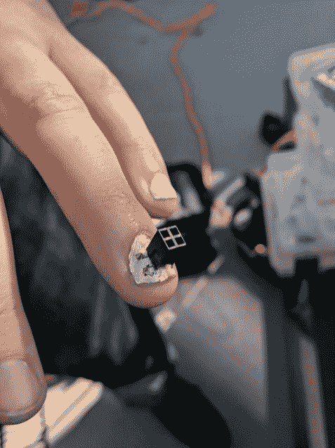](https://hackaday.com/2019/03/20/introducing-the-shitty-add-on-v1-69bis-standard/drb9symu0aaghap/) @JunesPhD added a Shitty Add-On connector to his fingernail [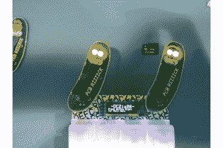](https://hackaday.com/2019/03/20/introducing-the-shitty-add-on-v1-69bis-standard/2018-08-30t03_23_56-217z-img_20180829_121233/) PCB RIIIICK from Snurkle engineering  Shy Guy from Potato Nightmare [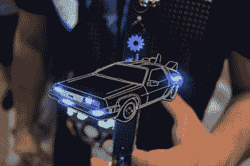](https://hackaday.com/2019/03/20/introducing-the-shitty-add-on-v1-69bis-standard/08-delorean-sao-2/) DeLorean, from @realanimationxp

## 更新、更好的标准

[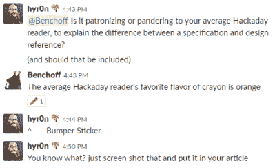](https://hackaday.com/wp-content/uploads/2019/02/orange.png)

A lot of discussion went into the creation of this new standard

在此之前，我想说这不是低劣的附加版本 1.69bis 标准的官方最终版本。还有一些事情仍在解决中，特别是关于两个额外引脚的功能。然而，而且！XOR 已经公布了使用 I2C EEPROM 的 an SAO 的 [一些参考设计](https://github.com/ANDnXOR/sao-reference-designs) ，与去年的潮 Pod SAO 一模一样。将来可能会有更多的功能。现在发布这个标准的原因是因为把东西发布出去比等到某样东西完美了更好。

从各方面来看，低劣的附加标准是成功的，但它并不完美。从机械角度来说，标准的 2×2 接头不是很坚固，如果你在附加元件上使用 SMD 公接头，这种情况会加倍。没有多少人使用 I2C 总线，但有很多人想扩展他们的 WS2812 或 APA101 RGB LED 灯串。

除非有更好的标准，否则标准就不是标准，所以现在徽章制造商社区已经为低劣的附加组件确定了更新、更好的标准。这是低劣的附加版本 1.69bis (SAO.69)，它极大地增加了低劣的附加标准的能力，同时保留了向后兼容性。

*   **新的连接器！**

[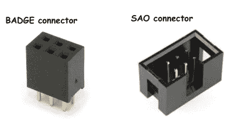](https://hackaday.com/wp-content/uploads/2019/02/connector.png) 由于需要低成本的连接器，并且需要保留向后兼容性，SAO.69 将使用标准的 0.1″ 2×3 连接器。

**徽章** 使用 2×3 母头(**)头尾，0.1”间距。类似于去年，但 6 针。强烈建议徽章使用通孔连接器，以免 Sao 扯掉你的 pad。这些*可能*是键控的，但是通孔 2×3 键控连接器要么不可能找到，要么贵得离谱。要找到*键控*徽章连接器，需要搜索的是， 2×3 Pin 6 Pin 带极化键。易贝将会显示搜索结果，但你一次只能购买 100 个。据报道，全球速卖通有，但他们是 0.40 美元/件。**

**[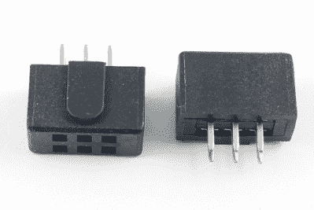](https://hackaday.com/wp-content/uploads/2019/02/thebestconnector.png)

The best connector. It’s unobtainable. I own 75% of the world’s supply.

不用说，*键控*徽章连接器是罕见的，昂贵的，并且很难找到。但是，它完美地解决了附加组件松动的问题。这些连接器已经过验证，适合标准 IDC 屏蔽接头。使用最好的徽章连接器，风险自负。

**附件**使用一个 2×3 的插头，带插脚，带护罩的连接器。这些实际上是一些最便宜和最普遍的连接器，如果你有一个 AVR ISP 接头的设备，*这是同一个连接器*。与徽章一样，强烈建议您使用通孔接头以获得机械强度。

## 新的引脚排列！

[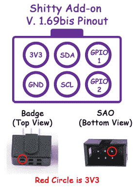](https://hackaday.com/wp-content/uploads/2019/02/image.png)Sao . 69 的引脚排列与去年的版本完全相同，只是在右侧增加了两个“GPIO”引脚。这些将用于各种附加类型，支持可寻址 RGB LEDs 和串行连接。

当然，我们希望大多数徽章只使用功率，即使在这里我们也有规格: *一个低劣的附加组件的最大功率消耗是 1.1 毫马力。*如果一个傻逼插件驱动一个 GPIO 引脚，它 **必须** 通过一个至少 330 欧姆的电阻。任何信号都不得超过 3.6v。**对于仅提供电源的附加装置，仅使用 VCC (3v3)和 GND 来做您想做的事情**。其他引脚应为 NC。不要超过 1.1 毫马力你的骚。

由于增加了两个新引脚，我们有了一些串行可寻址 led 的选项。对于 **WS2812(或新像素)**led，badge 可以支持基于 WS2812 的 SAO，方法是从徽章向 SAO 输出 WS2812 数据流，以同步或驱动 RGB 模式。徽章可以将现有 WS2812 strand 数据线的 **端** 连接到 GPIO1，或者将徽章 GPIO 连接到 GPIO1，以发送纯粹用于 SAO strand 的数据流。请注意，如果您要延长徽章的 WS2812s 链，记得在您的“链长度”上再加 10。

对于 **APA102(或 dot star)**led，驱动它们的方式类似于 WS2812 的工作方式，除了有两个引脚。GPIO1 用于数据(DO / MISO)，GPIO2 用于时钟(CO / CLK)。徽章也可以将 APA102 链中最后一个 LED 的输出直接连接到该引脚，前提是该引脚不超过 3.3V。如果 APA102 由更高的电压(例如 5 伏)驱动，则可以在徽章侧使用分压器将输出降至 3.3v。**sk 9822 LED**基本上与 APA 102 相同。

**串行/UART 数据也有点支持**，但是在一个 SAO 上使用串行通常不是一个好主意。这样做的主要原因是，一些徽章将有多个 SAO 端口，所有引脚都使用单一总线。这意味着当使用串行总线时，必须在串行总线之上标准化一种通用的“badgebus”语言，以区分同一串行总线上的多个 Sao 之间的目标，以免出现串扰等。这类似于 MQTT 之类的发布/订阅用例中对节点的要求。实施串行的注意事项包括:

*   SAO 不应向 SAO TX 引脚(GPIO2)发送输出，直到它首先接收到来自徽章的输入。
*   GPIO1 将数据从徽章传送到 SAO(徽章 TX，SAO RX)
*   GPIO2 将数据从 SAO 发送到徽章(徽章 RX，SAO TX)。
*   建议默认波特率为 115200。
*   请记住，使用串行将需要与徽章制造商合作，因为它需要徽章方面的硬件和软件支持。

## 而且是向后兼容的！

虽然我们希望新的机械规范能给我们带来更有弹性的附加组件，但是已经有数千个这样的附加组件被部署了。SAO.69 向后兼容现有的附加组件！徽章仍然有母头，插件仍然有公针。SAO.69 标准只是在右边加了两个管脚。

有一些人在谈论增加一个低劣的机械标准，比如一个 3 毫米的拉链孔，或者可以增加一个 M3 螺栓的地方。虽然这对于松散的附加组件来说是很棒的选择，但是“做你想做的”这个糟糕的选择对我们来说更好。

这是最好的标准吗？不，一点也不。这就是低劣的附加标准得名的原因。没有办法判断一个低劣的插件是否支持 WS2812、APA102 或串行连接。有人说 VCC 和 GND 之间有一个基于电阻的分压器，连接到 GPIO1。理论上，这可以用来查询一个徽章，以检测它是 WS2812、APA102 还是串行连接。我们还不知道这将如何工作。或者，我们可以在每个徽章上添加一个 I2C 闪存芯片，用一点点数据说明徽章是什么。再次，*傻逼*附加标准。

## 制定标准是有标准的

低劣的附加规范毕竟只是一些很容易实现的东西，被推到一个板上，并与你正在构建的任何会议徽章一起发布。重点是不要把我们自己当回事，这只是让电路板更加闪亮，给每个人一个试验小型附加 PCB 的平台。

然而，这是一个很大的然而，这是一个合法的标准诞生于微软油漆和 PCB blinky bling 的愿望。这导致了使低劣的附加标准成为真正的标准的可能性，是的，[有一个标准来制定标准。](https://standards.ieee.org/develop/process.html)

现在这只是一个半严肃的讨论，但是制定标准的过程是从请求标准开发组织批准创建一个基于社区需求的新标准开始的。一旦完成，接下来就是组建一个工作组，迭代标准草案，最后让标准开发组织批准它。我认为 badgemakers 社区可以处理把一个官方低劣的附加标准的几个草案放在一起，因为我们中的一些人仍然运行 Windows 并安装了 Microsoft Paint。诀窍是在游戏中加入 IEEE 或 ISO。一个官方的，公开的徽章间交流标准就在我们的掌握之中，我们只是需要一个有幽默感的内部人员。**