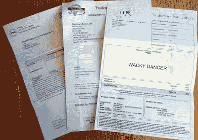
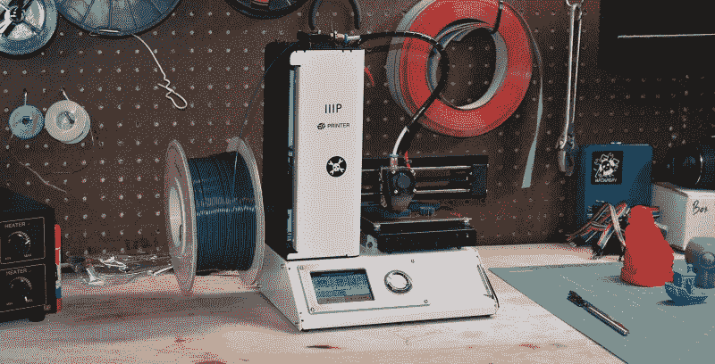

# Inventor 服务–可能适合您–可能

> 原文：<https://hackaday.com/2018/11/07/inventor-services-maybe-right-for-you-maybe/>

毫无疑问，你已经接触过各种发明家服务的广告；你有一个想法，他们想帮你把它商业化，得到你应得的钱*。无论是帮你提交法律文件，为你的想法辩护，将其开发成产品，还是出售，总有一家公司愿意提供帮助。那么，哪些是合法的，哪些是骗局，你到底需要什么才能赚到你的百万富翁呢？*

1999 年，美国通过了[美国发明人保护法案](https://www.uspto.gov/patent/laws-and-regulations/american-inventors-protection-act-1999)，承认绝大多数发明人服务公司是无效的或欺诈性的，并制定了报告要求，以确保人们在与这些公司打交道时充分知情。他们需要披露他们已经评估并接受了多少项发明，他们的客户总数，扣除公司费用后获得净利润的数量，以及他们的许可成功率。请访问任何 inventor 服务网站，查找他们的号码。经过广泛的搜索，虽然，我们只找到一对夫妇，实际上列出了数据，这不是很好。

| 客户数量 | #许可协议 | #净利润 | 利润百分比 |
| --- | --- | --- | --- |
| Six thousand five hundred and sixty-four | One hundred and sixty-six | forty-nine | 0.75% |
| Three thousand nine hundred and seventy-four | Sixty-six | Twenty-nine | 0.73% |

这篇文章最大的收获应该是这个；作为一名企业家，你拥有有限的可用资源，却有几乎无限的方式去使用它们。你应该选择把这些资源只花在能让你进入下一步的事情上，而不是那些在未来遥遥无期的事情上，也不是那些你自己能做的事情上。如果你没有要展示的产品，就不要花钱去一个华丽的贸易展览摊位。如果你能用 Arduino 和 cardboard 一起做一些东西，就不要花钱请人开发概念证明。绝对确定你知道你的钱能得到什么，并且你需要它去你想去的地方。

## 专利和商标

每次我得到一个商标或专利，我都发现它是在广告潮水般涌来时颁发的。几周后，USPTO 发出了官方通知，同时还有一张传单，警告那些试图骗取我钱财的貌似官方的骗局。如果你[决定注册一个商标](https://hackaday.com/2018/07/18/what-to-expect-when-youre-expecting-a-trademark/)，你会得到使用 R 符号而不是 TM 符号的好处。很好，但要确保它能增加业务价值。

These are a ripoff. Do not give them money. They just send invoice-looking things and hope you’ll be scared into paying them for nothing.

律师将有两种类型；那些希望你注册他们的特殊列表服务，以及那些希望你购买他们的商标维护服务。前者意味着你会给他们一大笔钱，他们把你的商标放在他们的数据库里。他们的数据库并没有真正用于任何事情，你也不会因为付费而得到任何额外的保护；这只是把你的钱给别人的一种方式。

另一个请求有一定的价值；他们将监控新申请与您的申请的相似性，然后在公开上市期间通知您或提出异议。每一个商标申请在被接受之前必须在公共论坛上列出一段时间供公众审查。如果没有任何抱怨，它被接受。如果有人提交了一份商标申请，通过了审查人员的审查，并被公开列出，但与你的相似，你可以提出投诉，他们会在发布或拒绝之前对新申请进行更多的审查。此外，在收到你的商标五年后，你必须向 USPTO 提交额外的文件，让他们知道你还在使用它。一些公司提供这方面的帮助，但这是一种快速简单的形式；如果你自己申请了商标，那么你就不需要帮助来续展它。

注册专利是一件棘手的事情，很大程度上需要律师的帮助，他们会把你的文件变成一堆你几乎认不出来的法律术语。在我们的专利体系中，这是一种不幸的事态，但事实就是如此。然而，你可以在很少的帮助下申请临时专利，这为你赢得了一年的保护期，直到你决定你的想法真的值得保护时，你才可以申请正式专利。

## 市场研究和商业计划开发

在你用接下来的几年时间追求你的想法之前，你应该弄清楚是否有真正的商业潜力，并决定你的计划来实现它。这就是市场调研和商业计划的切入点。是的，你可以花钱请别人来做这件事，但是你为什么要这样做呢？你雇佣的公司是否只是在整理一份提案，让你给他们更多的钱来执行他们的计划？如果是这样，你只是付钱让他们向你推销，当然他们会说市场很大。这是一个应该由你来完成的过程，即使有其他人你可以付钱去做。[找到一个模板](https://www.sba.gov/tools/business-plan/1)，你可以用它来填补空白，而不会忽略一些东西，但是做市场调查和商业计划开发是一个非常个人化的过程，需要对你计划如何参与以及你计划如何实现你的愿景进行大量的反思。你自己做这件事可能是最好的。

## 媒体生成

解说视频很受欢迎。拿一个概念，扔一些俗气的音乐，配音演员覆盖，和一些不错的动画在一起，你就有自己的视频，帮助人们了解你的产品是什么。它比真人动作视频或广告更便宜、更容易制作，也更时尚。对于一些新的复杂的产品，制作一个简单的视频来培训潜在客户可能是有意义的。

This is a hero shot. It’s carefully composed so that it looks good in landscape, but can be cropped to a square. It shows what it would look like in its natural environment. It shows off samples of what it can do, and it’s in use doing its thing.

产生好的媒体很重要。你需要英雄形象来展示你的产品，这些形象可以被销售、市场和杂志使用。如果你没有吸引人的图片或视频，你就不会得到关注。有时雇佣一些本地人是有意义的，他们拥有良好的设备和技能，可以让你的产品大放异彩，但是要时刻考虑你得到这种媒体的目的和用途，不要支付超出你需要的费用。你稍微改进的捕鼠器不会从超级碗级别的广告中获益。

## 产品开发

将一个想法从概念发展到生产需要大量的时间、工作、专业知识和投资，而且有许多不同规模和质量的产品开发公司。不过，它们不会把你带到同一个地方。有些侧重于生成概念证明，这样你就可以带着它去某个地方获得投资。其他人是财富 100 强公司的开发公司，没有时间给小人物。如果你没有将你的概念转化为可制造产品的技能，你需要自己开发，或者雇佣有这种技能的人。有一个很好的理由让你自己开发它。你会成为你产品的专家。你将能够试验它设计和装配的每一个方面。你将能够把它带到工厂，并确切地知道需要做什么。你将能够多次迭代并测试它，花费比雇佣公司少得多。

与一个经验丰富的专家团队相比，你可能需要花费更长的时间来学习和开发，这个专家团队能够在几周内开发出你的项目，并提供工具和组装所需的所有文件，并确信它可以使用标准的机器来制造。走这条路也可能会花很多钱，尤其是如果你只有一个概念，而公司需要对各种设计和功能进行实验。最好的选择是一种组合，在这种组合中，您已经试验了大部分的特性集，对产品有了一个坚实的概念，并且只需要他们为生产起草它。此外，要小心那些无聊的话；如果一家公司不想和你打交道，他们不会说不，但他们会给你一个很高的报价，代表他们不得不和你一起工作的痛苦。承认事情就是这样，你可能不适合他们，然后去找别人。

## 结论

从发明援助公司，到律师事务所，到产品开发公司，有很多人愿意接受你的钱，因为他们承诺你会得到一些有价值的东西，这将有助于推动你的想法进入大联盟。你的工作是筛选所有信息，并决定所提供的服务是否是你真正需要的，以及它是否能让你到达你想去的地方。这个世界不是一个你可以有一个想法，然后把它卖几百万的地方；创意多如牛毛。价值在于执行，你越能控制执行，越能有效地控制支出，你的执行就越有可能成功。这意味着你要自己做很多事情，在必要的时候雇佣专家来做范围有限的事情，把你的精力投入到那些能让你前进的事情上。